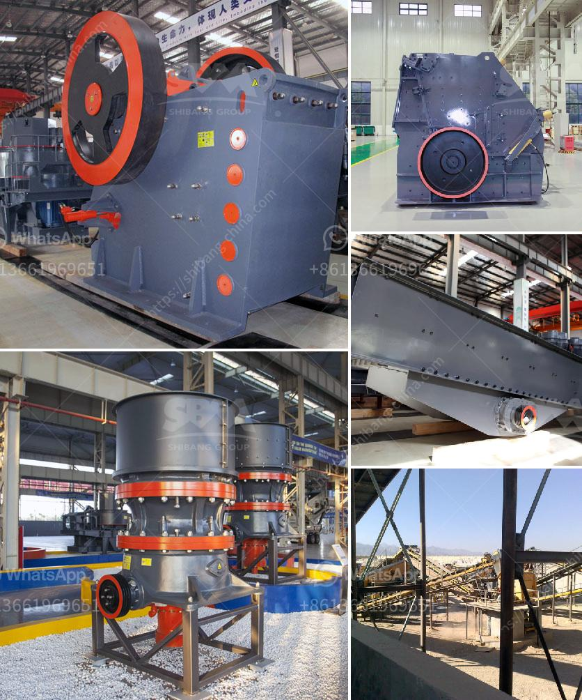

<h3>كسارة حجرية بمحرك ديزل قائمة أسعار في الهند</h3>
تعتبر الكسارات الحجرية بمحركات الديزل أدوات أساسية في صناعة البناء واستخراج المواد الخام في الهند. تُستخدم هذه الكسارات لتكسير الصخور الصلبة وتحويلها إلى مواد أصغر الحجم تستخدم في البناء وإعادة تدوير الخرسانة. يأتي الاهتمام بأسعار الكسارات الحجرية بمحركات الديزل من تكلفتها الاستثمارية المنخفضة وقدرتها على العمل في مناطق بعيدة عن شبكة الكهرباء.

تتراوح الأسعار لهذه الكسارات في الهند بين 200 إلى 400 ألف روبية هندية (الماكينة الواحدة) وتعتمد على القوة والسعة والميزات التي يتم توفيرها في الوحدة. جانبًا من تكلفة الشراء، يجب أن يأخذ كل من المشتري والمستخدم في الاعتبار أيضًا تكاليف الصيانة والوقود وقطع الغيار المستقبلية.

كسّارة الحجرية بمحرك ديزل تأتي بعدة أحجام وقدرات. في المقام الأول، تعتمد سعة الكسارة على الكمية المراد تكسيرها يومياً والحد الأقصى لحجم الصخور المطلوب تكسيره. يمكن أن تتراوح السعة من 10 طن في الساعة إلى 100 طن في الساعة أو أكثر. بالإضافة إلى سعة الكسارة، يجب أيضاً أن يتم النظر في الميزات الأخرى مثل النقل المحمول والإطار المتين، وفتحة التغذية وحجم المخرجات والكفاءة العامة للكسارة.

المحركات الديزلية في الكسارات الحجرية هي ما يجعلها تعمل بكفاءة في المناطق التي تفتقر إلى توفر الكهرباء المستمرة. هذا يعني أنه يمكن تشغيل الكسارة في الموقع ذات تكلفة أقل من إحضار مصدر كهرباء جديد. ومع أن الأسعار الأولية للكسارات بمحرك الديزل قد تكون أعلى قليلاً بالمقارنة مع الكسارات بمحركات كهربائية ، إلا أن توفر الوقود قد يساهم في توفير الأموال على المدى الطويل. علاوة على ذلك، فإن محرك ديزل قوي يضمن استمرارية العمل بأداء رائع وسهولة صيانة دورية.

باختصار، كسارة الحجرية بمحرك ديزل هي أداة إنشاء مهمة في صناعة البناء في الهند. وبفضل قدرتها على العمل بشكل مستقل عن الكهرباء، فهي خيار مناسب للمناطق النائية. وعلى الرغم من أن التكلفة الأولية قد تكون أعلى قليلاً، فإن توفير الوقود وسهولة الصيانة تساهم في جعلها خيارًا اقتصاديًا وفعالًا على المدى الطويل.
<h3>Contact us</h3><ul><li><strong>Whatsapp:&nbsp;<a href="https://wa.me/8613661969651">+8613661969651</a></strong></li><li><a href="https://swt.shibang-china.com/?git&amp;zhl&amp;كسارة حجرية بمحرك ديزل قائمة أسعار في الهند"><strong>Online Service(chat now)</strong></a></li></ul><h3>Related</h3><ul><li><a href='أسعار السيور الناقلة في ماليزيا.md'>أسعار السيور الناقلة في ماليزيا</a></li><li><a href='كسارات الحجر في بيلين.md'>كسارات الحجر في بيلين</a></li><li><a href='آلات لايم ستوم 100 إلى 500 شبكة مسحوق.md'>آلات لايم ستوم 100 إلى 500 شبكة مسحوق</a></li><li><a href='بيع كسارة طحن إندونيسيا.md'>بيع كسارة طحن إندونيسيا</a></li><li><a href='مطحنة قضيب الكرة الحجر الجيري.md'>مطحنة قضيب الكرة الحجر الجيري</a></li></ul>