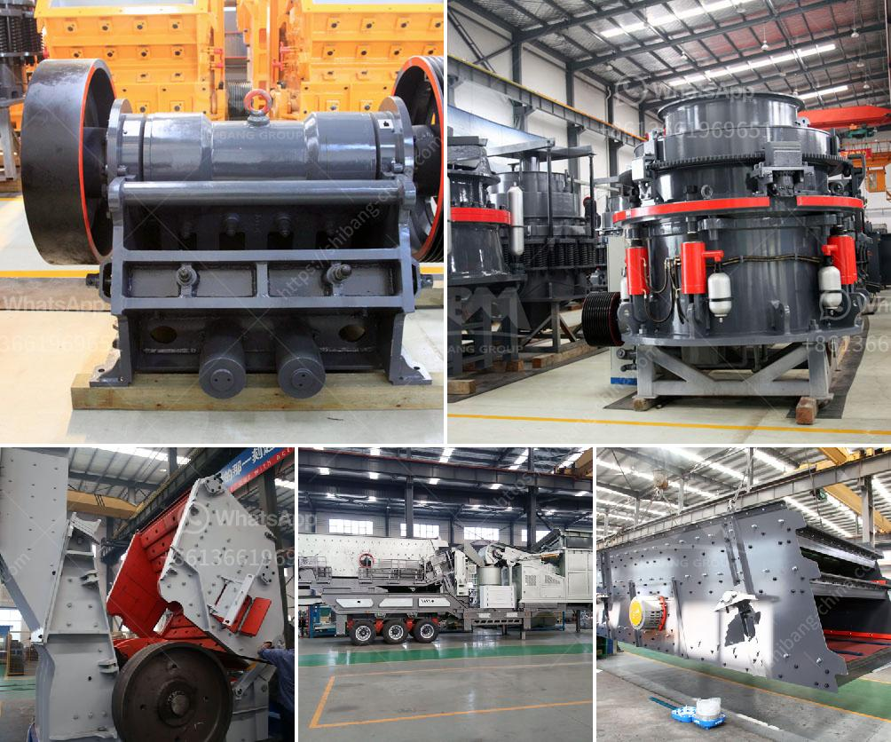

<h3>كسارة حجرية للبيع</h3>
تعد الكسارات الحجرية أدوات أساسية في صناعة البناء والتشييد، حيث تستخدم لتكسير وطحن الصخور والحجارة الكبيرة لتحويلها إلى قطع صغيرة قابلة للاستخدام في عمليات البناء المختلفة. وعندما يتعلق الأمر بشراء كسارة حجرية، فإن العوامل المهمة التي يجب مراعاتها هي الأداء والجودة والمتانة وسعر البيع.

إحدى أنواع الكسارات الحجرية المتوفرة في السوق هي الكسارة الفكية. تتميز الكسارات الفكية ببنيتها المتينة وقدرتها على تحمل الاستخدام المكثف. تعمل الكسارة الفكية عن طريق تطبيق قوة ضغط على الحجر الموجود في الفك العلوي المتحرك وجره نحو الفك السفلي الثابت لتكسيره. تتوفر الكسارات الفكية بمختلف الأحجام والموديلات، حيث يختلف سعر البيع تبعاً للحجم والقدرة الإنتاجية.

تعتبر الكسارات الحجرية ضرورية للعديد من مشاريع البناء، بدءًا من بناء المباني وحتى الطرق والجسور. إذا كنت تبحث عن كسارة حجرية للبيع، فيجب أن تأخذ في الاعتبار القوة والكفاءة والاستدامة للكسارة القادرة على ملاءمة احتياجات مشروعك. من المهم أيضًا أن تأخذ في الاعتبار التكلفة، فعلى الرغم من أهمية النوعية والأداء، يجب ألا تتجاوز الكسارة الميزانية الخاصة بك.

عند التعامل مع بائعي الكسارات الحجرية، يجب عليك طلب معلومات تفصيلية عن المنتج والضمان المقدم. كما يفضل أيضًا استشارة مهندس ميكانيكي متخصص للحصول على النصيحة المناسبة. قد يكون من المفيد أيضًا النظر في تقييمات المستخدمين والمراجعات عبر الإنترنت للتعرف على تجارب الآخرين مع الكسارة والشركة المصنعة.

في النهاية، إذا كنت تبحث عن كسارة حجرية للبيع، فإن العمل الجيد لا يكتمل بإيجاد المنتج المثالي فقط، بل يتطلب أيضًا الاستدامة والصيانة الدورية. يجب أن تبقى الكسارة في حالة جيدة للحفاظ على أدائها على المدى الطويل وتحقيق عائد استثمار جيد على المدى البعيد.

باختصار، عند البحث عن كسارة حجرية للبيع، يجب أن تأخذ في الاعتبار الأداء والجودة والمتانة والتكلفة والدعم الفني. يتعين عليك أيضًا البحث والتقييم المستمر ليتمكنوا من اتخاذ قرار ذكي وشراء الكسارة المناسبة لمشروعك.
<h3>Contact us</h3><ul><li><strong>Whatsapp:&nbsp;<a href="https://wa.me/8613661969651">+8613661969651</a></strong></li><li><a href="https://swt.shibang-china.com/?git&amp;zhl&amp;كسارة حجرية للبيع"><strong>Online Service(chat now)</strong></a></li></ul><h3>Related</h3><ul><li><a href='كسارة الفحم 10 مم.md'>كسارة الفحم 10 مم</a></li><li><a href='مطحنة الكرة مع محول mercadolibre.md'>مطحنة الكرة مع محول mercadolibre</a></li><li><a href='كسارة فكية في بتسوانا.md'>كسارة فكية في بتسوانا</a></li><li><a href='البحث عن كسارة الحجر.md'>البحث عن كسارة الحجر</a></li><li><a href='خطة عمل محجر الجرانيت.md'>خطة عمل محجر الجرانيت</a></li></ul>