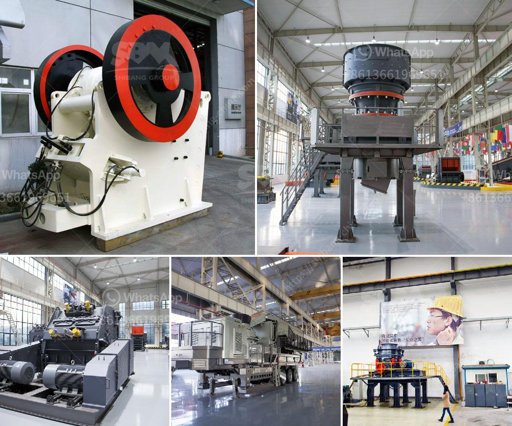

<h3>كسارة حجرية مستعملة للبيع</h3>
تعتبر الكسارات الحجرية المستعملة من الآلات التي تستخدم في صناعة التشييد والبناء. هناك العديد من الكسارات المستعملة المتاحة للبيع في السوق، ويمكن العثور عليها بأسعار تتراوح بين 200 و 400 الف دولار، حسب حجم ونوع الكسارة وحالتها.

يعتبر شراء كسارة حجرية مستعملة فكرة جيدة للمشروعات الصغيرة أو الناشئة التي ترغب في توفير تكاليف البدء وتشغيل أعمالها. إذا تم اختيار الكسارة المناسبة والمحترفين الذين يقومون بفحص وصيانتها بشكل منتظم، يمكن تحقيق العديد من الفوائد.

واحدة من أهم الفوائد لشراء كسارة حجرية مستعملة هي توفير التكاليف. فالكسارات المستعملة غالبًا ما تكون أرخص بكثير من الكسارات الجديدة. كما يمكن أن يوفر شراء الكسارة المستعملة من التكاليف الأخرى مثل تكاليف النقل والتأمين. بالإضافة إلى ذلك، فإن الكسارات المستعملة غالباً ما تكون جاهزة للاستخدام مباشرة، مما يوفر الوقت والجهد في عمليات الإعداد والتجميع.

ومع ذلك، هناك بعض الأشياء التي يجب مراعاتها قبل شراء كسارة حجرية مستعملة. فمن المهم التحقق من حالة الكسارة وأدائها ومدى سلامتها. يفضل أيضاً اختيار الكسارات المستعملة التي كانت تستخدم في أعمال خفيفة ومشاريع صغيرة، بدلاً من الكسارات التي تم استخدامها في مشاريع كبيرة وثقيلة. قد تحتاج الكسارة المستعملة إلى بعض التعديلات أو التحسينات لتلبية احتياجاتك الخاصة، وقد يكلف ذلك بعض الأموال والجهد.

بالاختصار، شراء كسارة حجرية مستعملة يمكن أن يكون خيارًا جيدًا للمشروعات الصغيرة والناشئة التي ترغب في توفير التكاليف. ومع العناية الجيدة والصيانة الدورية، يمكن تحقيق العديد من الفوائد من استخدام الكسارة المستعملة في صناعة التشييد والبناء. لذا، يجب أن تكون لديك خطة جيدة وتستعين بخبراء في المجال قبل اتخاذ أي قرار بشأن شراء كسارة حجرية مستعملة.
<h3>Contact us</h3><ul><li><strong>Whatsapp:&nbsp;<a href="https://wa.me/8613661969651">+8613661969651</a></strong></li><li><a href="https://swt.shibang-china.com/?git&amp;zhl&amp;كسارة حجرية مستعملة للبيع"><strong>Online Service(chat now)</strong></a></li></ul><h3>Related</h3><ul><li><a href='معدات إنتاج البازلت.md'>معدات إنتاج البازلت</a></li><li><a href='قائمة الشركات المحاجر في نيجيريا.md'>قائمة الشركات المحاجر في نيجيريا</a></li><li><a href='سعة مطحنة الكرة للطين.md'>سعة مطحنة الكرة للطين</a></li><li><a href='تحليل تكلفة سحق وفحص.md'>تحليل تكلفة سحق وفحص</a></li><li><a href='مطحنة الكرة للبيع في جنوب أفريقيا.md'>مطحنة الكرة للبيع في جنوب أفريقيا</a></li></ul>