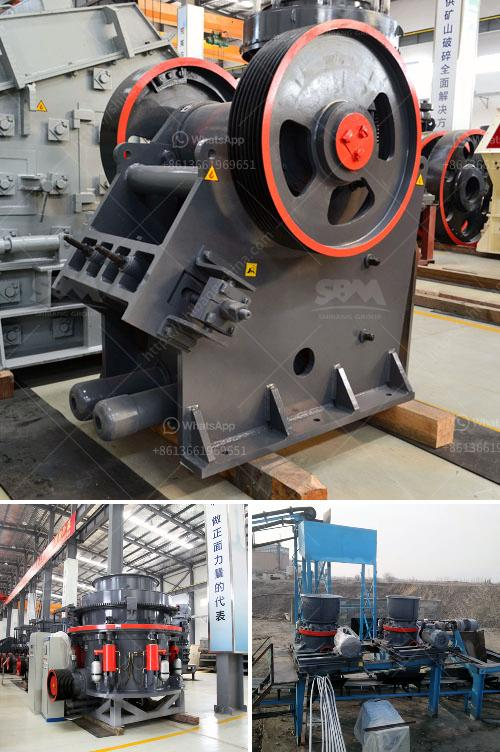

<h3>كسارة حصى ورمل في نيبال</h3>
تعد كسارة الحصى والرمل من أهم المعدات في صناعة البناء والإنشاءات. في نيبال، توجد قطاعات كثيرة تستفيد من وجود الكسارات، مثل صناعة الطرق، والبناء، والتعدين.

تعتبر كسارة الحصى والرمل في نيبال ضرورة أساسية لمشاريع البنية التحتية والتطوير العمراني. يتم استخدام الكسارة لتفتيت الصخور والحجارة الكبيرة إلى قطع صغيرة من الحصى والرمل، وهو ما يسهل العملية التالية لصناعة مواد البناء.

تعمل الكسارات من خلال آليات تقوم بسحق المواد الصخرية مثل الجرانيت والبازلت والحجارة الجيرية. يتم تفتيت هذه المواد وتكسيرها إلى أحجام مختلفة، حسب الاحتياجات المحددة. تستخدم الكسارات الحجارة المكسورة في إنتاج مواد البناء مثل الخرسانة والأسمنت والأسفلت.

تعد صناعة البناء من أكبر القطاعات الاقتصادية في نيبال، وتلعب الكسارات دورًا حيويًا في دعم هذا القطاع. تستخدم المواد المكسورة من الكسارات في مشاريع البنية التحتية مثل الطرق والجسور والسكك الحديدية. كما يتوجب استخدامها في بناء المنازل والمباني التجارية والسكنية.

ومع زيادة التطور العمراني في نيبال، زادت الطلبات على مواد البناء. وتعد الكسارات من الوسائل المهمة لتلبية هذا الطلب المتزايد. تعزز الكسارات الإنتاجية وتسرع عمليات البناء، مما يقلل من التكاليف والجهود البشرية المطلوبة لإتمام المشاريع.

مع ذلك، يجب أن ننوه أيضًا إلى التحديات التي يواجهها قطاع الكسارات في نيبال. يعاني هذا القطاع من مشاكل تشغيلية وقانونية، مما يؤثر على إمكانية تلبية الطلب الكبير على المواد المكسورة. كما أن استخراج المواد الصخرية من الكسارات يتسبب أحيانًا في تغيرات بيئية وتأثيرات سلبية على الطبيعة المحيطة.

بشكل عام، تلعب الكسارات دورًا حيويًا في صناعة البناء والإنشاءات في نيبال. يجب أن يرتفع مستوى التوعية بأهمية هذا القطاع وضرورة تكييفه مع المسائل البيئية والقانونية. يجب توفير الدعم اللازم لتطوير وتحديث التقنيات والمعدات في هذا القطاع، بهدف تحسين الإنتاجية وتقليل التأثير البيئي.
<h3>Contact us</h3><ul><li><strong>Whatsapp:&nbsp;<a href="https://wa.me/8613661969651">+8613661969651</a></strong></li><li><a href="https://swt.shibang-china.com/?git&amp;zhl&amp;كسارة حصى ورمل في نيبال"><strong>Online Service(chat now)</strong></a></li></ul><h3>Related</h3><ul><li><a href='الشركات التي تبيع كسارة الفك في كينيا.md'>الشركات التي تبيع كسارة الفك في كينيا</a></li><li><a href='مصنع طحن الذهب في زيمبابوي.md'>مصنع طحن الذهب في زيمبابوي</a></li><li><a href='تصميم وتخطيط محطة تكسير الحجارة pdf.md'>تصميم وتخطيط محطة تكسير الحجارة pdf</a></li><li><a href='معدات إنتاج الأسمنت في ألمانيا.md'>معدات إنتاج الأسمنت في ألمانيا</a></li><li><a href='كسارات الصخور للبيع.md'>كسارات الصخور للبيع</a></li></ul>