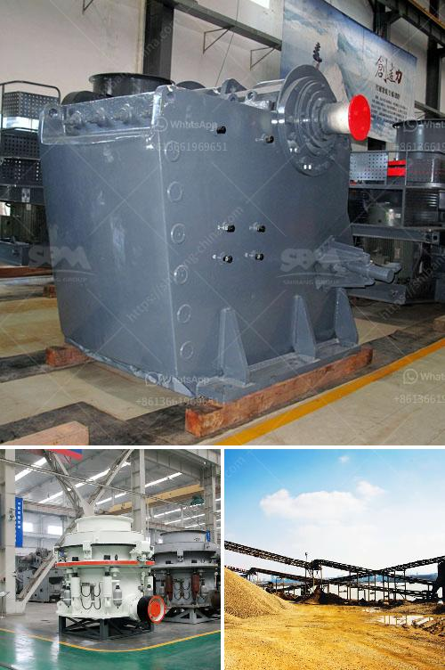

<h3>كسارة خام البوتاش</h3>
تعتبر كسارة خام البوتاش (Potash) أحد أجهزة التكسير التي تستخدم في صناعة التعدين لاستخراج خام البوتاش، وهو نوع من الأملاح المعدنية التي يستخرج منها البوتاسيوم. يتم استخدام البوتاسيوم في العديد من الصناعات بما في ذلك الزراعة، حيث يعد عنصرًا ضروريًا لنمو النباتات وتطورها.

تتألف كسارة خام البوتاش من مجموعة من الآلات المتكاملة والمتخصصة في إعداد خام البوتاش للاستخدام في الصناعة. يتم تحميل الخام في الكسارة حيث يتم طحنها وتكسيرها إلى قطع صغيرة من أجل تفتيتها وتحويلها إلى صورة ذات حبيبات أصغر.

تعتبر كسارة خام البوتاش جزءًا أساسيًا في عملية استخراج البوتاسيوم، حيث يتم تحطيم الصخور الصلبة بواسطة الكسارة. يتم استخدام الضغط والاحتكاك لتفتيت الحجارة إلى قطع أصغر. وبعد ذلك، تتم إزالة الطين والغبار من القطع الصخرية باستخدام العديد من العمليات المتتالية مثل عملية الفحص والفصل وعملية الغربلة.

بفضل هذه العمليات، يُحقق تحسين كفاءة استخراج خام البوتاش وإعداده للاستخدام النهائي. وتتضمن هذه الكفاءة تقليل التلوث البيئي، حيث يتم استخدام أحدث التقنيات للحد من الانبعاثات الضارة خلال عمليات التكسير.

توفر كسارات خام البوتاش قدرة عالية على معالجة الكميات الكبيرة من الخام، مما يزيد من إنتاجية الصناعة ويساهم في خفض تكلفة الإنتاج. يتم تصميم الكسارات عادةً بحيث تكون متينة وقادرة على تحمل الظروف القاسية في مواقع التعدين، وتوفير الصيانة السهلة والآمنة للعاملين.

باختصار، فإن كسارة خام البوتاش تلعب دورًا حاسمًا في عملية استخراج البوتاسيوم من الصخور الصلبة، وتمهد الطريق لاستخدامه في مجالات مختلفة من الصناعة. تقدم هذه الكسارات فوائد عديدة بما في ذلك زيادة الكفاءة وتخفيض التكلفة والحد من التلوث البيئي، مما يعزز قطاع التعدين والزراعة والصناعات الأخرى التي تعتمد على البوتاسيوم.
<h3>Contact us</h3><ul><li><strong>Whatsapp:&nbsp;<a href="https://wa.me/8613661969651">+8613661969651</a></strong></li><li><a href="https://swt.shibang-china.com/?git&amp;zhl&amp;كسارة خام البوتاش"><strong>Online Service(chat now)</strong></a></li></ul><h3>Related</h3><ul><li><a href='معدات معالجة خام الذهب المستخدمة للبيع.md'>معدات معالجة خام الذهب المستخدمة للبيع</a></li><li><a href='مصنع كسارة السخام في الهند.md'>مصنع كسارة السخام في الهند</a></li><li><a href='سعر مصنع كسارة الفك.md'>سعر مصنع كسارة الفك</a></li><li><a href='آلات إنتاج الكالسيوم.md'>آلات إنتاج الكالسيوم</a></li><li><a href='مصنع كسارة للبيع في المملكة العربية السعودية.md'>مصنع كسارة للبيع في المملكة العربية السعودية</a></li></ul>