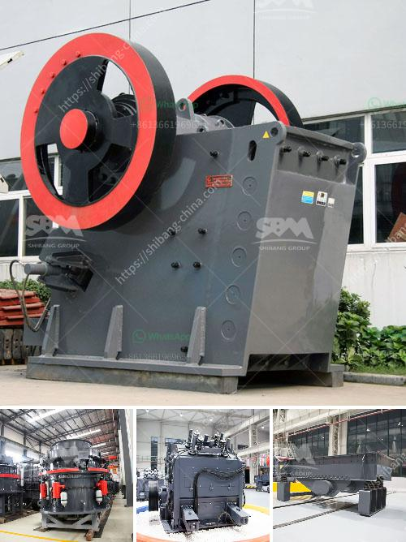

<h3>كسارة سريلانكا</h3>
تُعتبر سريلانكا واحدة من أجمل الوجهات السياحية في جنوب آسيا، حيث تزخر بالعديد من المعالم الطبيعية الساحرة. ومن بين هذه المعالم التي تستحق الزيارة هي كسارة سريلانكا.

تقع كسارة سريلانكا في المحافظة الشمالية الغربية من البلاد، على بُعد حوالي 122 كيلومترًا من العاصمة كولومبو. تتميز المنطقة بمناظرها الطبيعية الخلابة المكونة من أطلال المعابده القديمة، والشلالات الجميلة، والحدائق النباتية المورقة.

تاريخيًا، كانت كسارة سريلانكا أحد المراكز الرئيسية لمملكة كاشيابا في العصور القديمة. وتعتبر أطلال المدينة القديمة مكانًا يستحق الزيارة، حيث بُنيت على ضفاف نهر داغورا التي تعزز جمال المكان.

من أبرز المعابده في كسارة سريلانكا هي معبد "راجاغيريها" المذهل. يعود تاريخ هذا المعبد إلى القرن الثالث، ويعد واحدًا من أهم المواقع الدينية في البلاد. يتميز المعبد بالتماثيل الجميلة والتحف الفريدة من نوعها والتفاصيل المعمارية الرائعة.

تعتبر الحدائق النباتية في كسارة سريلانكا من الأماكن الممتعة للاستكشاف والاسترخاء. توفر هذه الحدائق مجموعة واسعة من النباتات المحلية والنباتات النادرة. بالإضافة إلى ذلك، يمكن للزوار الاستمتاع بمشاهدة العديد من الطيور والحيوانات المحلية.

أما بالنسبة للشلالات في المنطقة، فإنها تعد جزءًا أساسيًا من جمال كسارة سريلانكا. منها شلالات "تجاندا" و "بلياجا" التي تعتبر من أكبر الشلالات في المنطقة. يُعد زيارة هذه الشلالات من أهم النشاطات التي يمكن قم بها في المنطقة.

قد يستغرب البعض من عدم شهرة كسارة سريلانكا كما البعض الآخر من عدم ازدحام السياح في المنطقة. يمكننا أن نرجع ذلك إلى أنها لم تكن مركزًا رئيسيًا للسياحة في البلاد لفترة طويلة، مما جعلها محافظة على جمالها الطبيعي وسحرها الخاص.

في النهاية، يمكن القول إن كسارة سريلانكا هي واحدة من المواقع السياحية الخلابة في سريلانكا. تُعد متعة استكشافها واكتشاف تاريخها وروعة طبيعتها تجربة لا تُنسى. إذا كنتم من محبي السفر والاستمتاع بالمناظر الطبيعية الخلابة، فإن زيارة كسارة سريلانكا يجب أن تكون في قائمة أماكن الزيارة القادمة.
<h3>Contact us</h3><ul><li><strong>Whatsapp:&nbsp;<a href="https://wa.me/8613661969651">+8613661969651</a></strong></li><li><a href="https://swt.shibang-china.com/?git&amp;zhl&amp;كسارة سريلانكا"><strong>Online Service(chat now)</strong></a></li></ul><h3>Related</h3><ul><li><a href='تكلفة مطحنة مسحوق صغيرة.md'>تكلفة مطحنة مسحوق صغيرة</a></li><li><a href='آلة طلاء مسحوق كربونات الكالسيوم في الهند.md'>آلة طلاء مسحوق كربونات الكالسيوم في الهند</a></li><li><a href='آلة صنع مسحوق الجبس.md'>آلة صنع مسحوق الجبس</a></li><li><a href='كسارة صناعية للبيع.md'>كسارة صناعية للبيع</a></li><li><a href='تكلفة معدات التكسير والطحن في إثيوبيا.md'>تكلفة معدات التكسير والطحن في إثيوبيا</a></li></ul>