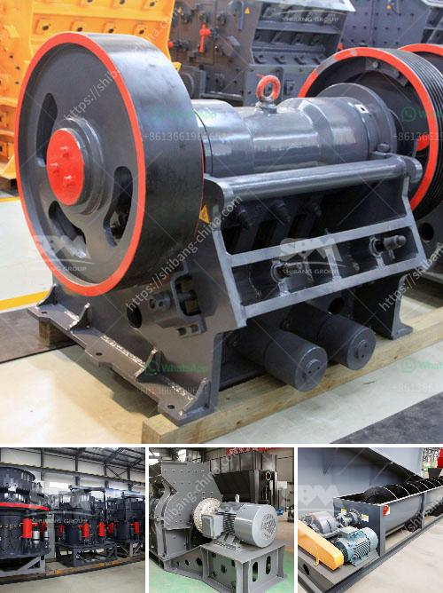

<h3>كسارة سلسلة السلسلة ومورديها</h3>
تعد كسارة سلسلة السلسلة واحدة من الأدوات الهامة في صناعة التعدين والبناء. تستخدم لتكسير المواد الخام إلى أحجام صغيرة تستخدم في عمليات البناء المختلفة. تنقسم هذه الكسارات إلى عدة أنواع ، بما في ذلك كسارة الفك ، كسارة الصدم وكسارة المخروط.

تعمل كسارة سلسلة السلسلة بواسطة استخدام مطرقة ثقيلة تتحرك في سرعة عالية لتحطيم المواد الخام. تتألف هذه الكسارة من سلسلة من اللوحات الفولاذية المتصلة ببعضها البعض في صف واحد. يتم تثبيت المطرقة على السلسلة ، وعندما تدور السلسلة ، تضرب المطرقة المواد الخام بشدة لتكسيرها. يتم ضبط فتحة الفك لتحقيق الحجم المطلوب للمواد التي ستمر.

يعتبر تأمين موردي كسارة سلسلة السلسلة بمنتجات ذات جودة موثوق بها أمرًا حاسمًا لضمان تشغيل فعال وسلس للمعدات. يجب التعاون مع موردين ذوي سمعة جيدة وتاريخ حافل في مجال توفير الكسارات وقطع الغيار المتعلقة بها.

تقدم موردي كسارة سلسلة السلسلة المواد ذات الجودة العالية والمتانة لتحقيق أداء ممتاز للكسارة. يقوم الموردون المحترفون بتجميع واختبار الكسارات قبل تسليمها للعملاء لضمان أنها تعمل بشكل صحيح وتلبي متطلبات الأداء.

يقوم الموردون أيضًا بتوفير قطع الغيار الأصلية للكسارة السلسلية لضمان استدامة تشغيلها. فقد تحدث أحيانًا الحاجة إلى استبدال بعض الأجزاء التالفة أو المكسورة بعد فترة من الاستخدام المستمر ، ومن الضروري أن تتوفر قطع الغيار الصحيحة للكسارة لضمان استمرار تشغيلها بكفاءة. لذلك ، يعد الحصول على قطع الغيار الأصلية من موردي الكسارة سلسلة السلسلة أمرًا هامًا جدًا.

بالاضافة الى ذلك ، يجب أن يقدم موردي الكسارة سلسلة السلسلة الدعم الفني المطلوب للعملاء. يجب أن يتم توفير دليل التشغيل والصيانة للكسارة ، بالإضافة إلى الإرشادات الفنية اللازمة لتجميع وتشغيل الكسارة بشكل صحيح. يجب أن تكون هناك فرق فني يقدم الدعم والمشورة اللازمة في حالة وجود مشاكل أو استفسارات.

باختيار موردي كسارة سلسلة السلسلة الصحيحين ، يمكن تحقيق أداء ممتاز واستدامة للكسارة. من خلال توفير المواد عالية الجودة وقطع الغيار الأصلية والدعم الفني المهني ، يمكن للكسارة أن تعمل بكفاءة وتحقق أقصى استفادة للعملاء في المشروعات التي تستخدمها.

الاستثمار في كسارة سلسلة السلسلة عملية هامة وتتطلب معرفة وتخطيط دقيق. يتعين أن تكون الكسارات قادرة على معالجة المواد الخام المحددة وتلبية احتياجات المشروع. عملية اختيار الموردين المناسبين تلعب دورًا حاسمًا في نجاح المشروع وتحقيق أفضل النتائج.
<h3>Contact us</h3><ul><li><strong>Whatsapp:&nbsp;<a href="https://wa.me/8613661969651">+8613661969651</a></strong></li><li><a href="https://swt.shibang-china.com/?git&amp;zhl&amp;كسارة سلسلة السلسلة ومورديها"><strong>Online Service(chat now)</strong></a></li></ul><h3>Related</h3><ul><li><a href='تقرير مشروع مصنع الكرة الصغيرة بتنسيق PDF.md'>تقرير مشروع مصنع الكرة الصغيرة بتنسيق PDF</a></li><li><a href='كسارة متنقلة بسعة ١٠٠٠ طن في الساعة.md'>كسارة متنقلة بسعة ١٠٠٠ طن في الساعة</a></li><li><a href='قائمة أسعار الشاشات الاهتزازية.md'>قائمة أسعار الشاشات الاهتزازية</a></li><li><a href='تكسير صخور صغيرة في لاس فيغاس.md'>تكسير صخور صغيرة في لاس فيغاس</a></li><li><a href='مصنع تكسير السلاغ في تاميل نادو.md'>مصنع تكسير السلاغ في تاميل نادو</a></li></ul>