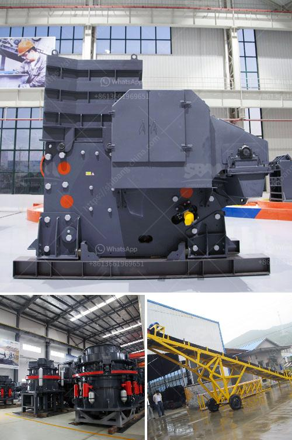

<h3>كسارة صخرية بسعة 500 متر مكعب في اليوم</h3>
يعتبر استخراج الصخور وتكسيرها أمرًا ضروريًا في صناعة البناء والبنية التحتية لأي اقتصاد. وفي هذا السياق، تلعب الكسارات الصخرية دورًا حيويًا في سحق الصخور الكبيرة إلى قطع أصغر تستخدم في مجموعة متنوعة من التطبيقات. واحدة من أمثلة هذه الكسارات هي كسارة الصخور ذات السعة اليومية لـ 500 متر مكعب.

تتميز كسارة الصخور هذه بسعة 500 متر مكعب في اليوم بأداء عالٍ وكفاءة قصوى. تستخدم هذه الكسارة لسحق الصخور الكبيرة وتحويلها إلى قطع صغيرة ومتناسقة التي يمكن استخدامها في مشاريع البناء المختلفة. تستخدم عادة في المحاجر ومواقع البناء الكبيرة حيث تكون الحاجة ماسة لمواد البناء.

تعمل كسارة الصخور بتقنية متقدمة تعتمد على القوة الميكانيكية للأدوات المستخدمة في الكسر. تتكون الكسارة من مجموعة من الألواح والأسطوانات الصلبة التي تطحن الصخور وتحطمها. عادة ما تمنح الكسارة هذه مقاسات الصخور المحطمة النهائية المطلوبة والمطابقة لاحتياجات المشروع.

تتميز كسارة الصخور ذات السعة اليومية لـ 500 متر مكعب بعدة مزايا مهمة. أولاً، فهي توفر قدرة عالية على سحق الصخور الكبيرة في فترة زمنية قصيرة، مما يزيد من إنتاجية العمل. ثانيًا، إن استخدام الكسارة يقلل من تكلفة العمالة، حيث أنه لا يلزم تكديس ونقل الصخور الكبيرة يدويًا إلى موقع العمل. وأخيرًا، تساعد الكسارة في تحسين جودة المواد المستخدمة في مشاريع البناء، حيث تحطم الصخور بشكل متناسق وفقًا للمعايير المطلوبة.

باختصار، تلعب كسارة الصخور ذات السعة اليومية لـ 500 متر مكعب دورًا حيويًا في صناعة البناء والبنية التحتية. تساهم في توفير مادة البناء بكفاءة عالية وتقليل التكاليف وتحسين جودة المواد المستخدمة. بالتالي، فإن اعتماد الكسارات الصخرية المتقدمة مثل هذه هو استثمار ضروري لنمو وتنمية البنية التحتية في البلدان المختلفة.
<h3>Contact us</h3><ul><li><strong>Whatsapp:&nbsp;<a href="https://wa.me/8613661969651">+8613661969651</a></strong></li><li><a href="https://swt.shibang-china.com/?git&amp;zhl&amp;كسارة صخرية بسعة 500 متر مكعب في اليوم"><strong>Online Service(chat now)</strong></a></li></ul><h3>Related</h3><ul><li><a href='مصنعون لمسحوق الطين.md'>مصنعون لمسحوق الطين</a></li><li><a href='سعر مطحنة المطرقة للطين.md'>سعر مطحنة المطرقة للطين</a></li><li><a href='معدات تكسير خام الكروم المستخدمة.md'>معدات تكسير خام الكروم المستخدمة</a></li><li><a href='كسارات الفحم المتنقلة للإيجار.md'>كسارات الفحم المتنقلة للإيجار</a></li><li><a href='كسارة الحجر في الفلبين.md'>كسارة الحجر في الفلبين</a></li></ul>