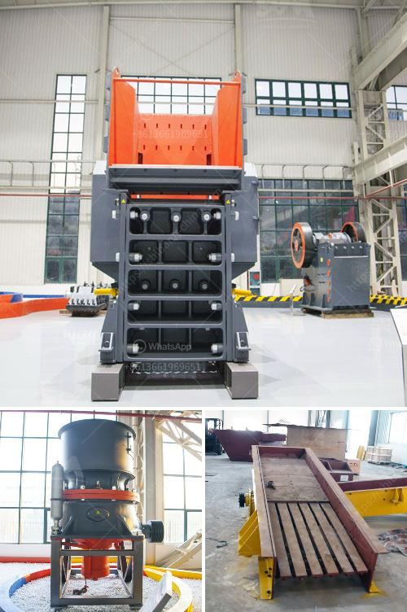

<h3>كسارة صخرية صناعية</h3>
تعتبر كسارة الصخور الصناعية جزءًا أساسيًا في صناعة التعدين والبناء، حيث تستخدم لتحطيم الصخور الكبيرة إلى قطع صغيرة قابلة للاستخدام في العديد من التطبيقات المختلفة. تعمل الكسارات الصخرية الصناعية بالضغط والقوة العالية لتكسير الصخور الصلبة وتحويلها إلى جزيئات أصغر حجمًا.

تتكون الكسارة الصخرية الصناعية من عدة أجزاء رئيسية، بما في ذلك الفك الثابت والفك المتحرك وآلية التحكم والمحرك الذي يقوم بتشغيل الكسارة. تعمل الكسارة بواسطة إدخال الصخور في الفك المتحرك، حيث يتم تكسيرها بفعل الضغط القوي الناتج عن الفك الثابت. تخرج الصخور المكسرة من الكسارة عبر الفتحة الموجودة في الفك المتحرك.

تتنوع استخدامات الكسارات الصخرية الصناعية بشكل كبير وتشمل العديد من الصناعات. فمن المشترك استخدامها في صناعة الاسمنت والبناء، حيث تستخدم لسحق الحجارة والصخور الكبيرة لاستخدامها في صناعة الخرسانة ومواد البناء الأخرى. بالإضافة إلى ذلك، تستخدم الكسارات الصخرية أيضًا في صناعة الطرق لتكسير الصخور الكبيرة وتحويلها إلى حصى صغيرة يتم استخدامها في إنشاء وصيانة الطرق.

وفي أعمال التعدين، تكون الكسارات الصخرية ضرورية لتحويل الصخور والمعادن الصلبة إلى قطع صغيرة مناسبة للعمليات اللاحقة مثل عمليات الطحن والفصل. إن استخدام الكسارات الصخرية الصناعية في صناعة التعدين يزيد من كفاءة العمليات ويقلل من تكاليف التشغيل.

على الرغم من أن الكسارات الصخرية الصناعية تعد ضرورية ومفيدة في العديد من الصناعات، إلا أنه يجب أن يكون هناك احترافية عالية في استخدامها وصيانتها. يجب أن يتم تجهيز العاملين بالمعرفة والمهارات اللازمة لتشغيل الكسارة بأمان وفعالية. بالإضافة إلى ذلك، يجب أن يتم الاهتمام بصيانة الكسارة بانتظام للحفاظ على الأداء العالي وتجنب التوقف غير المخطط له.

في الختام، تعتبر الكسارة الصخرية الصناعية أداة حاسمة في صناعة التعدين والبناء. سواء أكنت تعمل في صناعة البناء أو التعدين، فإن الاستثمار في كسارة صخور صناعية عالية الجودة سيجلب الفوائد العديدة ويساهم في تحقيق النجاح والاستدامة في الصناعة.
<h3>Contact us</h3><ul><li><strong>Whatsapp:&nbsp;<a href="https://wa.me/8613661969651">+8613661969651</a></strong></li><li><a href="https://swt.shibang-china.com/?git&amp;zhl&amp;كسارة صخرية صناعية"><strong>Online Service(chat now)</strong></a></li></ul><h3>Related</h3><ul><li><a href='كيفية صنع مسحوق الطين الأحمر للغراز.md'>كيفية صنع مسحوق الطين الأحمر للغراز</a></li><li><a href='سعر كسارة الحجر بسعة 100 طن في الساعة.md'>سعر كسارة الحجر بسعة 100 طن في الساعة</a></li><li><a href='مصنع تكسير الجرانيت 200 طن في الساعة للبيع.md'>مصنع تكسير الجرانيت 200 طن في الساعة للبيع</a></li><li><a href='تصميم محطة كسارة الحجر.md'>تصميم محطة كسارة الحجر</a></li><li><a href='مطاحن للبيع في الفلبين.md'>مطاحن للبيع في الفلبين</a></li></ul>