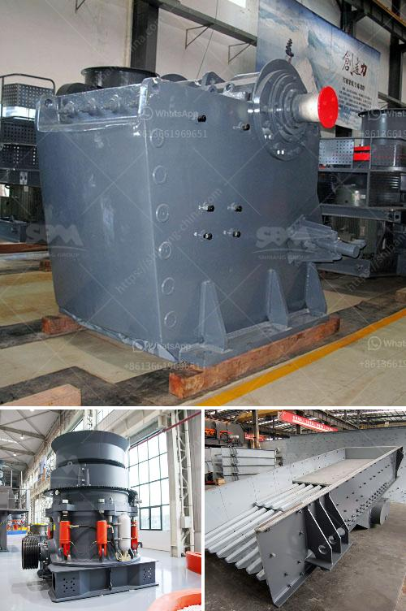

<h3>كسارة صخرية للبيع</h3>
في العصر الحالي، يعتبر البحث عن كسارة صخرية للبيع أمراً شائعاً في قطاعات متعددة مثل البناء والتعدين والأشغال العامة. تستخدم الكسارات الصخرية لتحويل الصخور الكبيرة إلى قطع صغيرة من المواد الخام، وتعتبر حلولاً فعالة لتلبية احتياجات السوق المتزايدة. في هذه المقالة، سنناقش ما يجب أن يتم مراعاته عند البحث عن كسارة صخرية للبيع بين راحة الميزانية وتلبية الاحتياجات الفنية.

أولاً وقبل كل شيء، يجب أن تضع في اعتبارك نوع الصخور التي ترغب في سحقها. بعض الكسارات صممت خصيصاً للعمل مع أنواع محددة من الصخور، مثل الحجر الجيري أو الجرانيت. لذا من المهم أن تحدد أنواع الصخور التي ترغب في تكسيرها وتضمن توافق الكسارة المراد شراؤها مع هذا النوع من الصخور.

ثانياً، يجب أن تنظر إلى الأداء الفني للكسارة. بعض العوامل التي يجب مراعاتها هي سعة الكسارة وتأثيرها على الإنتاجية وقدرتها على العمل لفترات طويلة دون أعطال، كما يجب أيضاً التأكد من مدى توافر قطع الغيار والصيانة الدورية للكسارة بهدف الحفاظ على أدائها الأمثل.

ثالثاً، يجب أن تأخذ في الاعتبار الميزانية الخاصة بك. تتراوح أسعار الكسارات الصخرية من 200 إلى 400 وحدة نقدية وهذا يعتمد على العلامة التجارية والمواصفات التقنية. لذا، يجب أن تحدد المبلغ الذي يمكنك تخصيصه لشراء الكسارة وتبحث عن العروض والخصومات حتى تتمكن من العثور على الكسارة المناسبة بأفضل سعر.

أخيراً ولكن ليس آخراً، تحتاج إلى البحث والاستفسار عن مصدر الكسارة. قم بالتحقق من سمعة الشركة المصنعة والموردين، وتعرف على خبرات الآخرين في استخدام الكسارة المطلوبة. يمكنك البحث عن التقييمات والمراجعات عبر الإنترنت أو التواصل مع أشخاص يعملون في نفس الصناعة للحصول على توصياتهم.

باختصار، اختيار كسارة صخرية للبيع يعتبر قراراً تجارياً مهماً للشركات والأفراد. يجب أن تحدد احتياجاتك الفنية وتلبية رغباتك بفعالية دون التخلي عن الجودة والأداء. كذلك، يجب أن تعمل على تقييم الميزانية المتاحة وتقدير العروض الموجودة في السوق. باعتبار هذه الاعتبارات، يمكنك اتخاذ قرار مستنير بشراء كسارة صخرية تلبي احتياجاتك بشكل ناجح.
<h3>Contact us</h3><ul><li><strong>Whatsapp:&nbsp;<a href="https://wa.me/8613661969651">+8613661969651</a></strong></li><li><a href="https://swt.shibang-china.com/?git&amp;zhl&amp;كسارة صخرية للبيع"><strong>Online Service(chat now)</strong></a></li></ul><h3>Related</h3><ul><li><a href='مصانع تكسير الأحجار قرب الدوران.md'>مصانع تكسير الأحجار قرب الدوران</a></li><li><a href='كسارة الحجر من النوع الصغير.md'>كسارة الحجر من النوع الصغير</a></li><li><a href='أنواع كسارات الفحم المستخدمة في الصناعة.md'>أنواع كسارات الفحم المستخدمة في الصناعة</a></li><li><a href='الطحن بالكرات في بنغالور.md'>الطحن بالكرات في بنغالور</a></li><li><a href='خطة عمل لكربونات الكالسيوم.md'>خطة عمل لكربونات الكالسيوم</a></li></ul>