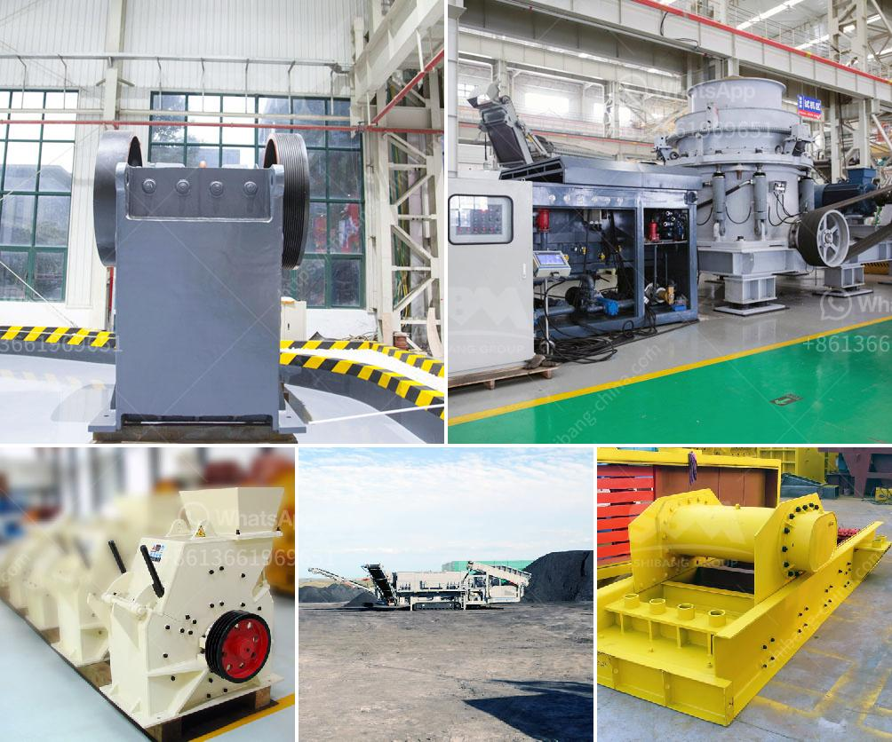

<h3>كسارة صخور الحجر الجيري</h3>
كسارة صخور الحجر الجيري هي آلة تقوم بسحق الحجر الجيري إلى قطع صغيرة مستخدمة في مجموعة متنوعة من التطبيقات الصناعية. يتم استخدام الحجر الجيري على نطاق واسع في البناء والصناعات الكيماوية والزراعية وغيرها من القطاعات. وتتم عملية سحق الحجر الجيري في الكسارة باستخدام آلية تتكون من مطرقة ثابتة ومطرقة متحركة. يتم سحق الحجر بفعل الضربات المتتالية للمطارق ، مما يؤدي إلى تحطيمه إلى قطع صغيرة.

تتميز الكسارة بالكفاءة العالية والقدرة العالية على سحق الحجارة الجيرية. فهي تقوم بسحق الصخور بسرعة وبتكلفة منخفضة نسبيًا. كما أن لديها القدرة على سحق الحجارة إلى قطع صغيرة بحجم محدد وفقًا لاحتياجات المشروع أو التطبيق المحدد. يتم استخدام الحجر الجيري المسحوق في صنع الأسمنت وفي صناعة الحديد والصلب والزجاج والكيماويات وغيرها من الصناعات.

تتوفر الكسارات الجيرية بمختلف الأحجام والقدرات ويتم اختيار النوع المناسب بناءً على حجم الحجر الجيري الذي سيتم سحقه واحتياجات المشروع. يمكن أن تكون الكسارات صغيرة المقاس ومناسبة للمشروعات الصغيرة والمتوسطة ، بينما تكون الكسارات الأكبر الحجم أكثر مناسبة للمشروعات الكبيرة.

بالإضافة إلى ذلك ، تعتبر الكسارة الجيرية أداة مهمة لاستخراج الحجر الجيري من المحاجر. يتم استخدام المعدات الثقيلة مثل الشاحنات والحفارات لاستخراج الحجر الجيري وتفجيره بالديناميت. ثم يتم نقل الحجر الجيري إلى الكسارة حيث يتم سحقه وتحويله إلى منتج قابل للاستخدام في العمليات الصناعية المختلفة.

باختصار ، تعد كسارة صخور الحجر الجيري جزءًا أساسيًا من صناعات البناء والتشييد. فهي تقوم بسحق الحجر الجيري إلى قطع صغيرة مستخدمة في مجموعة واسعة من التطبيقات الصناعية. وبفضل كفاءتها العالية وقدرتها على سحق الحجارة بسرعة وبتكلفة منخفضة ، فإن الكسارة الجيرية تلبي احتياجات العديد من الصناعات والمشاريع المختلفة.
<h3>Contact us</h3><ul><li><strong>Whatsapp:&nbsp;<a href="https://wa.me/8613661969651">+8613661969651</a></strong></li><li><a href="https://swt.shibang-china.com/?git&amp;zhl&amp;كسارة صخور الحجر الجيري"><strong>Online Service(chat now)</strong></a></li></ul><h3>Related</h3><ul><li><a href='كسارة فك محمولة في المملكة العربية السعودية.md'>كسارة فك محمولة في المملكة العربية السعودية</a></li><li><a href='مصنع معالجة للبيع في جنوب أفريقيا.md'>مصنع معالجة للبيع في جنوب أفريقيا</a></li><li><a href='مصنعي أحزمة الناقلات في بنجلاديش.md'>مصنعي أحزمة الناقلات في بنجلاديش</a></li><li><a href='رسم لآلات غسل الرمل كسارة مطحنة.md'>رسم لآلات غسل الرمل كسارة مطحنة</a></li><li><a href='كسارة الفك PE 150x250.md'>كسارة الفك PE 150x250</a></li></ul>