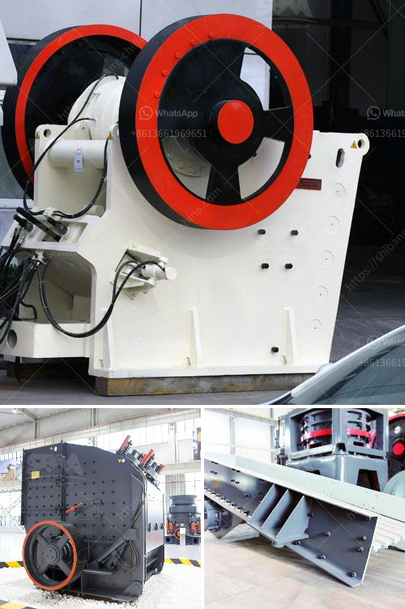

<h3>كسارة صخور صغيرة</h3>
تُعتبر كسارة الصخور الصغيرة من الأدوات الهامة في صناعة البناء والتشييد. فهي عبارة عن آلة تُستخدم لتحطيم الصخور الكبيرة إلى قطع صغيرة من الصخور المكسرة، وتُستخدم بشكل رئيسي في عمليات البناء والتشييد وتصنيع الركام المستخدم في الخرسانة.

تأتي الكسارة الصغيرة بأحجام مختلفة، وتتراوح قدرتها الإنتاجية عادةً بين 200 و400 طن في الساعة. وتعتبر هذه الآلة مثالية للقطع الكبيرة من الصخور والمعادن العالية المقاومة، حيث تعمل بشكل فعال وفعالية لتحقيق القدرة القصوى للإنتاج والإنتاجية.

تعتمد عملية كسارة الصخور الصغيرة على آلية تكسير الصخور، حيث يتم إرسال الصخرة إلى فوهة الكسارة وعندما يصطدم الصخرة ب المطرقة الدوارة ، يتم تكسيرها إلى قطع صغيرة. ثم تمرون بعدة مراحل من الفرز والغربلة للتأكد من حصولنا على المنتج المطلوب.

تستخدم هذه الكسارات الصغيرة في عمليات البناء والتشييد مثل بناء الطرق والسدود والمباني. وتساعد في توفير الركام المستخدم في صناعة الخرسانة والأسفلت والبناء. كما تساهم في إعادة تدوير الصخور وتقليل الحاجة للموارد الطبيعية الجديدة.

تتميز كسارات الصخور الصغيرة بعدة مزايا، فهي آلات قوية وفعالة يمكن تشغيلها بشكل مستمر. كما أنها محمولة ومرنة في استخدامها، وتتيح إعادة استخدام المواد البنائية المكسرة، مما يقلل من التكاليف ويحافظ على البيئة.

تعد كسارة الصخور الصغيرة أداة مهمة في صناعة البناء والتشييد، حيث تساهم في تسريع عمليات البناء وتوفير الركام اللازم للمشاريع. بفضل تصميمها وأدائها القوي، فهي قادرة على معالجة مختلف أنواع الصخور الكبيرة بطريقة سريعة وفعالة.

وبالتالي، فإن استخدام كسارة الصخور الصغيرة يمثل حلاً مثاليًا للشركات والمقاولين الذين يحتاجون إلى تكسير الصخور الكبيرة بشكل منتظم وفي وقت قصير لإكمال مشاريع البناء بنجاح وفي الوقت المحدد.
<h3>Contact us</h3><ul><li><strong>Whatsapp:&nbsp;<a href="https://wa.me/8613661969651">+8613661969651</a></strong></li><li><a href="https://swt.shibang-china.com/?git&amp;zhl&amp;كسارة صخور صغيرة"><strong>Online Service(chat now)</strong></a></li></ul><h3>Related</h3><ul><li><a href='سعر كسارة الفحم القدرة.md'>سعر كسارة الفحم القدرة</a></li><li><a href='مصنع كسارة الحجر القديمة للبيع.md'>مصنع كسارة الحجر القديمة للبيع</a></li><li><a href='حجم كرات الطحن في مطحنة الكرة لطحن الكوارتز.md'>حجم كرات الطحن في مطحنة الكرة لطحن الكوارتز</a></li><li><a href='مصنع تحسين أكسيد النحاس في الصين.md'>مصنع تحسين أكسيد النحاس في الصين</a></li><li><a href='تحسين مصنع التكسير.md'>تحسين مصنع التكسير</a></li></ul>