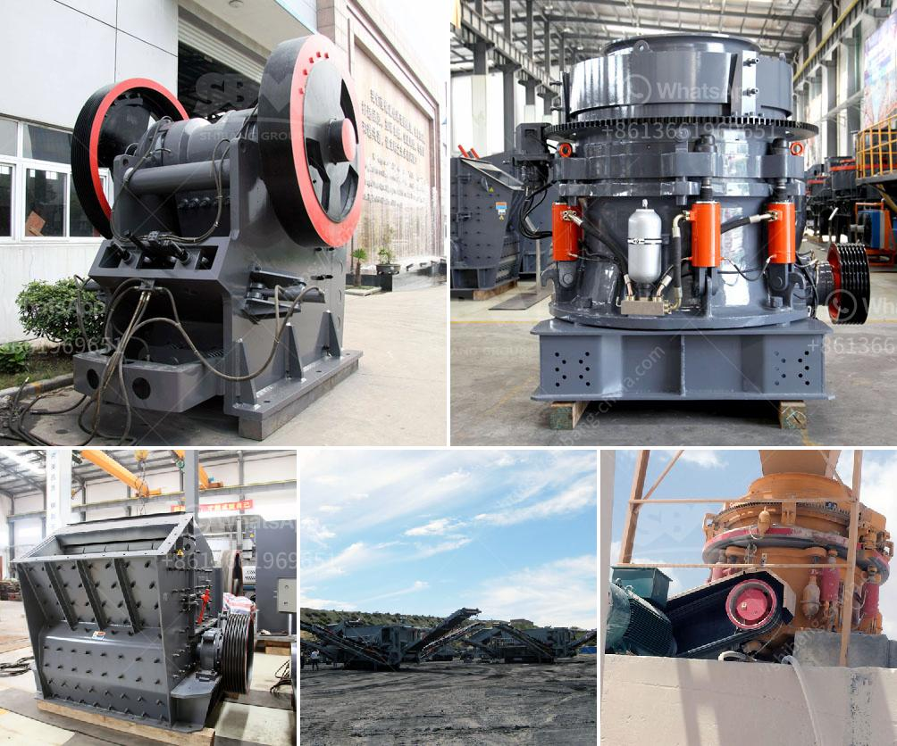

<h3>كسارة صخور محمولة صغيرة للسحق</h3>
تعد كسارة الصخور المحمولة صغيرة من الأدوات الهامة في صناعة التعدين والبناء. فهي تستخدم لسحق الصخور والحجارة الكبيرة إلى قطع صغيرة الحجم، مما يتيح إعادة استخدام هذه المواد في العديد من التطبيقات المختلفة. وسواء كنت تعمل في مشروع بناء صغير أو تعدين صخور أو حتى تنظيف حديقتك، فإن كسارة الصخور المحمولة صغيرة هي أداة لا يمكن الاستغناء عنها.

يتميز هذا النوع من الكسارات بحجمه الصغير ويسهولة نقله وتركيبه حيث يمكن نقلها بسهولة من مكان إلى آخر. بالإضافة إلى ذلك، يمكن للكسارة العمل بشكل مستقل وبدون الحاجة إلى توصيلها بالكهرباء المركزية، حيث تعمل بواسطة المحرك الديزل الذي يوفر الطاقة اللازمة لتشغيلها.

وتحظى كسارة الصخور المحمولة الصغيرة بشعبية كبيرة في عمليات البناء والتعدين الصغيرة وذلك بفضل قدرتها على سحق الصخور الصلبة والمواد الأخرى بدقة فائقة. تتميز هذه الكسارات بسرعة الإنتاج العالية وتكلفتها المنخفضة، مما يجعلها اختيارًا مثاليًا للمشاريع التي تتطلب كميات صغيرة من المواد المكسرة.

بالإضافة إلى ذلك، تأتي هذه الكسارات مجهزة بمجموعة من الملحقات، مثل أمشاط الفك وشاشة الغربال، مما يسهل اختيار الحجم المناسب للحصى والمواد الأخرى. يمكن أيضًا ضبط إعدادات الكسارة حسب الحاجة للحصول على قطع مكسرة بحجم محدد وفقًا لتوجيهات المشروع.

بالاعتماد على التصميم والمواصفات، يمكن أن تعمل كسارات الصخور المحمولة الصغيرة على مجموعة متنوعة من المواد، بما في ذلك الحصى والحجر الجيري والجرانيت والخرسانة والأسفلت والمعادن والعديد من المواد الأخرى.

في الختام، كسارة الصخور المحمولة الصغيرة هي أداة مهمة للعديد من الصناعات مثل التعدين والبناء. تتميز بحجمها الصغير وسهولة النقل والتركيب. كما تتيح لك سحق الصخور والحجارة بفعالية وبدقة عالية، مما يوفر لك المواد المكسرة للاستخدام في مجموعة متنوعة من التطبيقات المختلفة. بالنظر إلى فوائدها ومرونتها، يعد استخدام كسارة الصخور المحمولة الصغيرة اختيارًا رائعًا لكل من المشاريع الصغيرة والكبيرة.
<h3>Contact us</h3><ul><li><strong>Whatsapp:&nbsp;<a href="https://wa.me/8613661969651">+8613661969651</a></strong></li><li><a href="https://swt.shibang-china.com/?git&amp;zhl&amp;كسارة صخور محمولة صغيرة للسحق"><strong>Online Service(chat now)</strong></a></li></ul><h3>Related</h3><ul><li><a href='تكلفة عند استخدام كسارة الحجر.md'>تكلفة عند استخدام كسارة الحجر</a></li><li><a href='أنواع كسارة الحصى.md'>أنواع كسارة الحصى</a></li><li><a href='إعداد وحدة طحن الأسمنت بسعة 100 طن يوميًا.md'>إعداد وحدة طحن الأسمنت بسعة 100 طن يوميًا</a></li><li><a href='كسارة الحجر المستعملة للبيع في زيمبابوي.md'>كسارة الحجر المستعملة للبيع في زيمبابوي</a></li><li><a href='كسارات حجر مستعملة للبيع.md'>كسارات حجر مستعملة للبيع</a></li></ul>