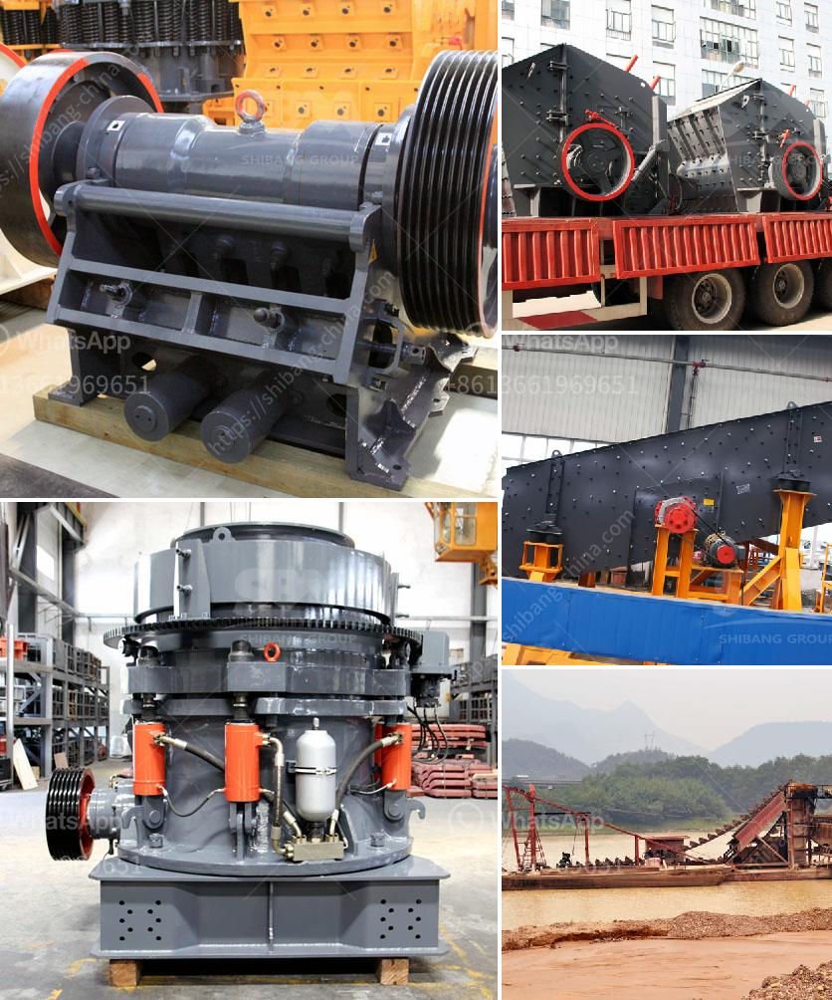

<h3>كسارة صخور محمولة صغيرة</h3>
تعتبر كسارات الصخور المحمولة الصغيرة من الآلات المهمة في صناعة التعدين والبناء، حيث تستخدم لسحق الصخور الكبيرة إلى قطع صغيرة مناسبة للاستخدام المستقبلي. تتميز هذه الكسارات بسهولة النقل والتركيب، حيث يمكن نقلها بسهولة من موقع لآخر وتركيبها بسرعة بدون الحاجة إلى معدات خاصة.

تعتبر كسارات الصخور المحمولة الصغيرة الخيار الأمثل للمشاريع الصغيرة والمواقع ذات المساحة المحدودة. فبدلاً من الاعتماد على كسارات الحجارة الكبيرة والثقيلة التي تتطلب المزيد من المساحة والوقت والطاقة للتركيب، يمكن استخدام الكسارات المحمولة الصغيرة لإنجاز المهمة بكفاءة وسرعة. كما أنها تعتبر الخيار الأمثل للمشروعات التي تحتاج إلى تكسير الصخور في مواقع متعددة، حيث يمكن نقل الكسارة بسهولة من موقع لآخر بدون الحاجة إلى تكرار تركيبها.

تتكون الكسارات المحمولة الصغيرة من وحدات متكاملة تحتوي على المطرقة الداخلية وطاحونة الفك ووحدة التغذية والحزام الناقل. تعمل الكسارة على سحق الصخور بواسطة ضربات الطرق السريعة والتكسر بواسطة المطرقة الداخلية، حيث تتحول الصخور الكبيرة إلى قطع صغيرة وسهلة التناول. تتميز الكسارات المحمولة الصغيرة بقدرتها على معالجة مجموعة متنوعة من الصخور، بما في ذلك الحجارة الجيرية والجرانيت والرخام والحصى والحجر الجيري.

بالإضافة إلى ذلك، تتميز الكسارات المحمولة الصغيرة بالعديد من المزايا الأخرى. فهي تتمتع بحجم صغير ووزن خفيف، مما يسهل عملية النقل والتركيب، كما أنها تستهلك كمية قليلة من الوقود والطاقة، مما يوفر التكاليف ويحمي البيئة. وبفضل تقنيات التحكم الحديثة، يمكن ضبط الكسارة لتلبية الاحتياجات المحددة، مما يزيد من كفاءتها وجودة الإنتاج.

باختصار، تعتبر كسارات الصخور المحمولة الصغيرة خيارًا مثاليًا للمشاريع الصغيرة والمواقع ذات المساحة المحدودة. توفر هذه الكسارات القدرة على تكسير الصخور بكفاءة وسرعة وتوفر عملية نقل تركيب مبسطة. كما أنها تتميز بالعديد من المزايا الأخرى مثل توفير الوقود وحماية البيئة والقدرة على التحكم في الإنتاج. بالنظر إلى هذه المزايا، يمكن القول إن كسارات الصخور المحمولة الصغيرة تعتبر استثمارًا مجديًا وفعالًا في صناعة التعدين والبناء.
<h3>Contact us</h3><ul><li><strong>Whatsapp:&nbsp;<a href="https://wa.me/8613661969651">+8613661969651</a></strong></li><li><a href="https://swt.shibang-china.com/?git&amp;zhl&amp;كسارة صخور محمولة صغيرة"><strong>Online Service(chat now)</strong></a></li></ul><h3>Related</h3><ul><li><a href='كسارة تأثير خام الحديد المتنقلة في الهند.md'>كسارة تأثير خام الحديد المتنقلة في الهند</a></li><li><a href='مطحنة رمل مستعملة في هولندا.md'>مطحنة رمل مستعملة في هولندا</a></li><li><a href='المعدات المطلوبة لعمل محجر الجرانيت.md'>المعدات المطلوبة لعمل محجر الجرانيت</a></li><li><a href='مصانع غسيل الفحم المستخدمة للبيع في الهند.md'>مصانع غسيل الفحم المستخدمة للبيع في الهند</a></li><li><a href='مطاحن الكرة في ماليزيا.md'>مطاحن الكرة في ماليزيا</a></li></ul>