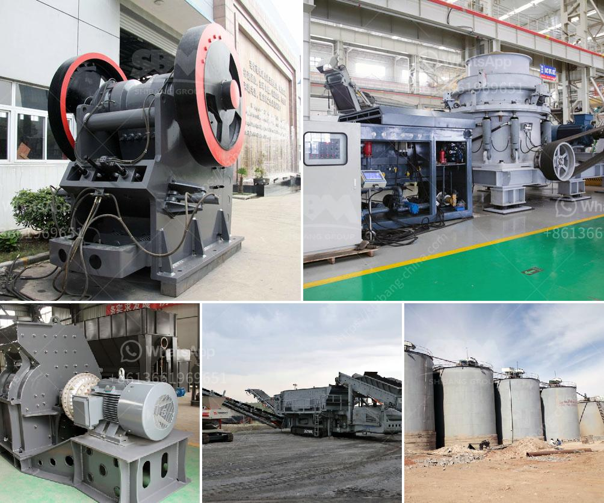

<h3>كسارة صخور محمولة مستعملة في كندا</h3>
تلعب كسارات الصخور دورًا حاسمًا في صناعة التعدين والبناء. تعتبر كندا واحدة من الدول الرائدة في هذه الصناعة، حيث تتمتع بموارد طبيعية غنية من الصخور والمعادن. وبشكل تحديد، يستخدم الكنديون كسارات الصخور المحمولة المستعملة لتحقيق عمليات كسر وتكسير الصخور.

كسارة الصخور المحمولة هي نوع من المعدات الثقيلة التي تُثبت على مقطورة أو شاحنة ويمكن نقلها بسهولة من موقع لآخر. سواء كنت بحاجة إلى سحق الصخور الصلبة أو الحجارة أو حتى أنقاض البناء، فإن الكسارات المحمولة هي الحل الأمثل لتلبية احتياجاتك. توفر هذه الأجهزة القوة والكفاءة المطلوبة لتحطيم الصخور الصلبة بسرعة وفعالية.

في كندا، يتم استخدام الكسارات المحمولة المستعملة بشكل واسع بسبب الفوائد العديدة التي توفرها. أولاً، فإن شراء كسارة جديدة قد يكون مكلفًا للغاية، خاصة عندما تكون شركات التعدين أو البناء تفضل تخفيض التكاليف قدر الإمكان. بالتالي، يعد شراء كسارة مستعملة بديلاً مثاليًا وبأسعار معقولة. بالإضافة إلى ذلك، يتيح الكسارات المحمولة المستعملة تقليل البيئة البيروقراطية، حيث يمكن المصادقة عليها بسهولة من قبل الجهات الرقابية الحكومية.

بينما يتوفر عدد كبير من الكسارات المحمولة المستعملة في السوق الكندية، لا يزال من المهم الانتباه لبعض الجوانب الرئيسية أثناء الشراء. نوعية الكسارة، وعمرها، وكفاءتها وقوتها يجب أن تكون العوامل الأساسية التي يجب النظر فيها. إجراء فحص ميكانيكي شامل ومعرفة سجل الصيانة للجهاز هي خطوات حاسمة للتأكد من أن الكسارة النمطية المحمولة ستكون قادرة على الأداء بشكل جيد لفترة أطول.

تتوفر الكسارات المحمولة المستعملة في المدى السعري من 200 إلى 400 كلمة في العديد من متاجر المعدات الثقيلة المختصة. يمكن للمشترين المهتمين الحصول على صفقات مذهلة من خلال البحث والمقارنة بين العروض المتاحة. قم بزيارة المواقع عبر الإنترنت، أو اتصل بالشركات المحلية التي تبيع هذه المعدات للحصول على معلومات أكثر تفصيلًا وللتحقق من توفر هذه الكسارات المحمولة المستعملة.

في النهاية، يمكن القول إن الكسارة الصخور المحمولة المستعملة هي اختيار مثالي لتلبية احتياجات التعدين والبناء في كندا. بفضل تكلفتها المعقولة وفعاليتها في تحطيم الصخور، فإنها تعتبر حلاً اقتصاديًا وعمليًا للمشاريع المختلفة في هذا القطاع. إذا كنت في حاجة إلى كسارة صخور محمولة في كندا، فلا تتردد في مراجعة العروض المتاحة واختيار الجهاز الأفضل بالنسبة لك.
<h3>Contact us</h3><ul><li><strong>Whatsapp:&nbsp;<a href="https://wa.me/8613661969651">+8613661969651</a></strong></li><li><a href="https://swt.shibang-china.com/?git&amp;zhl&amp;كسارة صخور محمولة مستعملة في كندا"><strong>Online Service(chat now)</strong></a></li></ul><h3>Related</h3><ul><li><a href='مصانع تكسير الفك في المملكة العربية السعودية.md'>مصانع تكسير الفك في المملكة العربية السعودية</a></li><li><a href='أنواع الكسارات المستخدمة في التعدين pdf.md'>أنواع الكسارات المستخدمة في التعدين pdf</a></li><li><a href='موردين معدات سحق السيليكا.md'>موردين معدات سحق السيليكا</a></li><li><a href='شاشات الفحم المتنقلة.md'>شاشات الفحم المتنقلة</a></li><li><a href='قشارة وكسارة متعددة الوظائف في الصين.md'>قشارة وكسارة متعددة الوظائف في الصين</a></li></ul>