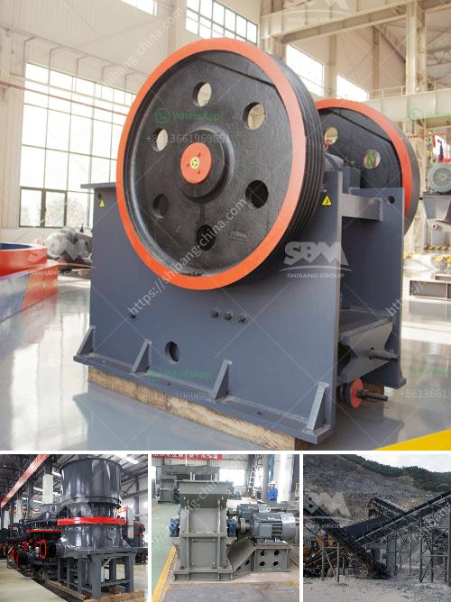

<h3>كسارة صخور مصنوعة يدوياً</h3>
تعد الكسارة اليدوية للصخور واحدة من الأدوات المهمة في صناعة البناء والتشييد. فهي تستخدم لسحق الصخور وتحويلها إلى قطع صغيرة من الركام، وذلك بهدف استخدامها في بناء المباني والطرق والجسور وغيرها من المشاريع الإنشائية.

تتكون هذه الكسارة اليدوية من عدة أجزاء أساسية، بما في ذلك مقبض طويل وقاعدة صلبة وفكين متحركين. يتم إدخال الصخور الكبيرة في الفك العلوي ويتم سحقها بواسطة حركة الفك السفلي، الذي يعمل عن طريق المقبض الطويل. يتم توجيه القوة للتركيز على النقاط الرئيسية في الصخرة من أجل تحقيق الكسر والتحطيم.

يمكن استخدام الكسارة اليدوية لمجموعة متنوعة من أنواع الصخور، بما في ذلك الجرانيت والحجارة الرملية والحجر الجيري وغيرها. كما يمكن استخدامها لكسر المواد الخام الصلبة مثل الحديد والنحاس والذهب وغيرها، حيث يمكن تحويل هذه المواد إلى القطع الصغيرة واستخدامها في صناعات أخرى.

من الجوانب الإيجابية للكسارة اليدوية أنها سهلة الاستخدام ومحمولة، مما يسهل نقلها واستخدامها في أي مكان. وقد تم تصميمها بطريقة تجعل عملية التحميل والتفريغ سهلة وآمنة، مما يقلل من مخاطر التعرض للإصابات أثناء العمل.

وعلى الرغم من أن استخدام الكسارة اليدوية يتطلب بعض الجهد البدني، إلا أنها تعتبر بديلاً رخيصًا وفعالًا للكسارات الكهربائية أو الهيدروليكية التي تحتاج إلى مصدر طاقة خارجي. وبالتالي، فإن استخدام الكسارة اليدوية يساهم في تقليل تكلفة البناء ويزيد من الكفاءة والإنتاجية.

باختصار، تعتبر الكسارة اليدوية للصخور أداة أساسية في صناعة البناء والتشييد. فهي تقوم بتحويل الصخور الكبيرة إلى قطع صغيرة من الركام التي يمكن استخدامها في العديد من المشاريع الإنشائية. وبفضل سهولة الاستخدام والتنقل، فإن الكسارة اليدوية توفر حلاً فعالًا وبأسعار معقولة لتحطيم الصخور بطريقة آمنة وفعالة.
<h3>Contact us</h3><ul><li><strong>Whatsapp:&nbsp;<a href="https://wa.me/8613661969651">+8613661969651</a></strong></li><li><a href="https://swt.shibang-china.com/?git&amp;zhl&amp;كسارة صخور مصنوعة يدوياً"><strong>Online Service(chat now)</strong></a></li></ul><h3>Related</h3><ul><li><a href='مصنع تكسير وفحص الكسارة.md'>مصنع تكسير وفحص الكسارة</a></li><li><a href='أسعار مطاحن المطرقة في الرأس الشرقي.md'>أسعار مطاحن المطرقة في الرأس الشرقي</a></li><li><a href='سحق الحجر الأسود تايلاند.md'>سحق الحجر الأسود تايلاند</a></li><li><a href='مصنع كسارة 150 طن في الساعة.md'>مصنع كسارة 150 طن في الساعة</a></li><li><a href='معدات تعدين مستخدمة.md'>معدات تعدين مستخدمة</a></li></ul>