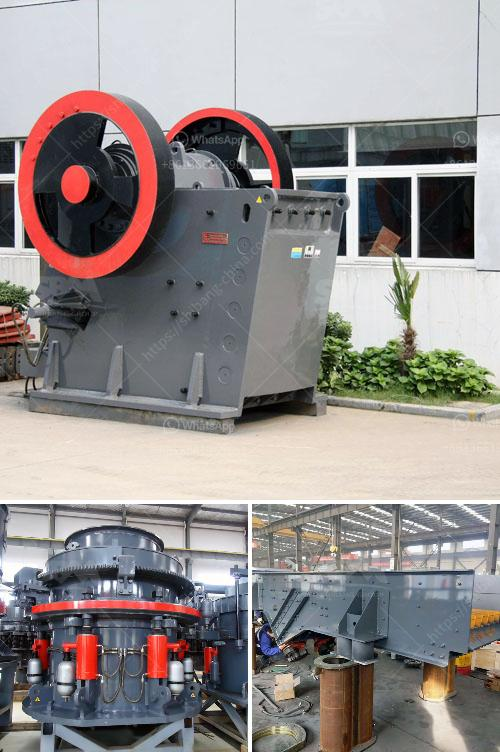

<h3>كسارة صخور وشاشات في الفلبين</h3>
في الفلبين، تعتبر كسارات الصخور والشاشات من أبرز الصناعات التي تلعب دورًا حيويًا في تطوير البنية التحتية والإنشاءات في البلاد. تساهم هذه الصناعة في توريد وتصنيع المواد الأساسية للبناء والبنى التحتية، وتعتبر عنصرًا أساسيًا للاقتصاد الفلبيني. في هذه المقالة، سنلقي الضوء على أهمية كسارات الصخور والشاشات في الفلبين.

تعد كسارات الصخور من ركائز صناعة البناء والبنى التحتية في الفلبين. هذه الكسارات تقوم بصنع الحصى والرمل والصخور المكسرة، التي تستخدم في البناء والأغراض الصناعية الأخرى. كما أنها تساعد في تلبية الطلب المتزايد على المواد الخام في البناء والبنية التحتية في البلاد. القدرة على توفير مواد البناء المحلية المصنعة يزيد بشكل كبير من الكفاءة ويقلل من تكلفة البناء. وبالتالي، فإن استخدام موارد محلية يساعد في تحقيق الاستدامة البيئية والاقتصادية في الفلبين.

من الجوانب الأخرى، تلعب شاشات الفلتر مثل شاشات الاهتزاز دورًا حاسمًا في صناعة التعدين في الفلبين. تستخدم هذه الشاشات لفصل وغربلة المواد، مما يسمح بفصل المواد الصالحة للاستخدام والقيمة عن المواد الأخرى. بدون هذه الشاشات، ستكون صعوبة تنقية المواد وتحديد الجودة وإزالة الشوائب كبيرة جدًا. لذلك، فإن استخدام الشاشات يزيد من فعالية عمليات التعدين وتقليل النفايات، مما يساهم في تحقيق الاستدامة البيئية.

تعتبر صناعة كسارات الصخور والشاشات مصدرًا رئيسيًا للوظائف في الفلبين. فهي تعمل على توفير العديد من الفرص العمل المباشر وغير المباشر. يعمل العديد من العمال في عمليات التعدين والإنتاج والصيانة، وأخرون في مجالات المبيعات والإدارة والأعمال الهندسية. تعتبر هذه الوظائف أساسية في تنمية الكفاءة وتعزيز القدرة التصنيعية للبلاد.

ومع ذلك، تنبعث بعض المخاوف البيئية مع النمو المتسارع لهذه الصناعة. فالنقل والتشغيل الكبير وتراكم النفايات يمكن أن يتسبب في تلوث الهواء والمياه. لذا، ينبغي على الحكومة والشركات أن تكون على استعداد لتنفيذ التدابير البيئية للحد من التأثير السلبي على البيئة والمحافظة على صحة العاملين والمجتمعات المحلية.

بشكل عام، يمكن القول إن صناعة كسارات الصخور والشاشات تلعب دورًا حيويًا في الفلبين. تلبي الطلب المتزايد على المواد الأساسية للبناء، وتعمل على دعم التنمية الاقتصادية وتوفير فرص العمل. ومع ذلك، يجب أن تتضمن هذه الصناعة اهتمامًا بالمسؤولية البيئية وتطبيق أفضل الممارسات للحد من التأثير على البيئة وصحة الناس.
<h3>Contact us</h3><ul><li><strong>Whatsapp:&nbsp;<a href="https://wa.me/8613661969651">+8613661969651</a></strong></li><li><a href="https://swt.shibang-china.com/?git&amp;zhl&amp;كسارة صخور وشاشات في الفلبين"><strong>Online Service(chat now)</strong></a></li></ul><h3>Related</h3><ul><li><a href='كسارة محمولة في ماليزيا.md'>كسارة محمولة في ماليزيا</a></li><li><a href='كيفية إعداد شركة محجر حجر.md'>كيفية إعداد شركة محجر حجر</a></li><li><a href='مصنع غسيل الرمل 50 طن في الساعة.md'>مصنع غسيل الرمل 50 طن في الساعة</a></li><li><a href='مصنع تكسير الصدم.md'>مصنع تكسير الصدم</a></li><li><a href='مصنع كسارة 150 طن في الساعة.md'>مصنع كسارة 150 طن في الساعة</a></li></ul>