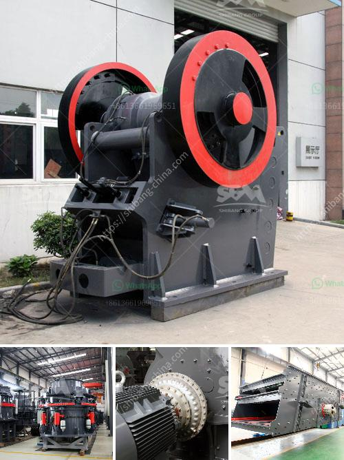

<h3>كسارة صغيرة متنقلة للحصى</h3>
تعد الكسارات المتنقلة للحصى ذات الحجم الصغير أداة ضرورية في صناعة البناء والهندسة المدنية. تستخدم هذه الكسارات في سحق وتفتيت الحصى إلى أحجام مختلفة، مما يسهل استخدامها في مجموعة من التطبيقات المختلفة مثل بناء الطرق والجسور والمباني.

تمتاز الكسارات المتنقلة للحصى بأنها صغيرة الحجم وقابلة للنقل بسهولة. يتم نقلها بواسطة الشاحنات أو المقطورات إلى الموقع المطلوب وتركيبها بسرعة. يمكن تشغيلها في وقت قصير بعد التركيب والتصحيح، مما يعني أنها تساهم في تقليل وقت التشغيل وتحسين الكفاءة.

تتميز الكسارات المتنقلة للحصى بأداء قوي وقدرة عالية على سحق الحصى. تعمل بواسطة محركات كهربائية أو محركات ديزل، وتستخدم نظامًا هيدروليكيًا لتحريك الأجزاء المتحركة. تعمل بواسطة صندوق التروس وتقوم بسحق الحصى بواسطة الفك المتحرك والفك الثابت. تتميز بقابلية التحكم في حجم الحصى المفتت وفقًا لاحتياجات المشروع.

تتميز الكسارات المتنقلة للحصى أيضًا بسهولة الصيانة والاستخدام. يتم تعيين فترة صيانة دورية لضمان أداء الكسارة بكفاءة. تحتاج الكسارات المتنقلة للحصى إلى تنظيف وتزييت منتظم للأجزاء المتحركة واستبدال قطع الغيار المتآكلة. بالإضافة إلى ذلك، يعد استخدام الكسارة بسيطًا وآمنًا، حيث تعمل بواسطة الضغط على زر أو تحريك مقبض للتحكم في عمليات السحق.

تعتبر الكسارات المتنقلة للحصى حلا مثاليا للمشاريع الصغيرة والوسطى والمواقع التي تتطلب تكسير الحصى في مكان واحد. بفضل قدرتها على النقل السهل والتشغيل البسيط، توفر هذه الكسارات الراحة والكفاءة. إنها توفر أيضًا تكلفة أقل مقارنة بالكسارات الثابتة، حيث لا يلزم الاستثمار في بنية أو أرضية دائمة للتركيب.

باختصار، الكسارات المتنقلة للحصى ذات الحجم الصغير هي أداة قوية وفعالة في صناعة البناء. تلبي هذه الكسارات الاحتياجات المحددة للمشاريع الصغيرة والمتوسطة، مما يجعلها حلا مثاليا لجميع العمليات التي تتطلب سحق وتفتيت الحصى. تأتي بقابلية نقل وتركيب سريعة، وتتميز بأداء عالي وصيانة بسيطة، وتوفر تكلفة أقل.
<h3>Contact us</h3><ul><li><strong>Whatsapp:&nbsp;<a href="https://wa.me/8613661969651">+8613661969651</a></strong></li><li><a href="https://swt.shibang-china.com/?git&amp;zhl&amp;كسارة صغيرة متنقلة للحصى"><strong>Online Service(chat now)</strong></a></li></ul><h3>Related</h3><ul><li><a href='المعدات المطلوبة لتعدين الذهب على نطاق واسع.md'>المعدات المطلوبة لتعدين الذهب على نطاق واسع</a></li><li><a href='معدات غسيل الذهب.md'>معدات غسيل الذهب</a></li><li><a href='البحث عن آلات معالجة الكاولين.md'>البحث عن آلات معالجة الكاولين</a></li><li><a href='كسارة متنقلة صغيرة الخرسانة.md'>كسارة متنقلة صغيرة الخرسانة</a></li><li><a href='تكنولوجيا معالجة خام الباريت.md'>تكنولوجيا معالجة خام الباريت</a></li></ul>