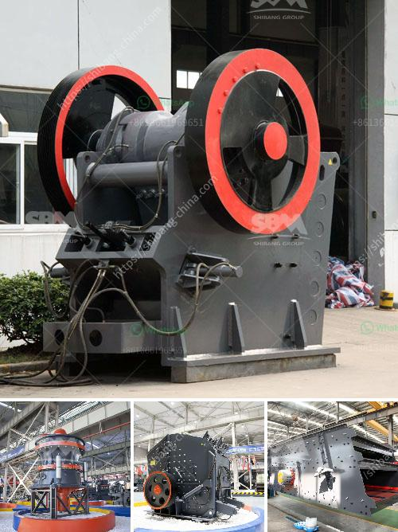

<h3>كسارة صناعية للبيع</h3>
تعتبر الكسارة الصناعية من الآلات الأساسية في صناعة التعدين والبناء. إنها تستخدم لكسر المواد الخام إلى قطع أصغر بحجم محدد. يتم استخدامها في العديد من الصناعات مثل صناعة الأسمنت، والحجر، والرمل، والزجاج، والفحم، والمعادن. وفي الوقت نفسه، يمكن استخدامها أيضًا لإعادة تدوير المواد القابلة لإعادة الاستخدام مثل الخرسانة والأنقاض.

إذا كنت تبحث عن كسارة صناعية للبيع، فإن هناك عدة جوانب يجب أخذها في الاعتبار. أولاً وقبل كل شيء، عليك أن تحدد نوع المواد التي ترغب في كسرها. فهذا سيساعدك في اختيار الكسارة المناسبة لاحتياجاتك. يوجد عدة أنواع من الكسارات مثل الفكية، والصدمية، والمخروطية، والأسطوانية. يختلف كل نوع في تصميمه وأداءه وسعة الإنتاج.

ثانيًا، يجب عليك أن تأخذ في الاعتبار حجم المواد التي تخطط لكسرها. بشكل عام، تتراوح قدرة الكسارات الصناعية بين 50 إلى 1000 طن في الساعة. لذا، يجب عليك اختيار الكسارة التي تناسب حجم المواد وسعة الإنتاج المطلوبة.

ثالثًا، يجب أن تتأكد من جودة الكسارة ومدى موثوقيتها. يفضل شراء الكسارة من شركة مشهورة وموثوق بها. قم بإجراء بحث مسبق حول الشركات المصنعة وقراءة تقييمات المستخدمين السابقين. يمكنك أيضًا الاستفسار من خبراء في هذا المجال أو الاطلاع على تقارير الاختبارات إذا كانت متاحة.

أخيرًا، لا تنسى أن تنظر في التكلفة المالية للكسارة. يجب أن تكون الكسارة التي تنوي شراؤها ذات قيمة جيدة للمال الذي ستنفقه. قارن بين الأسعار المختلفة المتاحة والخصائص والمزايا التي توفرها الكسارة لتجد الاختيار الأفضل بالنسبة لك.

باختصار، عند شراء كسارة صناعية للبيع، تحقق من نوع الكسارة، وحجم المواد التي تريد تكسيرها، وجودة الكسارة، والتكلفة المالية. قم بإجراء البحث اللازم واستفسر من الخبراء للحصول على أفضل اختيار يناسب احتياجاتك ومتطلباتك.
<h3>Contact us</h3><ul><li><strong>Whatsapp:&nbsp;<a href="https://wa.me/8613661969651">+8613661969651</a></strong></li><li><a href="https://swt.shibang-china.com/?git&amp;zhl&amp;كسارة صناعية للبيع"><strong>Online Service(chat now)</strong></a></li></ul><h3>Related</h3><ul><li><a href='مصنع غسيل الرمل 50 طن في الساعة.md'>مصنع غسيل الرمل 50 طن في الساعة</a></li><li><a href='سعر كسارة في موزمبيق.md'>سعر كسارة في موزمبيق</a></li><li><a href='مطاحن الذهب الصينية للبيع في جنوب أفريقيا.md'>مطاحن الذهب الصينية للبيع في جنوب أفريقيا</a></li><li><a href='آلة كسارة لصنع الرمل من الحجر.md'>آلة كسارة لصنع الرمل من الحجر</a></li><li><a href='مطحنة تعدين.md'>مطحنة تعدين</a></li></ul>