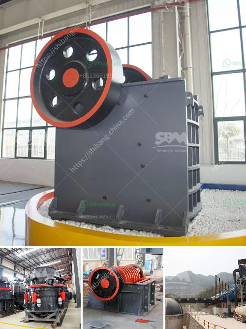

<h3>كسارة صناعية</h3>
تعتبر الكسارة الصناعية من الآلات والمعدات الهامة في عملية تكسير وطحن المواد الخام في مجالات عديدة مثل صناعة البناء والتعدين والتصنيع. تعتمد الكسارة الصناعية على مبدأ تكسير المواد بواسطة الضغط أو الصدمة لتقليل حجمها وتجهيزها للاستخدام في المراحل التالية للإنتاج.

تتكون الكسارة الصناعية من هيكل قوي يحتوي على مطارق أو لولبات تدور بسرعة عالية، وتقوم بتكسير المواد بواسطة الصدمة. المواد التي تراد تكسيرها تُركب تحت المطارق أو اللولبات أو تجرى من خلال فتحة الكسارة، وهذا يؤدي إلى تكسيرها وتقليل حجمها.

تتوفر الكسارة الصناعية في أحجام وقدرات مختلفة تتناسب مع أنواع وكميات المواد المراد تكسيرها. بعض الكسارات الصناعية الكبيرة يمكنها تكسير المواد بقوة تصل إلى عدة أطنان في الساعة، في حين أن الكسارات الأصغر يمكنها معالجة حجم أقل من المواد.

تتميز الكسارة الصناعية بعدة مزايا، فهي توفر عملية سريعة وفعالة لتكسير المواد وتحويلها إلى قطع أصغر بحجم محدد. كما أنها تتميز بسهولة الصيانة والتشغيل، وتوفر عمرًا طويلًا للجهاز إذا تم التعامل معه بطريقة صحيحة.

الكسارات الصناعية تستخدم في العديد من الصناعات. في صناعة البناء، تستخدم الكسارات الصناعية لتكسير الصخور والحجارة لتحضير الركام اللازم للخرسانة والأسفلت والأراضي الطينية، وتحسين خواصها الفيزيائية. بالإضافة إلى ذلك، تستخدم الكسارات الصناعية في صناعة التعدين لاستخراج وتجهيز المعادن والمواد الخام.

بالنظر إلى الأهمية الكبيرة للكسارة الصناعية في العديد من الصناعات، يجب اختيار الجهاز المناسب وفقًا لاحتياجات المشروع ومواصفات المواد التي تحتاج للتكسير. يجب أن يتم اختيار الكسارة الصناعية بعناية لضمان أداء عالي وجودة ممتازة للمواد المكسورة.

في النهاية، يمكن القول أن الكسارة الصناعية هي جهاز أساسي في صناعة التحميل والتكسير، وهي تلعب دورًا حيويًا في تحسين كفاءة العملية الإنتاجية وتقليل التكاليف. ومع استخدام التكنولوجيا المتطورة والتحسين المستمر في تصميم الكسارات الصناعية، يمكن تحقيق نتائج أفضل وأداء أفضل لعملية التكسير والطحن.
<h3>Contact us</h3><ul><li><strong>Whatsapp:&nbsp;<a href="https://wa.me/8613661969651">+8613661969651</a></strong></li><li><a href="https://swt.shibang-china.com/?git&amp;zhl&amp;كسارة صناعية"><strong>Online Service(chat now)</strong></a></li></ul><h3>Related</h3><ul><li><a href='طريقة فحص عمودية.md'>طريقة فحص عمودية</a></li><li><a href='كسارة الأسطوانة للبيع.md'>كسارة الأسطوانة للبيع</a></li><li><a href='مواصفات خام الكروم.md'>مواصفات خام الكروم</a></li><li><a href='معدات المحجر المملكة المتحدة.md'>معدات المحجر المملكة المتحدة</a></li><li><a href='مصانع معالجة الدولوميت من ألمانيا.md'>مصانع معالجة الدولوميت من ألمانيا</a></li></ul>