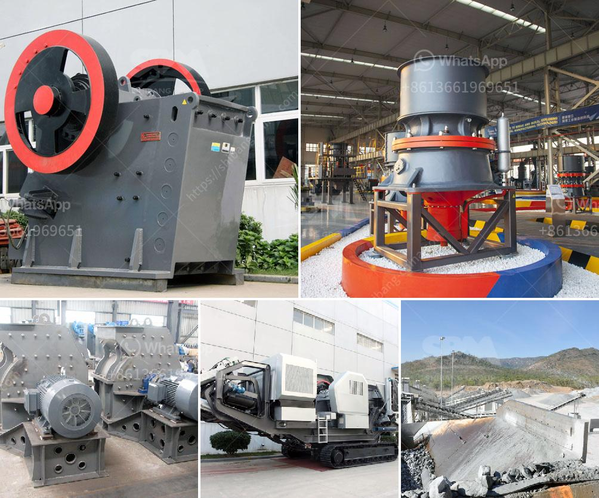

<h3>كسارة صنع الحصى</h3>
تعتبر كسارة صنع الحصى أداة أساسية في صناعة البناء والإنشاءات، حيث تقوم بسحق الصخور الكبيرة والحجارة الخشنة لتحويلها إلى حصى صغير قابل للإستخدام في العديد من التطبيقات. تتوفر هذه الكسارات بعدة أحجام وأنواع وقدرات مختلفة، لتناسب متطلبات الإنتاج المختلفة.

تعمل كسارة صنع الحصى عن طريق تغذية الحجارة إلى الجزء العلوي من الكسارة، حيث تمر عبر فتحة صغيرة ثم تتعرض للضرب والصدم من خلال طواحين الصلب الموجودة في داخلها. يتم سحق الحصى الكبير إلى حصى صغير يمكن استخدامه في مشاريع البناء المختلفة.

تتميز كسارة صنع الحصى بعدة مزايا، فهي قادرة على معالجة كميات كبيرة من الحجارة بسرعة وكفاءة. بالإضافة لذلك، تتميز بتوفير الجهد والوقت، حيث يتم انتاج الحصى بشكل أكثر فعالية مقارنة بالطرق التقليدية الأخرى. تعمل الكسارات الحديثة بكفاءة عالية وتستخدم تقنيات حديثة مثل التحكم بالكمبيوتر لتحسين جودة الإنتاج وتقليل التلوث البيئي.

تعد صناعة البناء والإنشاءات قطاعاً حيويًا في الاقتصاد، وتستخدم الحصى في العديد من التطبيقات مثل الأسفلت، الخرسانة، ومواد البناء الأخرى. بفضل وجود الكسارات الحديثة، يتم تلبية الطلب المتزايد على الحصى بشكل فعال ومستدام.

يجب مراعاة بعض النقاط الهامة عند استخدام كسارة صنع الحصى، فمثلاً يجب تحديد الحصى المناسب وفقًا للتطبيق المطلوب، وضبط إعدادات الكسارة بشكل صحيح لضمان جودة وحجم الحصى المنتج. كما يجب أيضًا أن يتم صيانة الكسارة بشكل منتظم للحفاظ على أداءها الأمثل واستدامتها بالطويل.

بالاختصار، تعتبر كسارة صنع الحصى أداة حيوية في صناعة البناء والإنشاءات، حيث تقوم بسحق الحصى وتحويله إلى مادة قابلة للاستخدام في العديد من التطبيقات المختلفة. بفضل تطور التكنولوجيا، أصبح بإمكان الكسارات الحديثة تلبية الطلب المتزايد على الحصى بشكل فعال ومستدام، مما يساهم في تطور صناعة البناء والإنشاءات على الصعيدين المحلي والعالمي.
<h3>Contact us</h3><ul><li><strong>Whatsapp:&nbsp;<a href="https://wa.me/8613661969651">+8613661969651</a></strong></li><li><a href="https://swt.shibang-china.com/?git&amp;zhl&amp;كسارة صنع الحصى"><strong>Online Service(chat now)</strong></a></li></ul><h3>Related</h3><ul><li><a href='معدات معالجة الجبس والكالسينيشن.md'>معدات معالجة الجبس والكالسينيشن</a></li><li><a href='آلات كسارة الحجر الكوارتز.md'>آلات كسارة الحجر الكوارتز</a></li><li><a href='صانع كسارة في مدينة سيبو.md'>صانع كسارة في مدينة سيبو</a></li><li><a href='مطحنة طحن الطين الصيني.md'>مطحنة طحن الطين الصيني</a></li><li><a href='المواصفات الفنية لمطحنة الكرة.md'>المواصفات الفنية لمطحنة الكرة</a></li></ul>