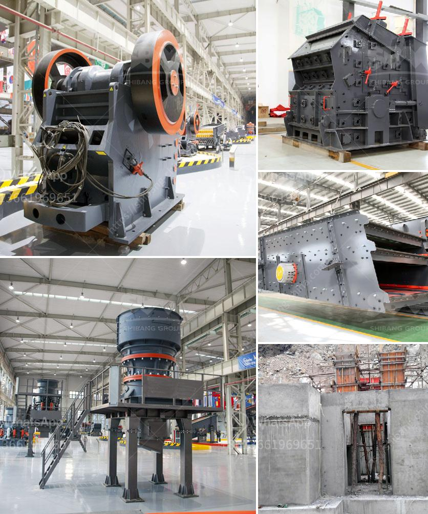

<h3>كسارة على أساس الإيجار في نيجيريا</h3>
كسارات الحجارة هي معدات هامة في صناعة البناء، حيث تستخدم لسحق الحجارة الكبيرة إلى قطع أصغر تستخدم في إنشاء الطرق، وإنتاج الخرسانة، وتشييد المباني. ومع زيادة الطلب على البنية التحتية والمشاريع الإنشائية في نيجيريا، أصبحت كسارات الحجارة على أساس الإيجار خيارًا شائعًا للشركات والمقاولين الذين يحتاجون إلى هذه المعدات دون الحاجة إلى شرائها.

تعتبر كسارات الحجارة على أساس الإيجار بديلاً اقتصاديًا وفعالًا عن شراء المعدات الثقيلة الخاصة بهذه العملية. فمن الصعب على الشركات الصغيرة والمتوسطة وحتى الكبيرة شراء وصيانة وتجديد كسارات الحجارة بأسعارها المرتفعة. وبالتالي، يصبح الإيجار خيارًا مثلى يساعد على تقليل التكاليف وتوفير الوقت والجهد.

تتوفر كسارات الحجارة على أساس الإيجار بمجموعة من الأحجام والسعات لتلبية متطلبات العملاء المختلفة. وبفضل تطور التكنولوجيا، أصبحت هذه الآلات قادرة على سحق الحجارة بسرعة وكفاءة عالية. كما تمتاز بالقوة والمتانة لتتحمل الظروف الصعبة في حقول الإنشاءات.

بجانب الاقتصادية، توفر كسارات الحجارة على أساس الإيجار العديد من المزايا الأخرى. فهي توفر مرونة أكبر للشركات والمقاولين، حيث يمكنهم استئجار المعدات لفترة زمنية محددة فقط عندما يكونون في حاجة إليها، وهذا يساعدهم على تجنب تجميع المعدات الغير مستخدمة وتكاليف التخزين.

علاوة على ذلك، توفر كسارات الحجارة على أساس الإيجار أيضًا الدعم الفني والصيانة المستمرة. فشركات الإيجار تهتم بإبقاء معداتها في حالة جيدة وعملية، وتقوم بالصيانة الدورية وإصلاح أي عطل يحدث. هذا يعني أن العملاء لا يحتاجون إلى القلق بشأن تكاليف الصيانة وإصلاح المعدات.

باختصار، تعتبر كسارات الحجارة على أساس الإيجار خيارًا مثلى في صناعة البناء في نيجيريا. فهي توفر الكفاءة والقوة والاقتصادية في نفس الوقت. ومع استمرار التطور والنمو في هذه الصناعة، يمكن توقع المزيد من الشركات التي توفر هذه الخدمة لتلبية الطلب المتزايد على كسارات الحجارة في البلاد.
<h3>Contact us</h3><ul><li><strong>Whatsapp:&nbsp;<a href="https://wa.me/8613661969651">+8613661969651</a></strong></li><li><a href="https://swt.shibang-china.com/?git&amp;zhl&amp;كسارة على أساس الإيجار في نيجيريا"><strong>Online Service(chat now)</strong></a></li></ul><h3>Related</h3><ul><li><a href='معدات تعدين مستخدمة.md'>معدات تعدين مستخدمة</a></li><li><a href='كسارة أسطوانية للحجر الجيري.md'>كسارة أسطوانية للحجر الجيري</a></li><li><a href='معدات إنتاج البازلت.md'>معدات إنتاج البازلت</a></li><li><a href='مخروط سحق 700 1000.md'>مخروط سحق 700 1000</a></li><li><a href='كسارة الفك في كينيا مصنعة.md'>كسارة الفك في كينيا مصنعة</a></li></ul>