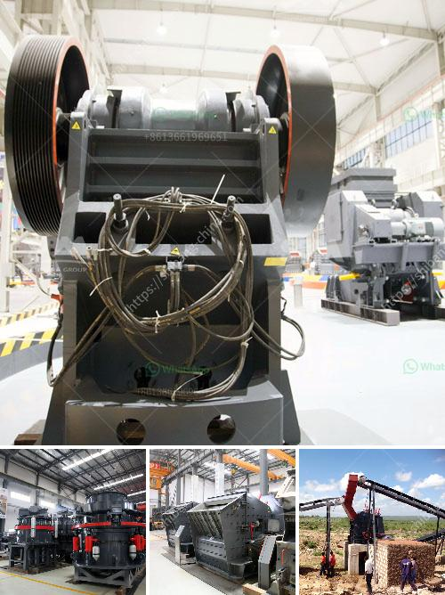

<h3>كسارة عمودية</h3>
الكسارة العمودية هي واحدة من الأدوات الهامة في صناعة التعدين والبناء. تعتبر هذه الكسارة من الأنواع المتقدمة التي تستخدم لطحن وتكسير المواد الخام بطريقة فعالة وسريعة.

تعدّ الكسارة العمودية مناسبة للعديد من المواد الخام المختلفة مثل الحجر الجيري والجرانيت والفحم والرمل والخبث والزجاج والبازلت والخرسانة المسلحة وغيرها الكثير. تتميز بالقوة والمرونة في التعامل مع هذه المواد وتحويلها إلى قطع صغيرة بحجم محدد للاستخدام النهائي.

تعمل الكسارة العمودية عن طريق الضغط والقوة المركزية التي يتم توجيهها إلى المادة الخام. تحتوي الكسارة على غرفة تكسير محورية تتحرك بسرعة عالية، وعندما يتم إطلاق المادة الخام في الكسارة، تتأثر بقوة الجاذبية والضغط وتتم تكسيرها وتفتتها.

تتميز الكسارة العمودية ببعض الميزات الفريدة، فهي توفر دورة تكسير مغلقة وفعالة، مما يقلل من هدر المواد ويزيد من كفاءة التكسير. كما أنها تنتج قطعًا صغيرة جداً تتناسب مع متطلبات البناء والتعدين المختلفة.

وبفضل تصميمها الخاص، فإن الكسارة العمودية تعمل بكفاءة عالية وبدون اهتزازات كبيرة أو ضوضاء مزعجة. توفر هذه الميزة بيئة عمل آمنة للعمال وتقلل من التأثير البيئي.

تتوفر الكسارة العمودية بمختلف الأحجام والقدرات، والتي تتراوح بين 200 إلى 400 طن في الساعة. يمكن استخدامها في المشاريع الصغيرة والكبيرة على حد سواء، لتلبية احتياجات الإنتاج المختلفة.

بشكل عام، الكسارة العمودية هي آلة ممتازة للطحن والتكسير في صناعة التعدين والبناء. تساعد في تحسين كفاءة العمل وتحقيق الإنتاجية العالية. لذا، فإنها تعتبر استثمارًا جيدًا للشركات والصناعات التي تحتاج إلى تكسير موادها الخام بسرعة وكفاءة.
<h3>Contact us</h3><ul><li><strong>Whatsapp:&nbsp;<a href="https://wa.me/8613661969651">+8613661969651</a></strong></li><li><a href="https://swt.shibang-china.com/?git&amp;zhl&amp;كسارة عمودية"><strong>Online Service(chat now)</strong></a></li></ul><h3>Related</h3><ul><li><a href='مطحنة فحم في ماليزيا.md'>مطحنة فحم في ماليزيا</a></li><li><a href='خدمات مصنع معالجة التعدين المحمول.md'>خدمات مصنع معالجة التعدين المحمول</a></li><li><a href='معدات تعدين في اليابان.md'>معدات تعدين في اليابان</a></li><li><a href='كسارة حجر ألمانية.md'>كسارة حجر ألمانية</a></li><li><a href='كسارات لآلة إعادة التدوير في الإمارات.md'>كسارات لآلة إعادة التدوير في الإمارات</a></li></ul>