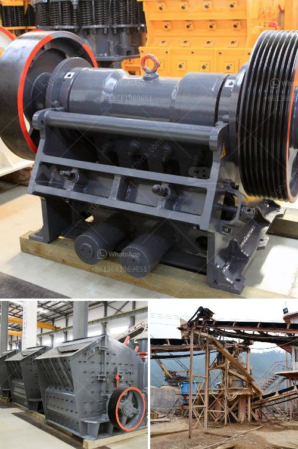

<h3>كسارة عينة صغيرة</h3>
تعتبر كسارة العينة الصغيرة أحد الأدوات المهمة في مجال الأبحاث العلمية والعمليات التحليلية في العديد من المجالات مثل الجيولوجيا والكيمياء وعلوم المواد. تستخدم هذه الكسارة لتحطيم وفصل العينات الكبيرة إلى أجزاء صغيرة قابلة للتحليل والتجزئة اللاحقة.

تتكون كسارة العينة الصغيرة عادةً من جهازين رئيسيين؛ الفك الثابت والفك المتحرك. يقوم الفك الثابت بالاحتفاظ بالعينة، في حين يتحرك الفك المتحرك بسرعة لتحطيم العينة الموضوعة بين الفكين. يعتمد نجاح العملية على قوة التحطيم والتشوه الناتج عنه.

تستخدم كسارة العينة الصغيرة بشكل رئيسي للعينات الصلبة مثل الصخور، والتربة المعدنية، والمواد الهندسية المتينة. بعد تحطيم العينة بواسطة الكسارة، يتم تحليل الحصى أو النقاط المتبقية باستخدام الطرق التحليلية المختلفة لتحديد خصائص وتركيب المادة. يمكن أن تستخدم الكسارة أيضاً لتحسين خواص العينة كتغيير حجم الحبيبات أو إضافة مواد أخرى لتحسين الخواص المرغوبة.

يتطلب استخدام كسارة العينة الصغيرة الحذر الكافي لتجنب أي ضرر للمستخدمين. يجب ارتداء قفازات ونظارات السلامة وملابس واقية لتجنب أي إصابات. كما يجب التأكد من ثبات العينة وتأمينها بشكل جيد لتفادي حوادث التواء أو انفصال العينة أثناء العملية.

بالإضافة إلى الاستخدام في المختبرات، يستفيد العديد من الصناعات من كسارة العينة الصغيرة أيضاً. تستخدم في الطرق والبناء لتحطيم الصخور الكبيرة قبل استخدامها في عمليات البناء. كما تستخدم أيضاً في صناعة الأسمنت والزجاج والمواد الكيميائية لتحطيم وفصل المواد قبل معالجتها بما يتوافق مع المعايير والمواصفات المطلوبة.

باختصار، تعد كسارة العينة الصغيرة أداة أساسية في العديد من المجالات والصناعات. تسهم في تحليل العينات ودراستها بشكل فعال، وتساهم أيضاً في تحسين الخواص المادية. لذا، تعتبر هذه الكسارات ضرورية لأي مختبر أو صناعة تقوم بالتحليل والتجهيز العيني.
<h3>Contact us</h3><ul><li><strong>Whatsapp:&nbsp;<a href="https://wa.me/8613661969651">+8613661969651</a></strong></li><li><a href="https://swt.shibang-china.com/?git&amp;zhl&amp;كسارة عينة صغيرة"><strong>Online Service(chat now)</strong></a></li></ul><h3>Related</h3><ul><li><a href='مصنعي آلات سحق النحاس في الصين.md'>مصنعي آلات سحق النحاس في الصين</a></li><li><a href='حساب تصميم مطحنة الكرة.md'>حساب تصميم مطحنة الكرة</a></li><li><a href='سير الناقل في زامبيا.md'>سير الناقل في زامبيا</a></li><li><a href='صناعة الحجر الجيري في الفلبين.md'>صناعة الحجر الجيري في الفلبين</a></li><li><a href='مطحنة الأسطوانة للحجر.md'>مطحنة الأسطوانة للحجر</a></li></ul>