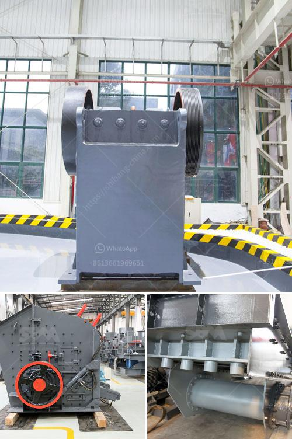

<h3>كسارة فك للبيع على موقع إيباي</h3>
كسارة الفك للبيع على موقع إيباي: توفر لك الجودة والفعالية

تعد كسارة الفك من أهم الأدوات المستخدمة في صناعة التعدين والبناء والصناعات الأخرى، حيث تستخدم لسحق وتكسير المواد الصلبة كالصخور والخامات المعدنية المختلفة. وبفضل تطور التكنولوجيا، أصبحت الكسارات الفكية متوفرة على العديد من المنصات التجارية عبر الإنترنت، بما في ذلك موقع إيباي.

عندما تبحث عن كسارة فكية للبيع على إيباي، فإنك سوف تجد تشكيلة واسعة من الخيارات والعروض الصاخبة التي قد تناسب احتياجاتك. تتنوع الكسارات الفكية المعروضة من حيث الموديلات والأحجام والمواصفات، لذا يتعين عليك تنظيف المعلومات ومراجعة الأداء للإشتراك في صفقة مربحة.

عند التسوق على إيباي، يجب أن تأخذ بعين الاعتبار بعض العوامل المهمة لضمان الحصول على كسارة الفك المناسبة لك. ففي المقام الأول، يجب أن تحديد الجودة المطلوبة للكسارة والمواصفات التقنية الضرورية لتنفيذ المهمة التي ترغب في تحقيقها. قد ترغب في التحقق من معدل إنتاجية الكسارة والطاقة المطلوبة لتشغيلها، وحجم المواد التي تمكنها من سحقها، وحجم الفتحة الفكية المتاحة لتحديد حجم الخرج. إضافة إلى ذلك، يمكن أن تكون العوامل الأخرى المهمة مثل السعر وصيانة الجهاز وشحنته إلى موقعك.

عندما تجد كسارة الفك التي تلبي احتياجاتك، يجب أن تستعرض ملف التوصيف المنشور على الموقع، فقد يوفر تفاصيل مهمة حول الحالة الفنية للجهاز وسبب البيع. بالإضافة إلى ذلك، من المفيد المشاهدة التوصيات والتعليقات التي تركها المشترين السابقين، فهذا يمنحك فكرة أفضل عن جودة المنتج ومدى رضا المشترين السابقين.

عندما تكون مستعدًا للشراء، يجب أن تقوم بتوجيه بعض الأسئلة إلى البائع للتأكد من أن المعلومات المذكورة صحيحة ومن أجل حصولك على خدمة ما بعد البيع المناسبة. من المهم أيضًا التواصل بشكل جيد مع البائع من خلال منصة إيباي، حيث يمكن طرح الأسئلة والاستفسارات وطلب عروض الأسعار الإضافية.

في الختام، يمكن القول بأن كسارة الفك تعتبر أداة هامة في العديد من الصناعات، وتوفر العديد من المواقع التجارية على الإنترنت فرصة متميزة للشراء، بما في ذلك موقع إيباي. عند التسوق عبر هذه المنصة، يجب أن تأخذ بعين الاعتبار العوامل المهمة وتبقى حذرًا واهتمامًا للحصول على كسارة فكية عالية الجودة وفعالة لتلبية احتياجاتك.
<h3>Contact us</h3><ul><li><strong>Whatsapp:&nbsp;<a href="https://wa.me/8613661969651">+8613661969651</a></strong></li><li><a href="https://swt.shibang-china.com/?git&amp;zhl&amp;كسارة فك للبيع على موقع إيباي"><strong>Online Service(chat now)</strong></a></li></ul><h3>Related</h3><ul><li><a href='صورة لمصنع معالجة رمل السيليكا.md'>صورة لمصنع معالجة رمل السيليكا</a></li><li><a href='البحث عن كسارة الحجر.md'>البحث عن كسارة الحجر</a></li><li><a href='حجم وقدرة كسارة الفك النموذجية.md'>حجم وقدرة كسارة الفك النموذجية</a></li><li><a href='أكبر معدات تحسين خام الحديد في الصين.md'>أكبر معدات تحسين خام الحديد في الصين</a></li><li><a href='صورة خط إنتاج الكلنكر الاسمنتي.md'>صورة خط إنتاج الكلنكر الاسمنتي</a></li></ul>