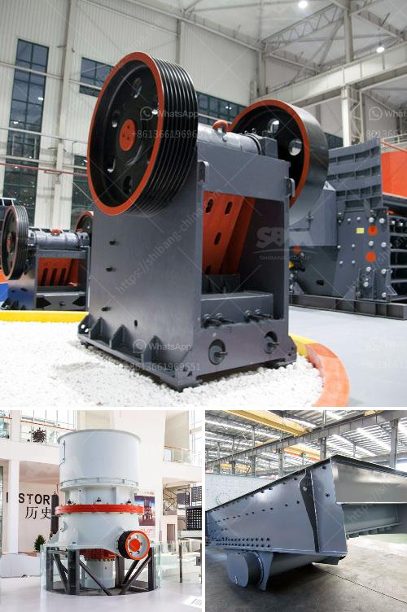

<h3>كسارة فك للبيع في الفيليبين</h3>
تعد الكسارات الفكية من أهم الأدوات المستخدمة في صناعة التعدين والبناء، وهي تساهم بشكل كبير في عمليات تقطيع وسحق الأحجار والصخور الكبيرة لتصبح قطع صغيرة، مما يسهل استخدامها في البناء والبناء وغيرها من الأغراض. وفي الفيليبين، يتم توفير العديد من الكسارات الفكية للبيع بأسعار تنافسية وجودة عالية.

تعد الكسارات الفكية جزءًا أساسيًا من صناعة التعدين والبناء في الفيليبين. تم تصميمها بشكل خاص لتكون قادرة على تحمل الأحجار والصخور الكبيرة وتحويلها إلى قطع صغيرة من الحجم المناسب. تحتوي هذه الكسارات على جا التكوين القدرة على فتح وإغلاق الفكين بشكل متتالي ، مما يسمح بتحطيم المادة المدخلة إلى حجم أصغر وتجهيزها للاستخدام في البناء وغيرها من الصناعات.

تتوفر العديد من الكسارات الفكية المستعملة للبيع في الفيليبين بأسعار تتراوح من 200 إلى 400 دولار. الأسعار تختلف بناءً على حالة الكسارة وعمرها وقدرتها على العمل. عند البحث عن كسارة فك للبيع ، يجب التركيز على معايير الجودة والاعتمادية والأداء. يجب أيضًا تحديد الاحتياجات الخاصة بك ، بما في ذلك القدرة على التحميل وحجم التغذية وحجم المخرج المطلوب.

يجب اختيار كسارة تتوافق مع مواصفاتك وتناسب احتياجاتك الخاصة. يمكنك أيضًا أن تستفسر عن الكسارات المستخدمة للبيع في السوق المحلية أو الاطلاع على مواقع الإنترنت المتخصصة التي توفر مجموعة واسعة من الكسارات الفكية للبيع في الفيليبين.

يمكن أن تكون الكسارات الفكية مفيدة في العديد من التطبيقات مثل التعدين والبناء والإنشاءات وغيرها. يمكن استخدامها لسحق الحجارة والصخور المختلفة مثل الجرانيت والحجر الجيري والرخام والحجر الرملي والفحم والحديد والنحاس والذهب والفضة والألماس وغيرها. كما تتميز الكسارات الفكية بسهولة الصيانة والتشغيل والاستخدام الأمثل للطاقة.

بالاختيار المناسب لكسارة الفك للبيع في الفيليبين ، ستتمكن من الاستفادة من العديد من المزايا والفوائد الهامة في صناعة التعدين والبناء. ستتمكن من زيادة إنتاجيتك وتقليل تكاليف العمل وتحسين جودة المنتج النهائي.
<h3>Contact us</h3><ul><li><strong>Whatsapp:&nbsp;<a href="https://wa.me/8613661969651">+8613661969651</a></strong></li><li><a href="https://swt.shibang-china.com/?git&amp;zhl&amp;كسارة فك للبيع في الفيليبين"><strong>Online Service(chat now)</strong></a></li></ul><h3>Related</h3><ul><li><a href='إنتاج مطحنة الأسمنت في أفريقيا.md'>إنتاج مطحنة الأسمنت في أفريقيا</a></li><li><a href='مصنع تكسير وفحص متنقل.md'>مصنع تكسير وفحص متنقل</a></li><li><a href='آلة طحن الطين المستخدمة للبيع.md'>آلة طحن الطين المستخدمة للبيع</a></li><li><a href='مورد لكسارة.md'>مورد لكسارة</a></li><li><a href='موردين مطحنة الأسطوانة الرأسية.md'>موردين مطحنة الأسطوانة الرأسية</a></li></ul>