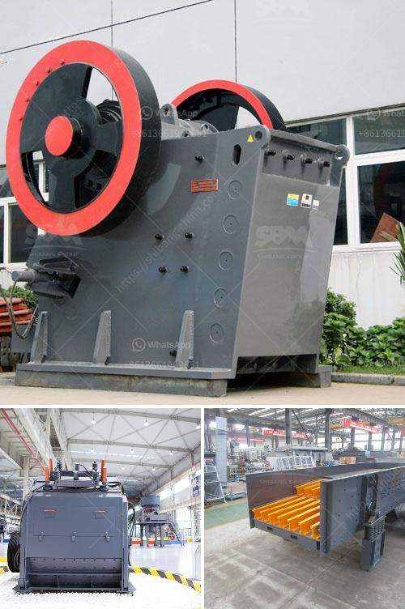

<h3>كسارة فك محمولة 30 × 42 للبيع</h3>
تعد الكسارة الفكية المحمولة 30 × 42 أحد أهم الأدوات المستخدمة في عمليات التكسير والفرز في صناعات البناء والتعدين. تتميز هذه الكسارة بقدرتها على سحق الصخور والمواد الخام بشكل فعال ودقيق لتحقيق الحبيبات المطلوبة.

تأتي هذه الكسارة بحجم 30 × 42، مما يعني أن الفك الثابت لها طول 30 بوصة والفك المتحرك له طول 42 بوصة. هذا الحجم الكبير يسمح بمعالجة كمية كبيرة من المواد في وقت واحد، مما يزيد من الإنتاجية ويقلل من وقت الانتظار والتوقفات غير المرغوب فيها.

تعمل الكسارة الفكية المحمولة بشكل سلس وسهل، حيث يتم توصيلها بواسطة محرك كهربائي. يمكن تشغيلها وتوجيهها بسهولة في الموقع، مما يجعلها مثالية للاستخدام في المواقع المؤقتة أو المشاريع التي تتطلب تحريك الكسارة من مكان إلى آخر.

بفضل التصميم المبتكر والمحمولية، فإن الكسارة الفكية 30 × 42 متعددة الاستخدامات وتتناسب مع الصخور المختلفة والمواد الخام. يمكن استخدامها في تكسير الحجارة والركام والصخور الصلبة والفحم ومواد التجديد والحصى وغيرها الكثير.

كما أن لها قدرة متقدمة على التحكم في الحجم، حيث يمكن ضبط فتحة الفك بحيث تنتج حبيبات مطلوبة بمقاسات محددة. يمنحك هذا الميزة القدرة على تلبية متطلباتك الدقيقة وتحقيق الجودة المطلوبة لمنتجك.

بخصوص السعر، تتوفر الكسارة الفكية المحمولة 30 × 42 للبيع بأسعار تتراوح بين 200 إلى 400 ألف دولار. يعتمد السعر على الحجم والمواصفات والميزات المختلفة التي تحتاجها لمشروعك الخاص.

في النهاية، فإن الكسارة الفكية المحمولة 30 × 42 هي عبارة عن أداة لا غنى عنها في صناعات البناء والتعدين. تتميز بقدرتها العالية على تكسير المواد وفرزها بدقة، مما يجعلها تستحق الاستثمار. إذا كنت بحاجة إلى كسارة قوية وفعالة، فإن الكسارة الفكية المحمولة 30 × 42 هي الخيار المثالي لك.
<h3>Contact us</h3><ul><li><strong>Whatsapp:&nbsp;<a href="https://wa.me/8613661969651">+8613661969651</a></strong></li><li><a href="https://swt.shibang-china.com/?git&amp;zhl&amp;كسارة فك محمولة 30 × 42 للبيع"><strong>Online Service(chat now)</strong></a></li></ul><h3>Related</h3><ul><li><a href='سعة آلة الكسارة 5 أطنان في الساعة.md'>سعة آلة الكسارة 5 أطنان في الساعة</a></li><li><a href='مطاحن الكرة للتعدين.md'>مطاحن الكرة للتعدين</a></li><li><a href='صناعة تكسير الحجر.md'>صناعة تكسير الحجر</a></li><li><a href='أنواع السيور الناقلة.md'>أنواع السيور الناقلة</a></li><li><a href='كسارة متنقلة في فيجي.md'>كسارة متنقلة في فيجي</a></li></ul>