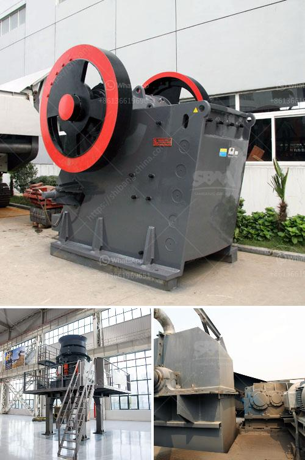

<h3>كسارة فك محمولة في المملكة العربية السعودية</h3>
تعتبر كسارات الفك المحمولة أحدث التقنيات المستخدمة في صناعة التعدين والبناء في المملكة العربية السعودية وجميع أنحاء العالم. تعمل هذه الكسارات على سحق الصخور الكبيرة والمواد الصلبة الأخرى في جزيئات صغيرة بحجم مطلوب. تتميز هذه الكسارات بالقدرة على تشغيلها ونقلها بسهولة في موقع العمل، حيث يمكن نقلها بسهولة على عجلات أو تأجيرها لترحيلها بواسطة الشاحنات.

تضمن الكسارات الفك المحمولة تحرير العمل البشري من العديد من المشاكل المرتبطة بتشغيل الكسارات التقليدية. تقدم هذه الكسارات مرونة وكفاءة عالية في المواقع غير المستقرة أو المحدودة المساحة، حيث يمكن نقلها بسهولة إلى الموقع المناسب للعمل بأقصر مدة زمنية ممكنة. بالإضافة إلى ذلك، تتميز هذه الكسارات بتصميم مدمج يتطلب مساحة أقل في الموقع ويمكنها عمل في الظروف القاسية وتحت التضاريس التي يصعب الوصول إليها.

تتميز كسارات الفك المحمولة بعدة مميزات فنية تجعلها خيارًا مثاليًا للتطبيقات المتنقلة في المملكة العربية السعودية. فهي مجهزة بمحرك كهربائي قوي يوفر الطاقة الكافية لسحق الصخور الكبيرة بسرعة وكفاءة. تم تصميم الفك المحمولة بشكل يسهل عملية التحميل والتفريغ، بالإضافة إلى وجود سيور ناقلة تستخدم لنقل المواد المكسورة إلى الأماكن المطلوبة بالموقع. تقدم الكسارات أيضًا إعدادات قابلة للتعديل تتيح للمشغل ضبط الحجم المطلوب للمواد المكسورة، مما يؤدي إلى تحقيق الكفاءة العالية والتشغيل المتناغم للكسارة.

تستخدم كسارات الفك المحمولة في العديد من التطبيقات في المملكة العربية السعودية. فهي تستخدم في إنشاء الطرق والجسور والتحصينات وتجهيز المواد الصخرية للمواد اللاحقة. بفضل القدرة على النقل السهلة والسريعة، تعد الكسارات المحمولة خيارًا مثاليًا للمشروعات الكبيرة والصغيرة على حد سواء.

باختصار، تعد كسارات الفك المحمولة في المملكة العربية السعودية حلاً مثاليًا لعمليات التعدين والبناء. توفر سهولة النقل والقدرة على التكيف مع المواقع المختلفة، مما يساعد على تحسين الكفاءة وتوفير الوقت والجهد. من المؤكد أن استخدام الكسارات الفك المحمولة سيسهم في تطوير صناعات التعدين والبناء في المملكة العربية السعودية.
<h3>Contact us</h3><ul><li><strong>Whatsapp:&nbsp;<a href="https://wa.me/8613661969651">+8613661969651</a></strong></li><li><a href="https://swt.shibang-china.com/?git&amp;zhl&amp;كسارة فك محمولة في المملكة العربية السعودية"><strong>Online Service(chat now)</strong></a></li></ul><h3>Related</h3><ul><li><a href='كسارة السيليكون الوافر.md'>كسارة السيليكون الوافر</a></li><li><a href='الفرق بين الطحن والتلميع.md'>الفرق بين الطحن والتلميع</a></li><li><a href='آلة تكسير الحجر في الصين.md'>آلة تكسير الحجر في الصين</a></li><li><a href='آلة طحن الصخور والألغام والخامات المسحوقة.md'>آلة طحن الصخور والألغام والخامات المسحوقة</a></li><li><a href='آلة سحق الكالسيت.md'>آلة سحق الكالسيت</a></li></ul>