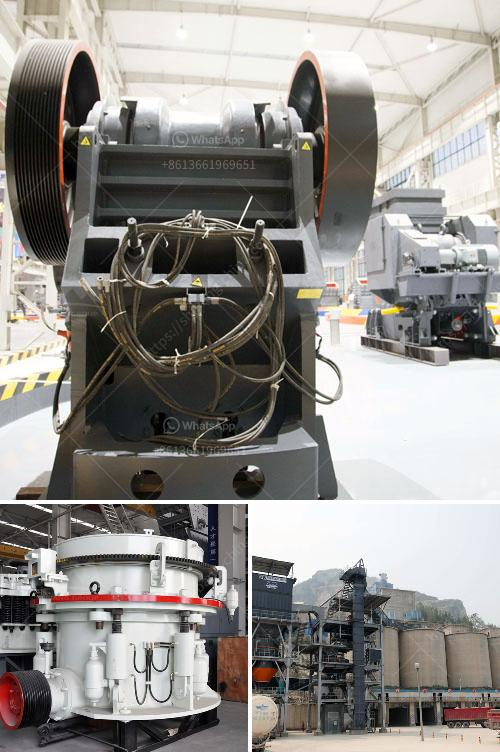

<h3>كسارة فك محمولة مستعملة في إسبانيا</h3>
تعتبر كسارة الفك المحمولة من الآلات الهندسية الحديثة التي تستخدم في صناعة التعدين والبناء. يتم استخدامها بشكل رئيسي لسحق المواد الصلبة والصخور الكبيرة إلى حجم صغير يمكن التعامل معه بسهولة. تعتبر إسبانيا واحدة من الدول الرائدة في صناعة التعدين والبناء، ولذلك تحظى بالعديد من الكسارات الفك المحمولة المستعملة.

في الأسواق الثانوية، يمكن العثور على العديد من الكسارات الفك المحمولة المستعملة في إسبانيا بأسعار منخفضة نسبيًا تتراوح بين 200 و 400 يورو. يعتبر هذا النطاق من الأسعار جذابًا للمشترين الذين يعملون على ميزانية محدودة أو يرغبون في الاستفادة من فوائد التوفير في التكاليف عند شراء آلات المستعملة.

إحدى المزايا الرئيسية لاستخدام كسارة الفك المحمولة هي قابليتها للتنقل وسهولة النقل من مكان لآخر. بالإضافة إلى ذلك، فإنها تتميز بأداء قوي وكفاءة عالية في سحق المواد. تعتبر هذه الآلة مثالية للاستخدام في مشاريع البناء الصغيرة والمواقع التي تحتاج إلى سحق المواد على الفور.

من الشائع استخدام كسارة الفك المحمولة في صناعة التعدين والبناء لسحق الصخور الكبيرة والحجارة الصلبة إلى حجم صغير يمكن الاستفادة منها في مشاريع أخرى. يتم تحقيق ذلك بفضل قوة الضغط العالية التي تتميز بها الكسارة، والتي تسمح لها بسحق المواد بكفاءة في فترة زمنية معينة.

بالإضافة إلى ذلك، تتمتع الكسارة الفكية المحمولة بتصميم مدمج يتيح سهولة الاستخدام والصيانة. يمكن تشغيلها بسهولة وتعديل حجم الفتحة ببساطة لتناسب الحجم المطلوب للمواد المراد سحقها. كما يمكن تغيير الفكين المستخدمين في الكسارة بسهولة لتتناسب مع أنواع المواد المختلفة.

ورغم أن الأسعار المنخفضة للكسارات الفك المحمولة المستعملة قد تكون جذابة، فإنه من المهم التأكد من حالة وجودة الآلة قبل الشراء. ينصح بشدة بإجراء الفحوصات والفحوصات اللازمة للتأكد من أن الكسارة ما زالت تعمل بشكل جيد وأنها تلبي احتياجات المشتري.

في الختام، تعتبر كسارة الفك المحمولة المستعملة من أفضل الخيارات للمشترين الذين يبحثون عن آلة قوية وفعالة لسحق المواد الصلبة والصخور الكبيرة بأسعار معقولة. إسبانيا تحظى بالعديد من الكسارات المحمولة المستعملة المتوفرة في السوق، ويمكن للمشترين اختيار الآلة التي تتناسب مع احتياجاتهم وميزانيتهم.
<h3>Contact us</h3><ul><li><strong>Whatsapp:&nbsp;<a href="https://wa.me/8613661969651">+8613661969651</a></strong></li><li><a href="https://swt.shibang-china.com/?git&amp;zhl&amp;كسارة فك محمولة مستعملة في إسبانيا"><strong>Online Service(chat now)</strong></a></li></ul><h3>Related</h3><ul><li><a href='دراسة الجدوى حول حجر الأبعاد في إثيوبيا.md'>دراسة الجدوى حول حجر الأبعاد في إثيوبيا</a></li><li><a href='كسارة صخور محمولة مستعملة في كندا.md'>كسارة صخور محمولة مستعملة في كندا</a></li><li><a href='تكلفة آلة معالجة الفلدسبار.md'>تكلفة آلة معالجة الفلدسبار</a></li><li><a href='موردي آلة فحص الفحم.md'>موردي آلة فحص الفحم</a></li><li><a href='كيفية اختيار كسارة مخروطية.md'>كيفية اختيار كسارة مخروطية</a></li></ul>