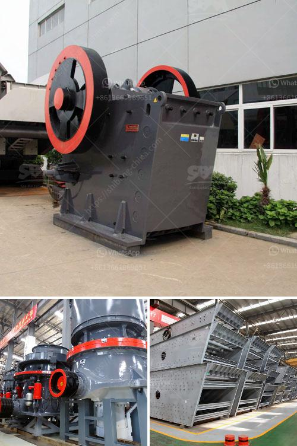

<h3>كسارة فكية 10x</h3>
الكسارة الفكية 10x هي جهاز هندسي حديث وفعال يستخدم في صناعة التعدين ومعالجة الصخور. تعتبر الكسارة الفكية من أكثر الأدوات استخداماً في مجال التكسير الأولي للمواد الخام.

يتميز الجهاز بتصميمه القوي والمتين وبنيته الصلبة التي تتحمل الضغط العالي للصخور والخامات المتعددة. تستخدم الكسارة الفكية 10x في سحق المواد الخام بحجمها الكبير إلى قطع أصغر، مما يعزز عملية المعالجة اللاحقة ويزيد كفاءة الإنتاج. يعتبر الفك القابل للتحريك في الكسارة من أهم عناصرها، حيث يعمل على سحق وطحن المواد عبر الضغط والاحتكاك.

تتميز الكسارة الفكية 10x بسهولة الاستخدام والصيانة، حيث تتمتع بجميع الميزات التي تسهل عملية التشغيل والتنظيف وإصلاح الأعطال. كما أنها تتميز بأداء فعال واقتصادي عند تكسير ومعالجة الصخور.

يستخدم الكسارة الفكية 10x في صناعات التعدين والبناء والصناعات الكيماوية والمعادن والسكك الحديدية والنفايات. يمكن استخدامها لسحق العديد من المواد مثل الحجر الجيري والرخام والجرانيت والكوارتز وخام الحديد وكثير من المواد الأخرى.

بفضل تقنية التحكم الهيدروليكية المستخدمة في الكسارة الفكية 10x، يمكن تعديل حجم الفتحة والسرعة والقوة بسهولة ودقة، مما يسمح بالتحكم الكامل في عملية التكسير وفقًا للمتطلبات المحددة. يتميز الجهاز أيضًا بنظام تشحيم آلي يضمن دوام العمل السلس والمستمر دون أي توقف غير مبرر.

باختصار، فإن الكسارة الفكية 10x هي جهاز قوي وفعال يستخدم على نطاق واسع في صناعة التعدين ومعالجة الصخور. يتميز بتصميمه القوي والمتين، وسهولة الاستخدام والصيانة، والأداء الفعال والاقتصادي. إن استخدام هذا الجهاز يساعد في زيادة الإنتاجية وتحسين جودة المنتج النهائي.
<h3>Contact us</h3><ul><li><strong>Whatsapp:&nbsp;<a href="https://wa.me/8613661969651">+8613661969651</a></strong></li><li><a href="https://swt.shibang-china.com/?git&amp;zhl&amp;كسارة فكية 10x"><strong>Online Service(chat now)</strong></a></li></ul><h3>Related</h3><ul><li><a href='مصنع مسحوق لوح الجبس في إثيوبيا.md'>مصنع مسحوق لوح الجبس في إثيوبيا</a></li><li><a href='آلة معالجة الجبس بسعة طن واحد.md'>آلة معالجة الجبس بسعة طن واحد</a></li><li><a href='شركات تصنيع مصانع المحاجر في المملكة المتحدة.md'>شركات تصنيع مصانع المحاجر في المملكة المتحدة</a></li><li><a href='كسارات لآلة إعادة التدوير في الإمارات.md'>كسارات لآلة إعادة التدوير في الإمارات</a></li><li><a href='عمل المطحنة الكرة بالهندية.md'>عمل المطحنة الكرة بالهندية</a></li></ul>