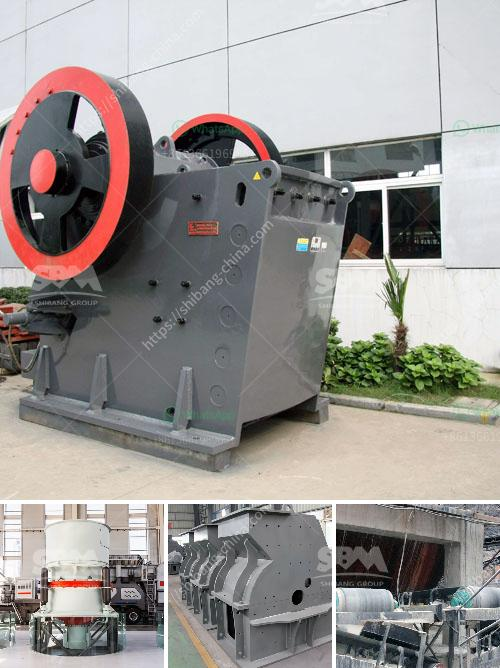

<h3>كسارة فكية بمقدار 100 طن في الساعة</h3>
تعتبر الكسارة الفكية من أهم المعدات في صناعة التعدين والبناء، حيث تستخدم لسحق الصخور والمواد الخام الكبيرة إلى حجم صغير يمكن استخدامه في عمليات إنتاجية مختلفة. وتتميز الكسارة الفكية بقدرتها على سحق المواد بسرعة وفاعلية، ومن أهم الموديلات المتوفرة في السوق هي الكسارة الفكية بسعة 100 طن في الساعة.

تتميز الكسارة الفكية بتصميم فعال يسمح بتحميل الصخور الكبيرة في فوهة التغذية وسحقها بواسطة الفك المتحرك والثابت. وتتألف هذه الكسارة من عدة أجزاء رئيسية، بما في ذلك الهيكل الخارجي، والإطار الأساسي، والفك المتحرك، والمحرك الكهربائي، والترس الرئيسي، ونظام التحكم وغيرها.

تستخدم الكسارة الفكية بصورة واسعة في صناعة التعدين ومحاجر الحجارة، حيث يتم استخدامها لسحق الصخور المتنوعة مثل الجرانيت والرخام والحجر الجيري والبازلت والكوارتز وغيرها من المواد الخام. وتساعد الكسارة الفكية في تحسين كفاءة إنتاج المواد الخام، حيث يتم سحقها إلى قطع صغيرة ثم يتم توجيهها إلى مراحل إنتاج إضافية للتكرير والتصنيف والغربلة.

تعد الكسارة الفكية بسعة 100 طن في الساعة خيارًا مثاليًا للشركات التي تعمل في قطاع التعدين والبناء، حيث تتميز بقدرتها على سحق كميات كبيرة من المواد الخام في فترة زمنية قصيرة. بالإضافة إلى ذلك، فإنها تعمل بكفاءة عالية وتحتاج إلى صيانة بسيطة.

يعود نجاح الكسارة الفكية إلى قدرتها على تحمل الصدمات والقوى الكبيرة التي تتعرض لها خلال عملية السحق. كما أنها تتميز بتصميم قوي ومتين يمكنه التعامل مع المواد الخشنة والصعبة. وبفضل التكنولوجيا الحديثة، فإن الكسارة الفكية قادرة على تحقيق أداء ممتاز وتحقيق أهداف الإنتاج بكفاءة عالية.

باختصار، تعد الكسارة الفكية بسعة 100 طن في الساعة أداة مهمة في صناعة التعدين والبناء. تتميز بقدرتها على سحق المواد الكبيرة بكفاءة عالية وفي فترة زمنية قصيرة. وتعتبر هذه الكسارة اختيارا رائعا للشركات التي تسعى لزيادة إنتاجيتها وتعزيز كفاءة وجودة منتجاتها.
<h3>Contact us</h3><ul><li><strong>Whatsapp:&nbsp;<a href="https://wa.me/8613661969651">+8613661969651</a></strong></li><li><a href="https://swt.shibang-china.com/?git&amp;zhl&amp;كسارة فكية بمقدار 100 طن في الساعة"><strong>Online Service(chat now)</strong></a></li></ul><h3>Related</h3><ul><li><a href='استخدام كسارة فكية صغيرة للخرسانة.md'>استخدام كسارة فكية صغيرة للخرسانة</a></li><li><a href='آلة طحن الرمل السيليكا.md'>آلة طحن الرمل السيليكا</a></li><li><a href='سعر كسارة حجر متنقلة صغيرة في روسيا.md'>سعر كسارة حجر متنقلة صغيرة في روسيا</a></li><li><a href='تكلفة وحدة طحن الأسمنت tpd كسارة.md'>تكلفة وحدة طحن الأسمنت tpd كسارة</a></li><li><a href='شركة تصنيع كسارة الحصى.md'>شركة تصنيع كسارة الحصى</a></li></ul>