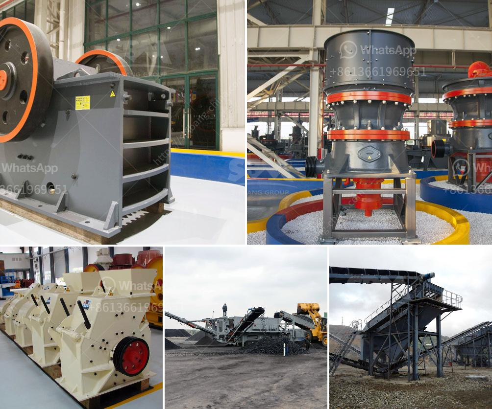

<h3>كسارة فكية ثابتة للبيع</h3>
تُعتبر الكسارة الفكية الثابتة أحد الأدوات الأساسية في صناعة التعدين والبناء. تُستخدم هذه الآلة لكسر الصخور والأحجار الكبيرة إلى قطع أصغر، مما يسهل عملية النقل والاستخدام في الأعمال الإنشائية. تتوفر الكسارات الفكية الثابتة بمجموعة متنوعة من الموديلات والأحجام والأنواع، ومن بينها الكسارة الفكية ذات السعة القدرة بين 200-400 طن في الساعة. 

إن تصميم الكسارة الفكية الثابتة يتكون من إطار قوي مصنوع من الفولاذ عالي الجودة، ومكونات متينة ومتطورة تضمن أداءً موثوقًا وفعالية عالية في كسر الصخور. يتم تثبيت الكسارة في الموقع بشكل ثابت عن طريق الأرضية، مما يضمن استقرارها أثناء العملية. 

تتميز الكسارة الفكية الثابتة بفتحة الفك الكبيرة ، التي تتيح استيعاب الصخور الكبيرة والأحجار بحجمها الطبيعي. إن وجود فتحة الفك الكبيرة يساعد في زيادة كفاءة عملية الكسر وتسهيل عملية التغذية. بالإضافة إلى ذلك ، يمكن ضبط حجم الفتحة وفقًا لاحتياجات المستخدمين ، مما يجعلها مثالية لمجموعة متنوعة من التطبيقات.

تتمتع الكسارة الفكية الثابتة أيضًا بنظام تشحيم فعال يضمن تشغيل سلس وموثوقية عالية. يتم تثبيت الكسارة بنظام تحكم كهربائي يسمح للمستخدم بإعدادات دقيقة ومراقبة العملية بشكل فعال. علاوة على ذلك ، يتم توفير حاجز للإشعاع ونظام إزالة الغبار لضمان السلامة والحماية البيئية خلال عملية التشغيل.

تنتج الكسارة الفكية الثابتة مواد ذات جودة عالية وشكل متساوٍ ، وهي مثالية للاستخدام في البناء والتشييد والطرق وصناعة السكك الحديدية والبناء المدني. تعتبر الكسارة الفكية الثابتة اختيارًا مثاليًا للشركات والمقاولين الذين يبحثون عن آلة قوية وفعالة لتلبية احتياجاتهم في عمليات الكسر والتكسير.

مع خيارات السعة التي تتراوح بين 200-400 طن في الساعة ، فإن الكسارة الفكية الثابتة المتوفرة للبيع تعد خيارًا اقتصاديًا وفعالًا للشركات الصغيرة والكبيرة على حد سواء. بفضل تصميمها القوي وأدائها العالي ، يمكن أن تكون الكسارة الفكية الثابتة ضمانًا لتحقيق أقصى استفادة من عمليات الكسر والتكسير وتلبية الاحتياجات الفورية للعملاء.
<h3>Contact us</h3><ul><li><strong>Whatsapp:&nbsp;<a href="https://wa.me/8613661969651">+8613661969651</a></strong></li><li><a href="https://swt.shibang-china.com/?git&amp;zhl&amp;كسارة فكية ثابتة للبيع"><strong>Online Service(chat now)</strong></a></li></ul><h3>Related</h3><ul><li><a href='سعر مطحنة الكرة في باكستان.md'>سعر مطحنة الكرة في باكستان</a></li><li><a href='كسارة فكية صغيرة في المملكة المتحدة.md'>كسارة فكية صغيرة في المملكة المتحدة</a></li><li><a href='آلة صنع الرمل VSI.md'>آلة صنع الرمل VSI.</a></li><li><a href='مصنع تكسير الكلنكر الاسمنتي.md'>مصنع تكسير الكلنكر الاسمنتي</a></li><li><a href='وحدة تكسير الحجر الكوارتز في الهند.md'>وحدة تكسير الحجر الكوارتز في الهند</a></li></ul>