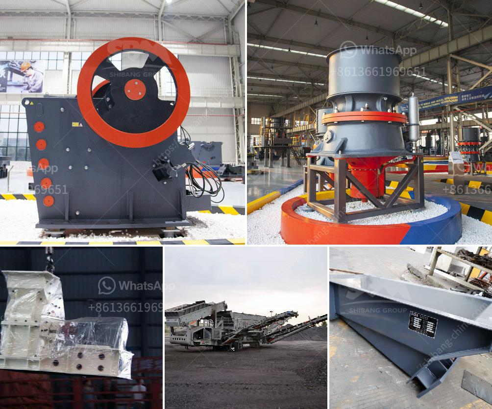

<h3>كسارة فكية صغيرة في المملكة المتحدة</h3>
تعتبر الكسارات الفكية الصغيرة أحد أدوات البناء الحديثة والمتقدمة التي تستخدم في صناعة التعدين والبناء، وتتميز بقدرتها الفائقة على تكسير الأحجار والصخور الكبيرة إلى قطع صغيرة وسهلة التصرف بها. وتستخدم هذه الكسارات في العديد من الصناعات بما في ذلك صناعة الأسفلت والخرسانة.

في المملكة المتحدة، يوجد العديد من الشركات التي توفر الكسارات الفكية الصغيرة للبيع والإيجار. وتتوفر هذه الكسارات بمختلف الأحجام والسعات، حيث يتراوح وزنها من 2 إلى 8 أطنان، مما يتيح استخدامها في المشاريع الصغيرة والضيقة.

تتميز الكسارات الفكية الصغيرة بسهولة استخدامها وتركيبها، حيث تتضمن عجلات مثبتة على الجزء السفلي من الكسارة، مما يسهل نقلها وتحريكها من موقع إلى آخر. كما أنها تحتوي على محرك كهربائي يعمل بالديزل أو الكهرباء، مما يجعلها مناسبة للعمل في أماكن لا تتوفر فيها مصادر الطاقة الثابتة.

بالإضافة إلى ذلك، تتميز الكسارات الفكية الصغيرة بأنها قادرة على معالجة أنواع مختلفة من المواد، بما في ذلك الصخور الصلبة والأسمنت والحصى والخرسانة المسلحة. وتعمل هذه الكسارات بنظام فعال لتكسير المواد، حيث يتم سحق المواد بين لوحين فكيين ثابتين، وبفضل ذلك يتم تحقيق قدرة كبيرة على تكسير الصخور وتقليل حجمها بشكل فعال.

تعتبر الكسارات الفكية الصغيرة وسيلة فعالة لتحقيق توفير في الوقت والجهد، حيث تقلل من حاجة إلى القيام بعملية تكسير الصخور يدويًا، ما يسهل عملية البناء ويوفر الكثير من الجهد والوقت للعمال. وبالتالي، تحظى هذه الكسارات بشعبية كبيرة في صناعة البناء والتعدين.

في الختام، تلعب الكسارات الفكية الصغيرة دوراً هاماً في صناعة البناء والتعدين في المملكة المتحدة. فهي تتميز بقدرتها على تكسير الصخور الكبيرة والمواد القاسية بشكل فعال، وتمكن العمال من تنفيذ المشاريع بسرعة وسهولة. لذا، فإن اقتناء الكسارة الفكية الصغيرة هو خيار مثالي للشركات والمشاريع الصغيرة في المملكة المتحدة.
<h3>Contact us</h3><ul><li><strong>Whatsapp:&nbsp;<a href="https://wa.me/8613661969651">+8613661969651</a></strong></li><li><a href="https://swt.shibang-china.com/?git&amp;zhl&amp;كسارة فكية صغيرة في المملكة المتحدة"><strong>Online Service(chat now)</strong></a></li></ul><h3>Related</h3><ul><li><a href='مصنع معالجة التنغستن في الهند.md'>مصنع معالجة التنغستن في الهند</a></li><li><a href='مصنع غسيل الفحم في جنوب أفريقيا الفلبين.md'>مصنع غسيل الفحم في جنوب أفريقيا الفلبين</a></li><li><a href='مصانع الفرز للبيع.md'>مصانع الفرز للبيع</a></li><li><a href='كسارة الكوارتز السيليكون.md'>كسارة الكوارتز السيليكون</a></li><li><a href='سعر كسارة الحصى.md'>سعر كسارة الحصى</a></li></ul>