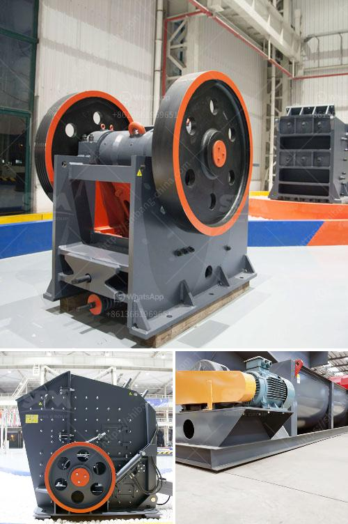

<h3>كسارة فكية في بتسوانا</h3>
تعد الكسارة الفكية أحد الآلات الهامة في صناعة التعدين والبناء حول العالم. وفي بتسوانا، تعد الكسارات الفكية من أهم الأدوات التي تستخدم في عمليات التعدين والبناء. تعد بتسوانا واحدة من الدول الواعدة في مجال التعدين حيث تحتوي على مختلف المعادن الثمينة والموارد الطبيعية القيمة.

تتميز الكسارة الفكية بالقدرة على تكسير المواد الصلبة والصعبة المستخدمة في صناعة التعدين والبناء. تعمل الكسارة الفكية عن طريق تحريك الفك الثابت والفك المتحرك في اتجاهين متعاكستين، مما يتيح لها تكسير المواد بشكل فعال ودقيق. تستخدم الكسارة الفكية في تكسير الصخور والحصى والخامات المختلفة للحصول على جزيئات أصغر قبل أن تدخل في عملية التصنيع أو الاستخدام النهائي.

تحتوي بتسوانا على العديد من مناجم الآلمنيوم، والنيكل، والفوسفات والألماس، وتعمل الكسارات الفكية على تكسير هذه المواد الصخرية القيمة لتحويلها إلى حجم مناسب للاستخدام في صناعة التعدين. بالإضافة إلى ذلك، يتم استخدام الكسارات الفكية في صناعة البناء لتكسير الحصى والرمل والخرسانة للاستخدام في الإنشاءات والطرق والمشاريع الأخرى.

تعتمد الكسارات الفكية في بتسوانا على التكنولوجيا الحديثة والمتقدمة، حيث تتضمن تصميمات ومواد قوية تجعلها قادرة على تحمل الظروف القاسية والعوامل البيئية المتغيرة في المنطقة. بالاعتماد على تلك الآلات، تتم تحسين سرعة العمل وكفاءة إنتاج المواد، مما يؤدي إلى زيادة الإنتاجية وتقليل التكاليف والوقت المستهلك في عمليات التعدين والبناء.

يعود الفضل في نجاح الكسارات الفكية في بتسوانا إلى اهتمام الحكومة بتطوير قطاع التعدين والبناء في البلاد. وتعمل الحكومة جنبًا إلى جنب مع الشركات الخاصة لتوفير البيئة الملائمة والدعم اللازم للعمليات التعدينية والبنائية، بما في ذلك توفير البنية التحتية اللازمة لتشغيل الكسارات الفكية ونقل المواد الصلبة.

في الختام، تعد الكسارة الفكية جزءًا أساسيًا وحاسمًا في صناعة التعدين والبناء في بتسوانا، حيث تعزز الإنتاجية وتشجع على التنمية الاقتصادية في البلاد. تقدم الكسارات الفكية أداءً ممتازًا في تكسير المواد وتنقلها للاستخدام النهائي، وتعد جزءًا حاسمًا في الإسهام في التنمية المستدامة لبتسوانا.
<h3>Contact us</h3><ul><li><strong>Whatsapp:&nbsp;<a href="https://wa.me/8613661969651">+8613661969651</a></strong></li><li><a href="https://swt.shibang-china.com/?git&amp;zhl&amp;كسارة فكية في بتسوانا"><strong>Online Service(chat now)</strong></a></li></ul><h3>Related</h3><ul><li><a href='مطحنة الكرة للصبغة.md'>مطحنة الكرة للصبغة</a></li><li><a href='كسارة صخور محمولة مستعملة في كندا.md'>كسارة صخور محمولة مستعملة في كندا</a></li><li><a href='سعر كسارة المختبر المستخدمة.md'>سعر كسارة المختبر المستخدمة</a></li><li><a href='آلة تسخين حجر الكوارتز للبيع.md'>آلة تسخين حجر الكوارتز للبيع</a></li><li><a href='آلة كسارة الحصى.md'>آلة كسارة الحصى</a></li></ul>