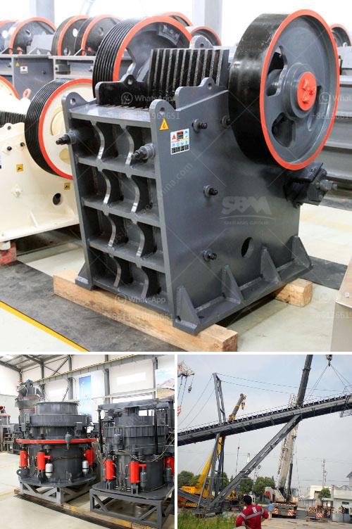

<h3>كسارة فكية لتكسير الجرانيت</h3>
الكسارة الفكية واحدة من أهم الأدوات المستخدمة في صناعة التكسير للجرانيت والأحجار الصلبة الأخرى. فهي تعمل عن طريق تكسير المواد الخام بواسطة ضغط عالٍ وقوة إصطدام. تستخدم الكسارة الفكية في عمليات تكسير الجرانيت بفعالية وكفاءة عالية للحصول على المنتج النهائي المطلوب.

تتكون الكسارة الفكية من صفيحتين فكية تسمى أيضًا كسارتي فك، تتحركان في اتجاهات متعاكسة لتكسير المواد. يتم تثبيت إحدى الصفيحتين الفكية بشكل ثابت في الصدر البابي للكسارة، بينما يتحرك الصفيحة الفكية الأخرى ذهابًا وإيابًا لتكسير المواد بواسطة قوة ضغط الفك.

تعتبر الكسارة الفكية مناسبة تمامًا لتكسير الجرانيت بسبب قدرتها العالية على تحمل ضغط الصخور الصلبة. وهي تتميز بعدة مزايا، مثل بنية بسيطة، استخدام مواد ذات جودة عالية في التصنيع، سهولة التشغيل والصيانة، كفاءة عالية في التكسير وتكاليف انتاجية منخفضة.

تعمل الكسارة الفكية وفقًا للأسلوب التالي: يتم إدخال الجرانيت الخام في فتحة التغذية للكسارة، حيث يتم تسحق المواد المصنعة بين الصفحتين الفكيتين. يتم تكسير الجرانيت إلى أحجام أصغر بفضل قوة الضغط العالية التي تنتجها الكسارة الفكية.

تعتبر الكسارة الفكية مثالية لتكسير الجرانيت إلى قطع صغيرة ومناسبة لمعدات البناء والصناعات الأخرى التي تتطلب جودة عالية وشكل متجانس للجرانيت. وتوفر تكلفة إنتاجية منخفضة ووقت تشغيل متواصل، مما يزيد من الإنتاجية ويقلل من تكاليف التشغيل.

بصفة عامة، يمكن القول إن الكسارة الفكية هي أداة هامة وفعالة في صناعة التكسير للجرانيت والصخور الأخرى. فهي توفر حلا دائمًا لتحويل الجرانيت الخام إلى مادة جاهزة للاستخدام في العديد من التطبيقات المختلفة. كما أنها تعزز من كفاءة الإنتاج وتقلل من التكاليف الإجمالية، مما يجعلها خيارًا مناسبًا للعديد من الشركات والمنشآت التجارية ضمن صناعة التكسير.
<h3>Contact us</h3><ul><li><strong>Whatsapp:&nbsp;<a href="https://wa.me/8613661969651">+8613661969651</a></strong></li><li><a href="https://swt.shibang-china.com/?git&amp;zhl&amp;كسارة فكية لتكسير الجرانيت"><strong>Online Service(chat now)</strong></a></li></ul><h3>Related</h3><ul><li><a href='كسارة حجر في إندونيسيا.md'>كسارة حجر في إندونيسيا</a></li><li><a href='قائمة معدات تعدين الذهب.md'>قائمة معدات تعدين الذهب</a></li><li><a href='سعر ناقل الحزام للتعدين.md'>سعر ناقل الحزام للتعدين</a></li><li><a href='موزع كسارة مخروط في إندونيسيا.md'>موزع كسارة مخروط في إندونيسيا</a></li><li><a href='معدات طحن مسحوق المطحنة.md'>معدات طحن مسحوق المطحنة</a></li></ul>