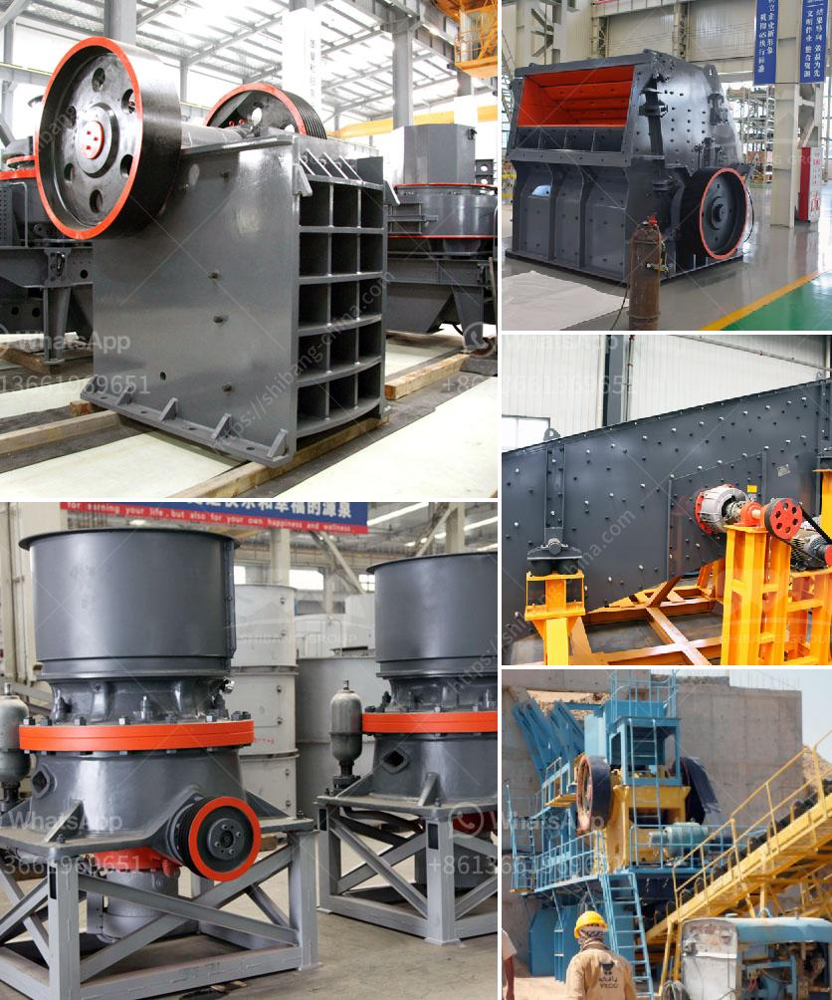

<h3>كسارة في أنتيوكيا، كولومبيا</h3>
تقع كسارة أنتيوكيا في إقليم كولومبيا الجميلة في جنوب أمريكا اللاتينية. كما يمكن تعريفها بأنها منطقة معزولة في قلب الطبيعة الخلابة التي تضم مجموعة متنوعة من الجبال والغابات والأنهار الجميلة.

تعتبر كسارة أنتيوكيا واحدة من أماكن السياحة الطبيعية الأكثر شهرة في كولومبيا. تتميز المنطقة بتضاريسها المتعرجة والمناظر الطبيعية الخلابة التي تعكس روعة الطبيعة الخلابة في هذا الجزء من العالم.

تعتبر الغابات المورقة والمناظر الطبيعية الخلابة جزءًا من جوهر كسارة أنتيوكيا. تتوفر في المنطقة فرص لاستكشاف الجبال ورياضة المشي لمسافات طويلة وتسلق الجبال. يمكن للزائرين الاستمتاع بالطبيعة الخلابة للمنطقة من خلال رحلة تسلق جبل كولومبيا، الذي يعتبر وجهة شهيرة لعشاق المغامرة.

لا يقتصر جمال كسارة أنتيوكيا على الجبال والغابات فقط، بل توجد أيضًا أنهار جميلة وشلالات خلابة في المنطقة. يمكن للزوار الاستمتاع بجمال أنهار الأمازون والأورينوكو، والتي تجذب الكثير من السياح الذين يرغبون في استكشاف المياه العذبة المنعشة والمناظر الطبيعية الخلابة.

كما يعد الطقس في كسارة أنتيوكيا مثاليًا للسياحة طوال العام. تتميز المنطقة بمعدلات درجات الحرارة الاعتيادية منخفضة نسبيًا، مما يجعلها وجهة رائعة للاسترخاء والتمتع بالهواء النقي.

بالإضافة إلى المناظر الطبيعية المدهشة، تتميز كسارة أنتيوكيا أيضًا بالثقافة الغنية والتراث التاريخي. يمكن للزوار اكتشاف المزيج الفريد من الثقافة الأصلية والثقافة الإسبانية من خلال زيارة القرى التاريخية والمتاحف المحلية.

في الختام، يمكن القول إن كسارة أنتيوكيا في كولومبيا هي وجهة سياحية رائعة لمحبي الطبيعة والمغامرة. من المناظر الطبيعية الساحرة إلى الثقافة الغنية، توفر المنطقة تجربة فريدة من نوعها للزائرين. قم بزيارة كسارة أنتيوكيا واستكشف جمال هذه المدينة وروعة الطبيعة المحيطة بها.
<h3>Contact us</h3><ul><li><strong>Whatsapp:&nbsp;<a href="https://wa.me/8613661969651">+8613661969651</a></strong></li><li><a href="https://swt.shibang-china.com/?git&amp;zhl&amp;كسارة في أنتيوكيا، كولومبيا"><strong>Online Service(chat now)</strong></a></li></ul><h3>Related</h3><ul><li><a href='سعر مصنع خام الحديد للبيع في المكسيك.md'>سعر مصنع خام الحديد للبيع في المكسيك</a></li><li><a href='مطحنة تشانغفا للطحن.md'>مطحنة تشانغفا للطحن</a></li><li><a href='معدات تعدين في اليابان.md'>معدات تعدين في اليابان</a></li><li><a href='عملية تعدين الذهب.md'>عملية تعدين الذهب</a></li><li><a href='تكلفة أعمال المحجر في الهند.md'>تكلفة أعمال المحجر في الهند</a></li></ul>