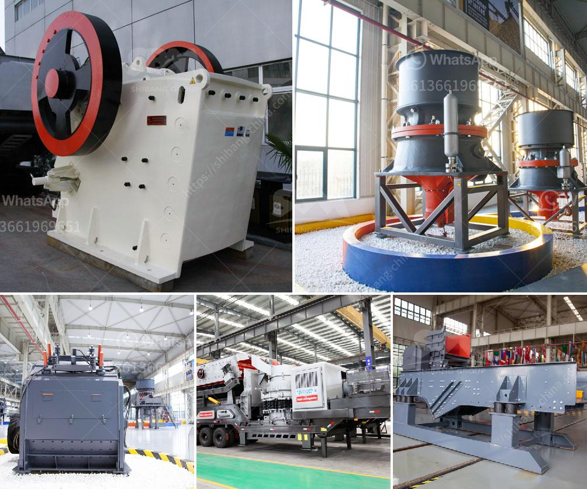

<h3>كسارة في الفلبين</h3>
تعد الفلبين واحدة من الدول الواعدة في جنوب شرق آسيا، حيث تشتهر بثرواتها الطبيعية المتنوعة والغنية. واحدة من هذه الثروات هي الصخور والمعادن التي تتواجد في الجبال والمرتفعات. لا يمكننا الحديث عن هذه الثروة من دون الإشارة إلى دور الكسارات في تعزيز صناعة التعدين في البلاد.

تعد الكسارات بنية هامة في صناعة التعدين، إذ تقوم بسحق وطحن الصخور والمعادن للاستفادة منها في العديد من التطبيقات. يتم استخدام الصخور المكسورة في صناعة البناء لإنشاء الطرق والجسور والمباني. كما يتم استخدامها في إنتاج الخرسانة والأسفلت والزجاج والسيراميك ومواد البناء الأخرى.

في الفلبين، تعمل الكسارات على اقتلاع الصخور وتكسيرها باستخدام الآلات والمعدات المتخصصة. يتم نقل الصخور المكسورة باستخدام الشاحنات إلى المواقع المطلوبة. بالإضافة إلى ذلك، تقوم الكسارات بإعادة تدوير المواد القابلة للتدوير مثل الخرسانة والأسفلت، مما يساهم في حماية البيئة وتقليل استغلال الموارد.

تساهم الكسارات في دعم اقتصاد الفلبين وتوفير فرص العمل للعديد من الأشخاص. فهي توفر احتياجات الصناعات المحلية وتقلل من الاعتماد على استيراد المواد الخام. كما تسهم في تحسين البنية التحتية للبلاد وتعزيز النمو الاقتصادي.

ومع ذلك، يجب أن نأخذ في الاعتبار الآثار البيئية والاجتماعية لعمليات الكسارة. قد يؤدي استخراج الصخور وتكسيرها إلى تغييرات في النظام البيئي المحلي وتلوث الهواء والمياه. لذا، يجب على الشركات المتعاونة مع الكسارات اتباع المعايير البيئية وتنفيذ تقنيات العمل المستدامة.

باختصار، تعد الكسارات في الفلبين جزءًا أساسيًا من صناعة التعدين وتلعب دورًا هامًا في دعم الاقتصاد وتوفير فرص العمل. ومع ذلك، يجب أن تتم عمليات الكسارة وفقًا للمعايير البيئية وتحسين النشاط الاجتماعي في المنطقة. على الحكومة والشركات العمل معًا لتنفيذ تلك المعايير والحفاظ على التنمية المستدامة لقطاع التعدين في الفلبين.
<h3>Contact us</h3><ul><li><strong>Whatsapp:&nbsp;<a href="https://wa.me/8613661969651">+8613661969651</a></strong></li><li><a href="https://swt.shibang-china.com/?git&amp;zhl&amp;كسارة في الفلبين"><strong>Online Service(chat now)</strong></a></li></ul><h3>Related</h3><ul><li><a href='معدات غسيل الذهب.md'>معدات غسيل الذهب</a></li><li><a href='كسارة صخور محمولة مستعملة للبيع.md'>كسارة صخور محمولة مستعملة للبيع</a></li><li><a href='مصنع غسيل الكروم للبيع في جنوب أفريقيا.md'>مصنع غسيل الكروم للبيع في جنوب أفريقيا</a></li><li><a href='كسارة تأثير الفك بولندا.md'>كسارة تأثير الفك بولندا</a></li><li><a href='مصنع آلات كلنكر الأسمنت للبيع.md'>مصنع آلات كلنكر الأسمنت للبيع</a></li></ul>