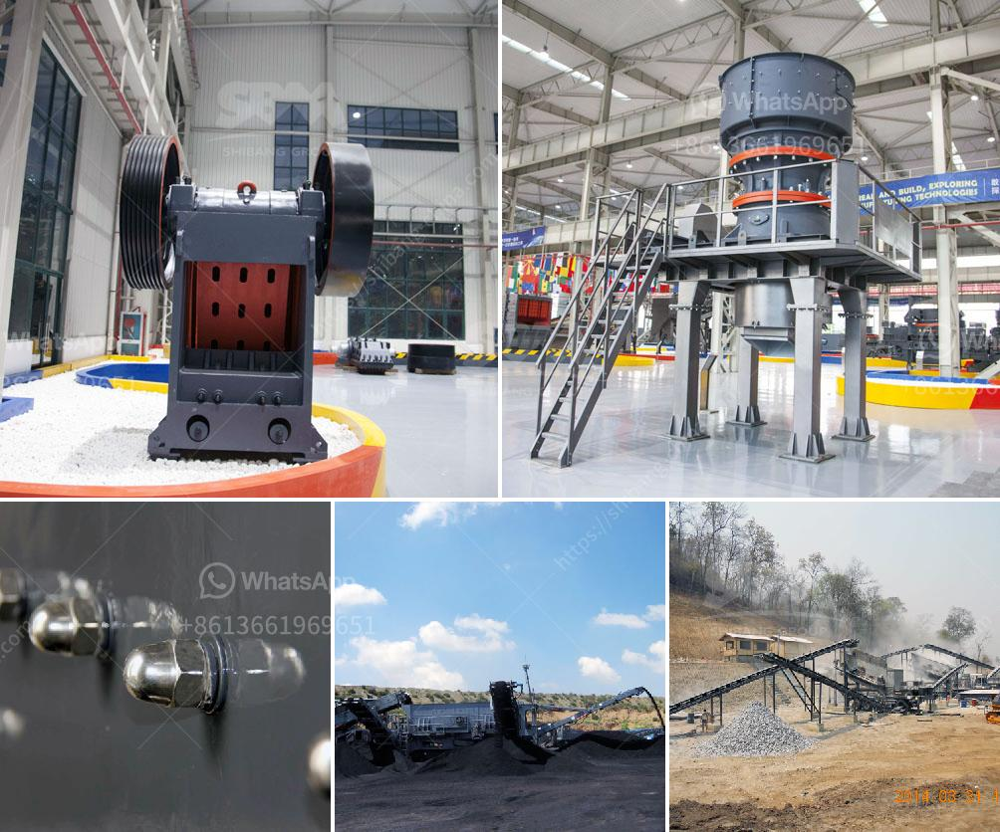

<h3>كسارة في ليما</h3>
تقع مدينة ليما في بيرو، وهي العاصمة الاقتصادية والثقافية للبلاد. تحظى المدينة بشعبية كبيرة بين السياح والزوار الذين يأتون لاستكشاف ثقافة بيرو الغنية والتمتع بجمال المدينة. إحدى المعالم السياحية المشهورة في ليما هي "كسارة" والتي سنتناولها في هذه المقالة.

تعتبر كسارة واحدة من أهم المعالم التاريخية في ليما، وتعود أصولها إلى القرن السادس عشر عندما كانت تستخدم كمصنع لسكن البطريركات الكاثوليكية. تضم المباني القديمة الجميلة والفنون والمعمار الرائع ، تعتبر كسارة من الأماكن المهمة التي تروج لتاريخ البلاد وثقافتها العريقة.

تتميز كسارة بتصميمها المعماري الباروكي الذي يعتبر مدهشًا وفريدًا من نوعه، حيث يمكن للزوار المشاهدة من الداخل والخارج بشكل يدهش العين. تضم المكان العديد من الغرف الممتازة والفسيحة والفنون التصويرية الفريدة والمجموعات الثمينة من المصوغات والمجوهرات والأواني الفخارية.

بالإضافة إلى جمالها المعماري، تعتبر كسارة مسرحًا لعروض الأوبرا والمسرحيات والحفلات الموسيقية التقليدية، وتستقطب رواد الفنون والثقافة من مختلف أنحاء العالم. يمكن للزوار الاستمتاع بالمعارض الثقافية والفنية التي تعقد في الموقع، والتعرف على ثقافة بيرو وتاريخها العريق.

بجانب المباني التاريخية والفنون، يعتبر حديقة كسارة من أماكن الترفيه المفضلة للزوار. تحتوي الحديقة على مناظر طبيعية خلابة ومساحات خضراء واسعة يمكن للزوار الاستمتاع بها أثناء التنزه والاسترخاء. يوجد أيضًا مقاهي ومطاعم تقدم المأكولات الشهية المحلية والعالمية.

باختصار، تعتبر كسارة وجهة رائعة للزوار الذين يرغبون في اكتشاف تاريخ البلاد وثقافتها والاستمتاع بالفنون والمسرح والحدائق الجميلة. توفر المدينة العديد من الفرص للاستمتاع بتجربة ثقافية ممتعة وحصرية في ليما، بيرو.
<h3>Contact us</h3><ul><li><strong>Whatsapp:&nbsp;<a href="https://wa.me/8613661969651">+8613661969651</a></strong></li><li><a href="https://swt.shibang-china.com/?git&amp;zhl&amp;كسارة في ليما"><strong>Online Service(chat now)</strong></a></li></ul><h3>Related</h3><ul><li><a href='سعر كسارة الفحم.md'>سعر كسارة الفحم</a></li><li><a href='مصنع مسحوق التلك.md'>مصنع مسحوق التلك</a></li><li><a href='طحن المطاحن الصناعية.md'>طحن المطاحن الصناعية</a></li><li><a href='مورد مصنع تكسير الحجر في الفلبين.md'>مورد مصنع تكسير الحجر في الفلبين</a></li><li><a href='كسارات الحجر المهجورة.md'>كسارات الحجر المهجورة</a></li></ul>