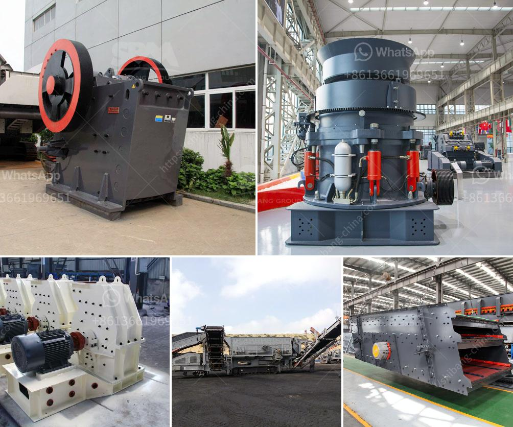

<h3>كسارة كونيكا في إثيوبيا</h3>
تُعد كسارة كونيكا في إثيوبيا واحدة من المعالم السياحية البارزة في البلاد. تقع هذه الكسارة في منطقة كونيكا الجبلية الخلابة في إقليم أمهرا بجنوب شرق العاصمة أديس أبابا. تُعتبر كسارة كونيكا واحدة من أهم المواقع الثقافية والتاريخية في إثيوبيا، حيث تجذب الآلاف من السياح سنويًا.

تم تأسيس كسارة كونيكا في القرن الثالث عشر. يُعتقد أنها كانت تستخدم كموقع دفن للملوك والأمراء الهامين في العصور الوسطى. يُعتقد أن مؤسسها هو الملكلا مارو، وقد أنشأها كنصب تذكاري للفخر والعظمة. تم بناء كسارة كونيكا على تلة عالية مطلة على المناظر الطبيعية الخلابة التي تحيط بها. يعتبر الموقع أحد أهم المواقع الأثرية في إثيوبيا وتم ادراجه في قائمة اليونسكو للتراث العالمي.

تضم كسارة كونيكا مجموعة من الهياكل المعمارية المذهلة. يتميز الموقع بوجود اثنين من البرجين الشاهقين، واللذان يعتبران أبرز جوانبها المعمارية. يبلغ ارتفاع البرجين حوالي 50 مترًا ويعتبران مقدمة مثالية للمنظر العام للموقع. يُمكن للزوار تسلق البرجين والاستمتاع بمناظر خلابة من الأعلى.

يحتوي الموقع أيضًا على العديد من القاعات والغرف الملكية المزينة بالأعمدة الرائعة والألواح الجدران المزخرفة. يتم ترتيب القاعات وفقًا لنمط العمارة الأثيوبية التقليدية، مما يُشكل مكانًا مدهشًا للاستمتاع بالفن الأثيوبي التقليدي. يضيف المتحف الموجود في كسارة كونيكا طابعًا تعليميًا وتاريخيًا إلى الموقع، حيث يعرض العديد من القطع الأثرية والمعروضات التي تكشف عن تاريخ الموقع وحضارة المملكة في تلك الفترة.

بالإضافة إلى أهميتها الثقافية والتاريخية، فإن كسارة كونيكا تعتبر وجهة مثالية لمحبي الطبيعة. تتمتع المنطقة المحيطة بالكسارة بمناظر طبيعية خلابة من الجبال والوديان والشلالات. يُمكن للزوار التجول واستكشاف المنطقة المحيطة سيرًا على الأقدام والاستمتاع بالطبيعة الخلابة المحيطة.

في الختام، تعتبر كسارة كونيكا في إثيوبيا واحدة من المعالم السياحية البارزة في البلاد. تجمع هذه الكسارة بين الجمال الطبيعي والتاريخ والثقافة. لذا ، فإن زيارة هذا الموقع ستكون تجربة ممتعة وفريدة من نوعها لجميع السياح.
<h3>Contact us</h3><ul><li><strong>Whatsapp:&nbsp;<a href="https://wa.me/8613661969651">+8613661969651</a></strong></li><li><a href="https://swt.shibang-china.com/?git&amp;zhl&amp;كسارة كونيكا في إثيوبيا"><strong>Online Service(chat now)</strong></a></li></ul><h3>Related</h3><ul><li><a href='مطحنة الطحن بالميكرون.md'>مطحنة الطحن بالميكرون</a></li><li><a href='تقرير المشروع لمصنع تكسير الحجر.md'>تقرير المشروع لمصنع تكسير الحجر</a></li><li><a href='مطاحن الأسطوانة العليا للبيع.md'>مطاحن الأسطوانة العليا للبيع</a></li><li><a href='فرضية عامة لكسارة الفك.md'>فرضية عامة لكسارة الفك</a></li><li><a href='سعر كسارة مخروطية هيدروليكية.md'>سعر كسارة مخروطية هيدروليكية</a></li></ul>