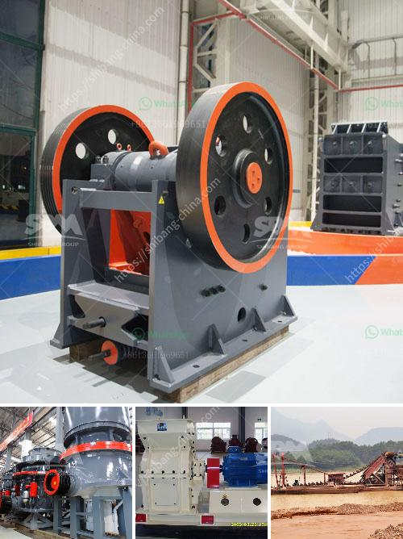

<h3>كسارة لخام الحديد</h3>
تعتبر كسارة لخام الحديد جزءًا أساسيًا في صناعة الحديد والصلب. تستخدم الكسارة لتكسير خام الحديد إلى قطع صغيرة بحجم محدد. تتعدد أنواع الكسارات المستخدمة في عملية تكسير خام الحديد، وتشمل الكسارات الفكية والكسارات التصادمية والكسارات المخروطية.

تعمل الكسارة الفكية عن طريق وضع الخام بين صفيحتين صلبتين وتحريك إحدى الصفائح باتجاه الأخرى بحيث يتم سحق الخام. تعتبر الكسارة الفكية مناسبة للخامات ذات الصلابة المتوسطة والعالية.

أما الكسارة التصادمية، فتستخدم قوة الصدمة لتكسير الخام. تتكون هذه الكسارة من ثلاثة أجزاء رئيسية هي المطرقة والصفيحة الصلبة والصندوق. تفتت الكسارة التصادمية الخام بفعل قوة الصدمة الناجمة عن تحرك المطرقة بسرعة عالية وضربها للخام.

تُستخدم الكسارة المخروطية لتكسير الخام بواسطة ضغط الخام بين جدران المخروط، وبالتالي تفتت الجزيئات وتقليل حجمها. تعتبر الكسارة المخروطية من الكسارات المتخصصة للخامات ذات الصلابة العالية التي تتطلب تكسيرًا دقيقًا.

تتميز الكسارة لخام الحديد بأنها تساهم في تكسير الخام إلى أحجام صغيرة ومنتظمة، مما يجعل عملية إنتاج الحديد والصلب أكثر كفاءة. كما تسمح للمصانع باستخدام الخام المستخدم بفاعلية أكبر، وذلك بفضل قدرتها على تفتيت الصخور والشوائب المختلفة الموجودة في الخام.

بالإضافة إلى ذلك، تساهم الكسارة لخام الحديد في تقليل تكاليف الإنتاج وتحسين جودة المنتج النهائي. فهي تساعد على توزيع الحمل بين المعدات وتقليل الاحتكاك والتآكل، مما يزيد من عمر المعدات ويقلل من تكاليف الصيانة.

باختصار، تعد كسارة لخام الحديد أداة حيوية في صناعة الحديد والصلب، حيث تساهم في تكسير الخام إلى أحجام صغيرة، وتحسين الكفاءة والجودة، وتقليل تكاليف الإنتاج. ينبغي الالتفات أيضًا إلى ضرورة استخدام الكسارة المناسبة لمتطلبات العملية وخصائص الخام المتاح، لتحقيق أقصى قدر من الفعالية والتوفير.
<h3>Contact us</h3><ul><li><strong>Whatsapp:&nbsp;<a href="https://wa.me/8613661969651">+8613661969651</a></strong></li><li><a href="https://swt.shibang-china.com/?git&amp;zhl&amp;كسارة لخام الحديد"><strong>Online Service(chat now)</strong></a></li></ul><h3>Related</h3><ul><li><a href='تقرير مشروع مصنع كسارة الحجر بتنسيق PDF.md'>تقرير مشروع مصنع كسارة الحجر بتنسيق PDF</a></li><li><a href='تكلفة فتح مصنع للأسمنت الصغير.md'>تكلفة فتح مصنع للأسمنت الصغير</a></li><li><a href='كسارة الفك الجديدة من نوع زينيث.md'>كسارة الفك الجديدة من نوع زينيث</a></li><li><a href='مطحنة هامر مختبرية.md'>مطحنة هامر مختبرية</a></li><li><a href='مصنع إنتاج مسحوق الجبس بسعة 500 طن.md'>مصنع إنتاج مسحوق الجبس بسعة 500 طن</a></li></ul>