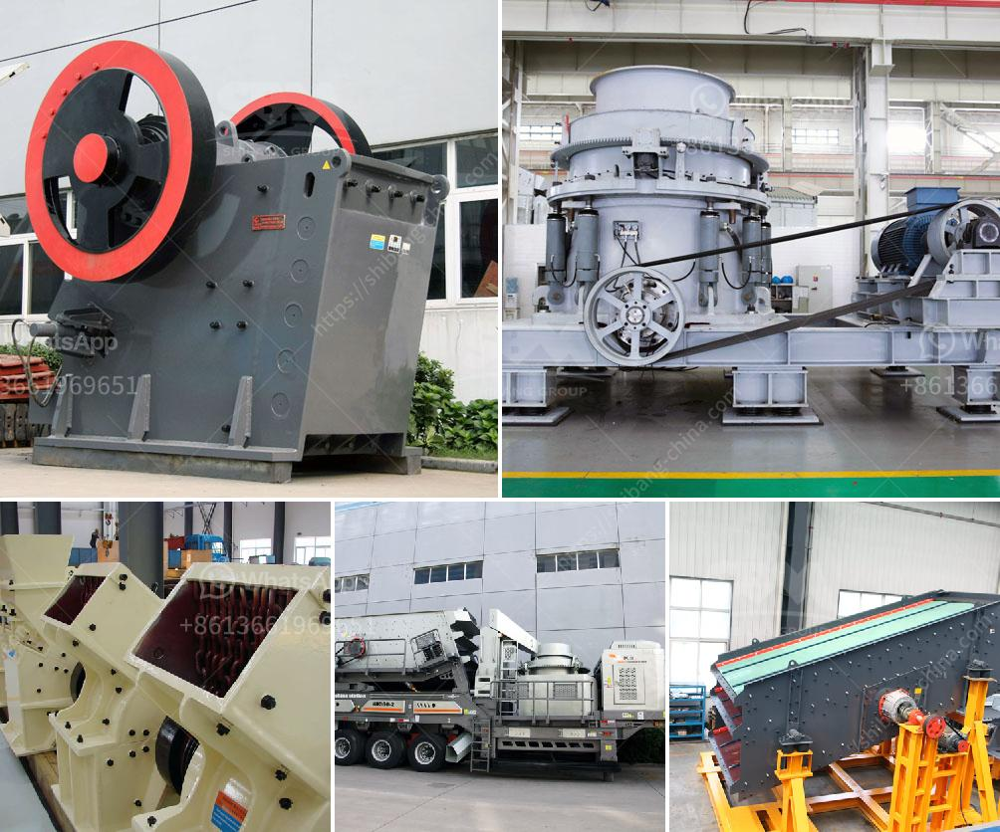

<h3>كسارة لسحق الكوارتز</h3>
تعد كسارة الكوارتز جهازًا هامًا في صناعة التعدين ومعالجة المواد. تستخدم في سحق الكوارتز وتحويله إلى حجم جيد للاستخدام في العديد من التطبيقات المختلفة. يشير مصطلح "الكوارتز" إلى صخرة معدنية تحتوي على نسبة عالية من السيليكا. وتعد السيليكا المكون الرئيسي للكوارتز، والتي تستخدم في العديد من الصناعات المختلفة بسبب خواصها الفريدة.

تهدف كسارة الكوارتز إلى سحق الصخور الكوارتزية الكبيرة إلى قطع صغيرة ومناسبة للاستخدام في الصناعات المختلفة. يتم تحقيق ذلك عن طريق وضع الكوارتز في غرفة السحق واستخدام قوة ميكانيكية لكسرها وتقليل حجمها. تتكون كسارة الكوارتز عادة من مدخل لتحميل الصخور، ومخروط أو كسارة فكية للسحق الأولي، وغرفة سحق رئيسية للسحق الثانوي، ومخرج للمنتجات المكسرة.

يمكن أن تتراوح قدرة كسارة الكوارتز من مئات الأطنان إلى عدة آلاف الأطنان في الساعة، اعتمادًا على الحجم والقوة والكفاءة. وتستخدم عادة في صناعة البناء والتعدين، حيث يتم استخدام الكوارتز في مجموعة واسعة من التطبيقات مثل إنتاج الرمل الاصطناعي، والخرسانة، والخزف، والطلاء، والمنتجات الصيدلانية، وصناعة الزجاج، وغيرها.

تمتاز كسارة الكوارتز بعدة ميزات، بما في ذلك كفاءة عالية في السحق، وتشغيل مستقر، وتكلفة صيانة منخفضة. كما أن لها تأثير إيجابي على صناعة البناء والتعدين من خلال تلبية الطلب المتزايد على الكوارتز المكسور في السوق.

وفي الختام، تعد كسارة الكوارتز أداة أساسية في صناعة التعدين ومعالجة المواد. تساهم في تحويل الصخور الكبيرة من الكوارتز إلى قطع صغيرة ومناسبة للاستخدام الصناعي. وبفضل ميزاتها مثل الكفاءة العالية وتكلفة الصيانة المنخفضة، تساهم كسارة الكوارتز في تحفيز صناعة البناء والتعدين وتلبية احتياجات السوق المتزايدة.
<h3>Contact us</h3><ul><li><strong>Whatsapp:&nbsp;<a href="https://wa.me/8613661969651">+8613661969651</a></strong></li><li><a href="https://swt.shibang-china.com/?git&amp;zhl&amp;كسارة لسحق الكوارتز"><strong>Online Service(chat now)</strong></a></li></ul><h3>Related</h3><ul><li><a href='تكلفة كسارة الحجر.md'>تكلفة كسارة الحجر</a></li><li><a href='كسارة الحجر في الكاميرون.md'>كسارة الحجر في الكاميرون</a></li><li><a href='كيفية جعل مسحوق الحجر الجيري.md'>كيفية جعل مسحوق الحجر الجيري</a></li><li><a href='كسارة حجر الجرانيت المحمولة.md'>كسارة حجر الجرانيت المحمولة</a></li><li><a href='مطاحن الهامر المستخدمة في تعدين الذهب.md'>مطاحن الهامر المستخدمة في تعدين الذهب</a></li></ul>