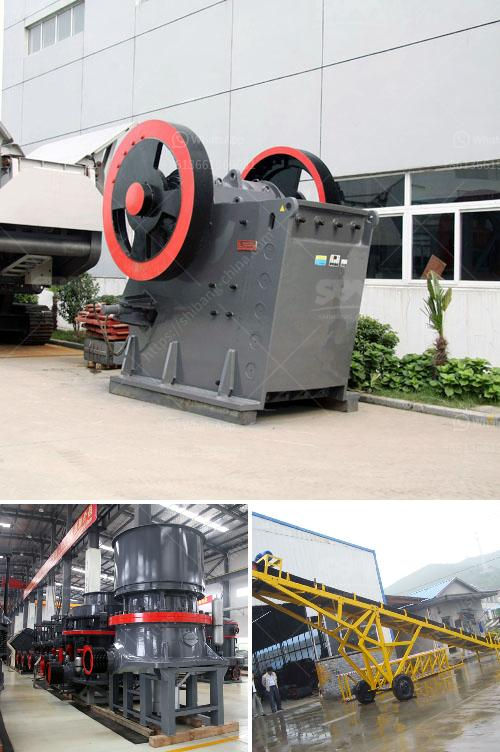

<h3>كسارة لفة مسننة جاجيد</h3>
تُعد الكسارة لفة مسننة جاجيد من الأدوات الحديثة والفعالة المستخدمة في صناعة التعدين والبناء. تتميز هذه الكسارة بقدرتها على سحق المواد الصلبة ذات الصلابة المتوسطة والعالية، وتقطيعها إلى جزيئات صغيرة قابلة للتحمل والتشكيل في عمليات إنتاج الركام والتعدين.

تتألف الكسارة لفة مسننة جاجيد من اثنتين من الأسطوانات المسننة المواجهة لبعضها البعض. تدور الأسطوانات في الاتجاه المعاكس أحدهما إلى الآخر، مما يسبب القوة التي تحطم وتقسم المواد الخام. يتم تشغيل الكسارة بواسطة محرك يقوم بتوجيه الأسطوانات للدوران في الاتجاه المطلوب.

تتكون الكسارة لفة مسننة جاجيد من عدة أجزاء رئيسية، بما في ذلك الإطار الرئيسي والأسطوانات المسننة والمحرك ونظام التحكم. تعمل الأسطوانات المسننة كأداة رئيسية للتكسير، حيث يتم تغذية المواد الخام من الجزء العلوي بين الأسطوانتين ويتم تحطيمها عن طريق الضغط والاحتكاك بين الأسطوانات. يتم الحصول على المنتج النهائي عندما تنخفض المواد المكسورة إلى الحجم المطلوب وتخرج من الجهة السفلية للكسارة.

تعد الكسارة لفة مسننة جاجيد من الأدوات الحديثة والمطورة تطويراً للكسارات التقليدية. فهي تتميز بقوتها وكفاءتها العالية في تكسير المواد الصلبة والمتينة. كما أنها تعمل بطريقة سهلة ومستقرة، مما يساعد على زيادة الإنتاجية وتوفير الوقت والمجهود.

باستخدام الكسارة لفة مسننة جاجيد، يمكن تحقيق العديد من الفوائد. فهي تتميز بتكلفة تشغيل منخفضة، وبالتالي توفر المزيد من الوقت والمال. كما أنها تعمل بسلاسة وتقلل من الانقطاعات في الإنتاج، مما يساهم في تحقيق الأداء العالي.

بالاعتماد على العمليات الآلية وقوة التحمل العالية، تُعتبر الكسارة لفة مسننة جاجيد أداة مهمة في صناعة التعدين والبناء. تسهم في زيادة الإنتاجية وتحسين جودة المنتج النهائي. إنها تجمع بين التكنولوجيا المبتكرة والأداء القوي، مما يجعلها خيارًا مثاليًا للشركات التي تبحث عن أدوات فعالة وفعالة في عملياتها.
<h3>Contact us</h3><ul><li><strong>Whatsapp:&nbsp;<a href="https://wa.me/8613661969651">+8613661969651</a></strong></li><li><a href="https://swt.shibang-china.com/?git&amp;zhl&amp;كسارة لفة مسننة جاجيد"><strong>Online Service(chat now)</strong></a></li></ul><h3>Related</h3><ul><li><a href='آلة كسارة الطين في راجكوت.md'>آلة كسارة الطين في راجكوت</a></li><li><a href='قائمة المعدات التي تستخدم في مناجم الجرانيت.md'>قائمة المعدات التي تستخدم في مناجم الجرانيت</a></li><li><a href='كسارات الحجر للبيع في كينيا.md'>كسارات الحجر للبيع في كينيا</a></li><li><a href='شراء وبيع حجر الكسارة في ماليزيا.md'>شراء وبيع حجر الكسارة في ماليزيا</a></li><li><a href='آلات كبيرة القدرة لمبيعاتها في الهند.md'>آلات كبيرة القدرة لمبيعاتها في الهند</a></li></ul>