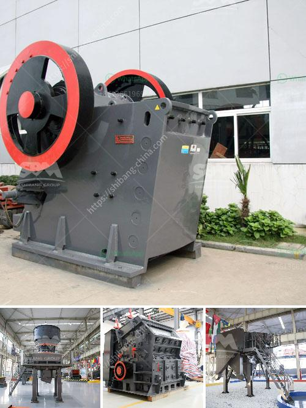

<h3>كسارة لفة معدات مستخدمة tph الفحم الروسية</h3>
تعتبر كسارة لفة المعدات المستخدمة في تكسير الفحم بسعة 200-400 tph من الأدوات الروسية المتميزة التي تعمل على تحويل الفحم من حالته الطبيعية إلى جسيمات صغيرة قابلة للاستخدام في صناعات مختلفة. تتميز هذه الكسارة بإمكانيات فريدة تجعلها الخيار الأمثل لتلبية احتياجات الصناعات المختلفة التي تعتمد على الفحم كمصدر للطاقة أو المواد الخام.

تتكون كسارة لفة المعدات المستخدمة tph الفحم الروسية من خطوط متعددة التجويف تعزز من كفاءة عملية التكسير، حيث يتم وضع الفحم بين الأسطوانات الثنائية المتحركة والثابتة وتتم دفعه باتجاه الأسطوانة الثابتة الأخرى. هذه الحركة الدورانية للأسطوانات تعمل على تكسير الفحم إلى قطع صغيرة بشكل فعال بفضل الضغط المتعدد الاستثنائي الذي يمارس عليه.

تتميز كسارة لفة المعدات المستخدمة tph الفحم الروسية ببنية قوية ومتينة مصنوعة من مواد عالية الجودة تجعلها متينة وقادرة على تحمل الضغوط العالية والاستخدام المستمر دون تلف. نظرًا للعمل الشاق الذي يتعرض له الفحم أثناء العملية، فإن المواد المقاومة للتآكل تعزز عمر الكسارة وتحافظ على كفاءتها طويلة الأمد.

بفضل التكنولوجيا المتقدمة التي تم استخدامها في تصميم الكسارة، يمكن ضبط حجم الفحم المكسور حسب الحاجة، مما يعزز التحكم الدقيق في عملية التكسير ويتيح للمشغلين تحقيق النتائج المطلوبة بسهولة. كما تم تجهيز الكسارة بنظام إزالة الشوائب لضمان حصول العملاء على مواد نهائية نقية خالية من الشوائب.

بالإضافة إلى ذلك، توفر كسارة لفة المعدات المستخدمة tph الفحم الروسية مستوى عالٍ من الكفاءة العالية، مما يعني توفير الوقت، والطاقة والتكاليف. تعمل بكفاءة عالية وتحجز تمثيلًا جيدًا في تقليل استهلاك الطاقة وزيادة الإنتاجية، مما يتيح للشركات تحقيق الأداء المرغوب فيه وزيادة ربحيتها.

في النهاية، يمكن القول بأن كسارة لفة المعدات المستخدمة tph الفحم الروسية هي اختيار مثالي للشركات الناشئة في صناعة الفحم أو الشركات الكبيرة التي تسعى لتحسين الكفاءة وتعزيز إنتاجها. توفر هذه المعدات المتطورة القدرة على تحقيق الاستدامة والإنتاجية العالية التي تلبي احتياجات الصناعة وتساهم في تنمية الاقتصاد المستدام.
<h3>Contact us</h3><ul><li><strong>Whatsapp:&nbsp;<a href="https://wa.me/8613661969651">+8613661969651</a></strong></li><li><a href="https://swt.shibang-china.com/?git&amp;zhl&amp;كسارة لفة معدات مستخدمة tph الفحم الروسية"><strong>Online Service(chat now)</strong></a></li></ul><h3>Related</h3><ul><li><a href='الفرق بين كسارة الفك وكسارة الصدم.md'>الفرق بين كسارة الفك وكسارة الصدم</a></li><li><a href='تقرير مشروع مصنع الأسمنت الصغير.md'>تقرير مشروع مصنع الأسمنت الصغير</a></li><li><a href='أسعار مصنع معالجة الكولتان.md'>أسعار مصنع معالجة الكولتان</a></li><li><a href='كسارة محمولة للحطام.md'>كسارة محمولة للحطام</a></li><li><a href='عملية تشكيل الأسمنت.md'>عملية تشكيل الأسمنت</a></li></ul>