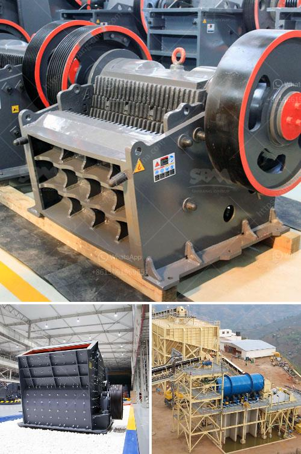

<h3>كسارة لقاعدة الطريق الزرقاء</h3>
تعتبر كسارة لقاعدة الطريق الزرقاء جزءًا حيويًا من عملية بناء الطرق الحديثة. تُستخدم هذه الكسارة في تكسير الصخور والحجارة الكبيرة لتحويلها إلى قوام السطح الأساسي للطريق. تعد مهمة تجهيز القواعد الجيولوجية للطرق من أهم الخطوات في عملية البناء، وبالتالي فإن وجود كسارة لقاعدة الطريق الزرقاء يعد جوهرياً.

إن استخدام كسارة لقاعدة الطريق الزرقاء في بناء الطرق يضمن وجود طرق آمنة ومتينة تستمر لسنوات عديدة. عندما يتم استخدام الحجارة الكبيرة وتكسيرها في الكسارة، يتم إنتاج حبيبات صغيرة من الصخور التي تكون مناسبة لبناء القاعدة الأساسية للطريق. بعد استخدام كسارة لقاعدة الطريق الزرقاء، يتم تركيب الحبيبات المكسرة فوق الأرض بشكل متماسك ومستوٍ، ويتم ضغطها بواسطة معدات ثقيلة لضمان استقرار الطريق عند مرور المركبات عليه.

تتميز كسارة لقاعدة الطريق الزرقاء بعدة مزايا. تعمل الكسارة بكفاءة عالية وتنتج حبيبات منتظمة الحجم والشكل، مما يساعد في ضمان استقرار ومتانة الطرق. تتواجد هذه الكسارات عادة بالقرب من مواقع البناء لتسهيل إمداد الطرق بالمواد الأساسية اللازمة. تساهم استخدام الكسارة لقاعدة الطريق الزرقاء في تقليل التكاليف العامة للبناء، حيث أن استخدام الحبيبات المكسرة يعد بديلاً اقتصاديًا مقارنة بشراء المواد من مصادر خارجية.

بالإضافة إلى ذلك، يلعب استخدام كسارة لقاعدة الطريق الزرقاء دورًا هامًا في الحفاظ على البيئة. فقد تم تفعيل عدد من الاشتراطات البيئية لتشغيل هذه الكسارات، مما يضمن الحفاظ على جودة الهواء والحفاظ على الطبيعة المحيطة بالموقع. تعمل هذه الكسارات بتقنيات حديثة تعتمد على الحد من الانبعاثات الضارة وتوفير استخدام الطاقة الأمثل.

استخدام كسارة لقاعدة الطريق الزرقاء يعد نقلة نوعية في عملية بناء الطرق الحديثة. تضمن جودة القاعدة الأساسية للطرق واستدامتها على المدى الطويل، وتقليل التكاليف والحفاظ على البيئة. تعتبر الكسارة لقاعدة الطريق الزرقاء تقنية مبتكرة تسهم في تحسين عملية بناء الطرق وضمان سلامة المستخدمين.
<h3>Contact us</h3><ul><li><strong>Whatsapp:&nbsp;<a href="https://wa.me/8613661969651">+8613661969651</a></strong></li><li><a href="https://swt.shibang-china.com/?git&amp;zhl&amp;كسارة لقاعدة الطريق الزرقاء"><strong>Online Service(chat now)</strong></a></li></ul><h3>Related</h3><ul><li><a href='إنتاج خط الإنتاج لكسارة الطوب.md'>إنتاج خط الإنتاج لكسارة الطوب</a></li><li><a href='كسارة صخور وشاشات في الفلبين.md'>كسارة صخور وشاشات في الفلبين</a></li><li><a href='آلة تكسير الصخور في الفلبين.md'>آلة تكسير الصخور في الفلبين</a></li><li><a href='كسارة للبيع في ماليزيا.md'>كسارة للبيع في ماليزيا</a></li><li><a href='جهاز كسر الكوارتز الصغير.md'>جهاز كسر الكوارتز الصغير</a></li></ul>