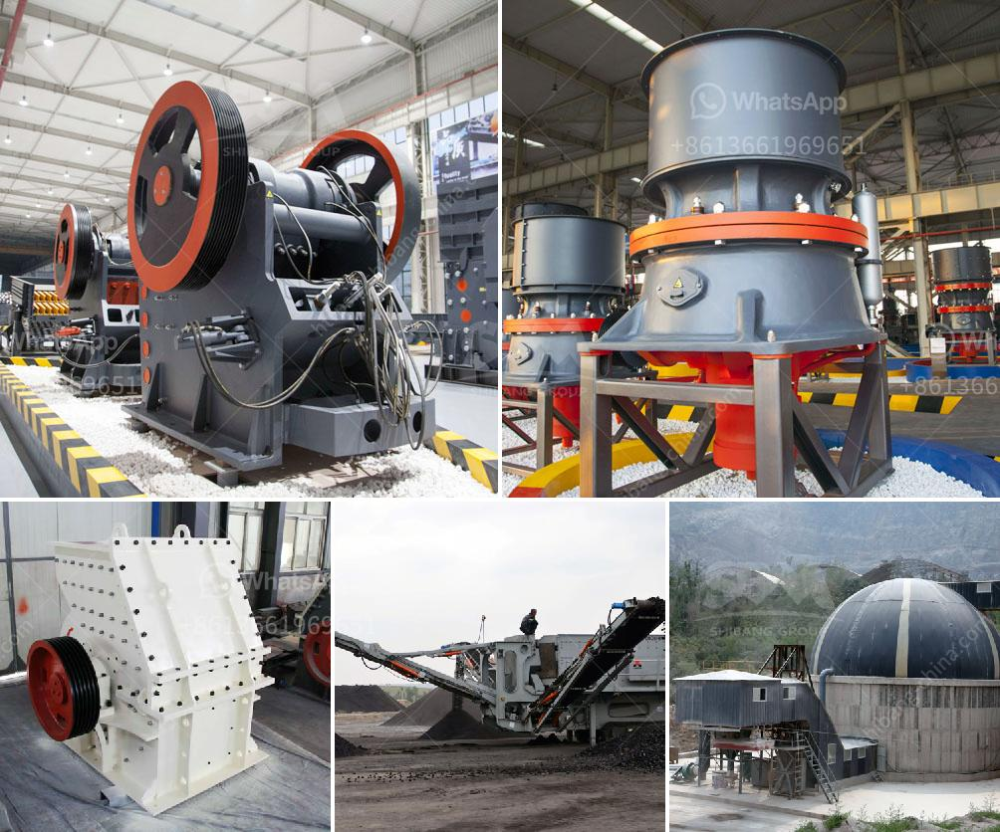

<h3>كسارة للبيع في الفلبين</h3>
إذا كنت تبحث عن كسارة للبيع في الفلبين، فأنت بالتأكيد في المكان المناسب. تعتبر الكسارات أداة أساسية في صناعات البناء والتشييد والتعدين، حيث تستخدم لتكسير وتحطيم المواد الخام والأحجار الكبيرة إلى أجزاء أصغر يمكن استخدامها في عمليات البناء والتشييد المختلفة.

قد تواجه بعض التحديات عند البحث عن كسارة للبيع في الفلبين، ولكن مع البحث والجهد المناسب، يمكنك العثور على كسارة تناسب احتياجاتك وميزانيتك. يتعين عليك أولاً تحديد ماهية الكسارة التي تبحث عنها، مثل الكسارات الفكية أو الكسارات المخروطية أو الكسارات الأفقية أو الكسارات الصدمية، وبعدها يمكنك البحث عن البائعين والموزعين المعتمدين.

تحتاج أيضًا إلى مراجعة الميزانية المتاحة لديك. يجب عليك تحديد العلامة التجارية المفضلة، والحجم المطلوب، والمواصفات التقنية، والتأكد من أن الكسارة المعروضة للبيع تتوافق مع هذه المواصفات والميزانية المحددة.

تختلف أسعار الكسارات في الفلبين وفقًا للحجم والعلامة التجارية والمواصفات التقنية. قد تبدأ الأسعار من حوالي 200 دولار إلى 400 دولار، ويزداد السعر بزيادة قدرة ومواصفات الكسارة.

علاوة على ذلك، يجب عليك أيضًا التأكد من جودة الكسارة المعروضة للبيع ومدى توافر قطع الغيار والصيانة في الفلبين. يفضل اختيار الشركات الموثوقة والذين لديهم سمعة جيدة في هذا المجال.

يوفر شراء كسارة للبيع في الفلبين العديد من المزايا، فهو يساعد في توفير الوقت والجهد في عمليات البناء والتشييد، ويزيد من كفاءة العمل ويقلل التكلفة. لذلك، إذا كنت تعمل في صناعة البناء والتشييد أو التعدين في الفلبين، فسوف تستفيد كثيرًا من امتلاك كسارة.

في الختام، عندما تنوي البحث عن كسارة للبيع في الفلبين، يجب أن تكون واثقًا من احتياجاتك ومتطلباتك وميزانيتك. قم بالبحث المناسب والاطلاع على الاختيارات المتاحة واتخاذ القرار المناسب. استثمر في كسارة عالية الجودة وقادرة على تلبية احتياجاتك، واحرص على الحصول على ضمانات وخدمات صيانة من الشركة التي تقدم الكسارة للبيع.
<h3>Contact us</h3><ul><li><strong>Whatsapp:&nbsp;<a href="https://wa.me/8613661969651">+8613661969651</a></strong></li><li><a href="https://swt.shibang-china.com/?git&amp;zhl&amp;كسارة للبيع في الفلبين"><strong>Online Service(chat now)</strong></a></li></ul><h3>Related</h3><ul><li><a href='سعر معدات غسل الفحم.md'>سعر معدات غسل الفحم</a></li><li><a href='مخروط سحق 700 1000.md'>مخروط سحق 700 1000</a></li><li><a href='خط إنتاج الجرانيت.md'>خط إنتاج الجرانيت</a></li><li><a href='معدات طحن الرماد الخشن.md'>معدات طحن الرماد الخشن</a></li><li><a href='كسارات وشاشات متنقلة مستعملة في جنوب أفريقيا.md'>كسارات وشاشات متنقلة مستعملة في جنوب أفريقيا</a></li></ul>