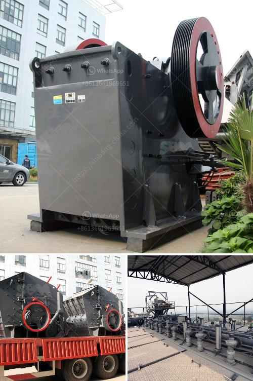

<h3>كسارة للبيع في بيرو</h3>
تعتبر صناعة التعدين من الصناعات الهامة في العديد من البلدان، وتلعب الكسارات دورًا حيويًا في هذه الصناعة، فهي تستخدم لتكسير الصخور والمواد الصلبة الأخرى للاستخراج والاستفادة منها. وفي بيرو، توجد العديد من الكسارات المتاحة للبيع، ومن بينها يمكن ذكر كسارة تتراوح أسعارها بين 200-400.

تعتبر هذه الكسارة المعروضة للبيع في بيرو فرصة ممتازة للشركات المهتمة بقطاع التعدين، فهي تتميز بالعديد من المميزات التي تجعلها اختيارًا مثاليًا. أولًا، تتميز الكسارة بقدرتها على تكسير الصخور الكبيرة بكفاءة عالية وبسرعة، مما يوفر الوقت والجهد للعمال ويعزز الإنتاجية. كما أنها تعمل بكفاءة في البيئات القاسية وتتحمل الاستخدام الشاق بفضل جودة تصنيعها العالية.

بالإضافة إلى ذلك، تعتبر الكسارة سهلة الاستخدام وتتطلب صيانة بسيطة، مما يقلل من التكاليف التشغيلية للشركة المالكة. كما أنها قابلة للنقل بسهولة ويمكن تركيبها في موقع التعدين المطلوب بسرعة. وتأتي الكسارة بمجموعة متنوعة من الأحجام والإمكانيات، ما يسمح بتلبية متطلبات التعدين المختلفة بفعالية.

وبفضل هذه الميزات المذكورة، فإن الكسارة المتاحة للبيع في بيرو تعتبر اختيارًا مثاليًا للشركات التي تبحث عن كفاءة وجودة عالية في عمليات التكسير. كما تساهم في تعزيز القدرة التنافسية للشركات في قطاع التعدين وزيادة الإنتاجية والربحية.

باختصار، يمكن القول إن الكسارة للبيع في بيرو بسعر يتراوح بين 200-400 تمثل فرصة ممتازة للشركات في قطاع التعدين. فبفضل مميزاتها الفريدة من نوعها وقدرتها على تحمل الاستخدام الشاق، تلبي الكسارة متطلبات التعدين بكفاءة عالية وتساهم في تحسين الإنتاجية والربحية. لذا، فإن العمل على الحصول على هذه الكسارة قد يكون استثمارًا ناجحًا للشركات المهتمة.
<h3>Contact us</h3><ul><li><strong>Whatsapp:&nbsp;<a href="https://wa.me/8613661969651">+8613661969651</a></strong></li><li><a href="https://swt.shibang-china.com/?git&amp;zhl&amp;كسارة للبيع في بيرو"><strong>Online Service(chat now)</strong></a></li></ul><h3>Related</h3><ul><li><a href='مورد كسارة في الصين.md'>مورد كسارة في الصين</a></li><li><a href='كيفية صنع كسارة كرات.md'>كيفية صنع كسارة كرات</a></li><li><a href='مطحنة هامر لطحن البولي إيثيلين منخفض الكثافة.md'>مطحنة هامر لطحن البولي إيثيلين منخفض الكثافة</a></li><li><a href='تحكم هيدروليكي في فك الكسارة.md'>تحكم هيدروليكي في فك الكسارة</a></li><li><a href='مطحنة الكرة للبيع في جنوب أفريقيا.md'>مطحنة الكرة للبيع في جنوب أفريقيا</a></li></ul>