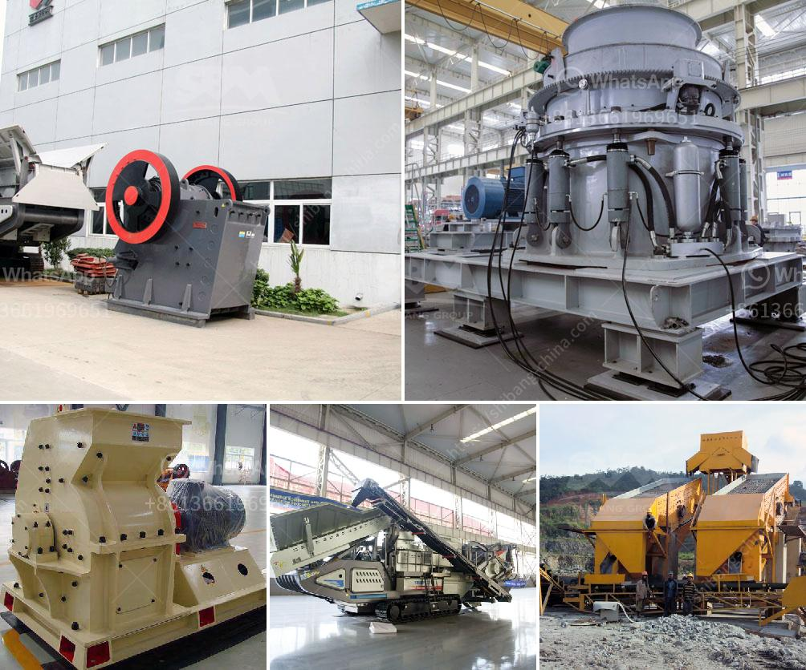

<h3>كسارة للبيع في جنوب أفريقيا</h3>
تعد جنوب أفريقيا واحدة من الدول التي تتمتع بقطاع التعدين القوي والمزدهر. تضم البلاد مجموعة متنوعة من الموارد المعدنية الثمينة وغير الثمينة مثل الذهب والفحم والألماس والبوتاس والبلاتين والمنغنيز والزنك والنحاس. وبفضل هذه الموارد الوفيرة، فإن قطاع التعدين قوي جدًا ويعد من أهم القطاعات الاقتصادية في البلاد.

في مجال التعدين، تتطلب عمليات التعدين استخدام مجموعة متنوعة من المعدات والأدوات. ومن بين هذه المعدات المهمة، تأتي كسارة الحجارة في المقدمة. تستخدم الكسارات في عمليات التعدين لكسر الصخور الكبيرة إلى قطع أصغر وتسهيل عمليات الفصل والتحبيب. وهي تتوفر في العديد من الأحجام والأنواع المختلفة لتلبية احتياجات العملاء المتنوعة.

إحدى المعدات المميزة المستخدمة في عمليات التعدين في جنوب أفريقيا هي كسارة الحجر. تتوفر العديد من كسارات الحجر للبيع في جنوب أفريقيا، بمجموعة متنوعة من المواصفات والأحجام والقدرات. تبدأ أسعار الكسارات عادة من 200 دولار وتصل إلى 400 دولار، وتتفاوت حسب المواصفات والميزات المختلفة.

تتميز الكسارات المستخدمة في جنوب أفريقيا بجودتها العالية وقدرتها على تحمل الظروف القاسية المحيطة بعمليات التعدين. فقد تم تصميمها خصيصًا لتتحمل الصدمات والاهتزازات الناتجة عن عمليات تكسير الصخور الكبيرة. كما تتوفر الكسارات بمستويات مختلفة من الأتمتة والتحكم لتحقيق الكفاءة القصوى في عمليات التعدين.

بالإضافة إلى ذلك، فإن الكسارات المستخدمة في جنوب أفريقيا متوفرة بتكنولوجيا حديثة تسهل الصيانة وتقلل من التوقفات غير المخطط لها. هذا يعزز كفاءة الإنتاج ويقلل من تكاليف الصيانة على المدى الطويل.

بصفة عامة، يعتبر اقتناء كسارة للبيع في جنوب أفريقيا استثمارًا رائعًا لأي شخص يعمل في قطاع التعدين. فهو يساعد على زيادة الإنتاجية وتحقيق الربحية، كما يدعم تحقيق الاستدامة البيئية عن طريق تحسين عمليات التعدين وتقليل التأثير البيئي السلبي.

في النهاية، تعد كسارة للبيع في جنوب أفريقيا أداة حاسمة في عمليات التعدين. وبفضل التطورات التكنولوجية، فإنها تحقق الكفاءة والمرونة والثبات الذي يجعل من الممكن تلبية تحديات قطاع التعدين في البلاد. وبالتالي، يعتبر الحصول على كسارة للبيع في جنوب أفريقيا خطوة حاسمة لضمان النجاح والتنافسية في صناعة التعدين.
<h3>Contact us</h3><ul><li><strong>Whatsapp:&nbsp;<a href="https://wa.me/8613661969651">+8613661969651</a></strong></li><li><a href="https://swt.shibang-china.com/?git&amp;zhl&amp;كسارة للبيع في جنوب أفريقيا"><strong>Online Service(chat now)</strong></a></li></ul><h3>Related</h3><ul><li><a href='آلة حبيبات الجبس في الهند.md'>آلة حبيبات الجبس في الهند</a></li><li><a href='كسارة الفحم 10 مم.md'>كسارة الفحم 10 مم</a></li><li><a href='الشاشات الاهتزازية في إيطاليا.md'>الشاشات الاهتزازية في إيطاليا</a></li><li><a href='مصنع غسيل الذهب بسعة ١٠٠ طن في الساعة.md'>مصنع غسيل الذهب بسعة ١٠٠ طن في الساعة</a></li><li><a href='آلة كسارة في الصين.md'>آلة كسارة في الصين</a></li></ul>