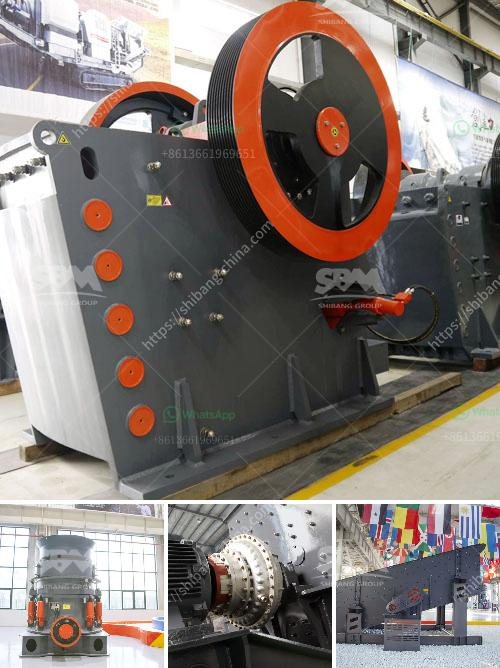

<h3>كسارة للبيع في كيرالا</h3>
تعد كيرالا واحدة من الولايات الهندية الساحلية الجميلة والمشهورة بمناظرها الطبيعية الخلابة وثقافتها الفريدة. تتمتع كيرالا بمناخ استوائي رائع وتضم العديد من الجبال والنهر والغابات التي تجعلها واحدة من أجمل الوجهات السياحية في الهند.

وفي هذا السياق، يشتهر قطاع البناء في كيرالا بسبب قدرته على استخدام المواد الطبيعية مثل الحجر والخشب في بناء المنازل والمباني. ومن المعروف أيضًا أن كيرالا غنية بالموارد الطبيعية مثل الجرانيت والرمال النهرية والصخور البركانية، وهذا يعتبر فرصة رائعة لتطوير قطاع الكسارات في الولاية.

لذا، يمكن العثور على العديد من إعلانات بيع الكسارات في كيرالا، حيث يعرض المالكون أجهزتهم للبيع للمستثمرين أو العملاء المهتمين. تتراوح أسعار الكسارات المعروضة في كيرالا من 200 إلى 400 ألف روبية، وتختلف الأسعار حسب حالة الكسارة وحجمها وعمرها والتجهيزات المرفقة.

تتمتع الكسارات المستعملة المتاحة للبيع بكفاءة عالية في تكسير وطحن الصخور والحجارة، مما يجعلها أداة أساسية في عمليات البناء والهدم والتعدين. فإذا كنت رجل أعمال في مجال البناء أو المقاولات، فإن شراء كسارة مستعملة يمكن أن يكون اختيارًا مستدامًا ومقتصدًا في نفس الوقت.

عند شراء كسارة مستعملة، يجب التحقق من حالتها الفنية والميكانيكية والتأكد من أنها تعمل بكفاءة عالية. كما يجب أيضًا التحقق من توفر قطع الغيار والتجهيزات اللازمة للكسارة، حيث أن قطع الغيار قد تكون مشكلة إذا كانت صعبة أو غير متوفرة في السوق المحلية.

قبل شراء الكسارة، من المهم أن تقوم بإجراء البحث اللازم ومقارنة الأسعار والخيارات المتاحة في السوق. يمكن أيضًا الاتصال بالبائعين المحليين أو التواصل مع شركات البناء والتعدين للحصول على المشورة والمعلومات الأساسية قبل اتخاذ قرار الشراء.

في الختام، يمكن القول إن كيرالا تعد وجهة مثالية للبحث عن كسارة للبيع بسعر 200-400 ألف روبية، حيث توفر الطبيعة الساحرة بيئة مثالية للتعدين والبناء. ومع تنوع الموارد الطبيعية المتاحة يمكن العثور بسهولة على الكسارة المناسبة لاحتياجاتك واستخداماتك المحددة.
<h3>Contact us</h3><ul><li><strong>Whatsapp:&nbsp;<a href="https://wa.me/8613661969651">+8613661969651</a></strong></li><li><a href="https://swt.shibang-china.com/?git&amp;zhl&amp;كسارة للبيع في كيرالا"><strong>Online Service(chat now)</strong></a></li></ul><h3>Related</h3><ul><li><a href='مطاحن الحجر للبيع في كينيا.md'>مطاحن الحجر للبيع في كينيا</a></li><li><a href='تكسير صخور صغيرة في لاس فيغاس.md'>تكسير صخور صغيرة في لاس فيغاس</a></li><li><a href='سعر مطحنة الحجر في المغرب.md'>سعر مطحنة الحجر في المغرب</a></li><li><a href='خط سحق البازلت.md'>خط سحق البازلت</a></li><li><a href='أسعار آلات المحجر.md'>أسعار آلات المحجر</a></li></ul>