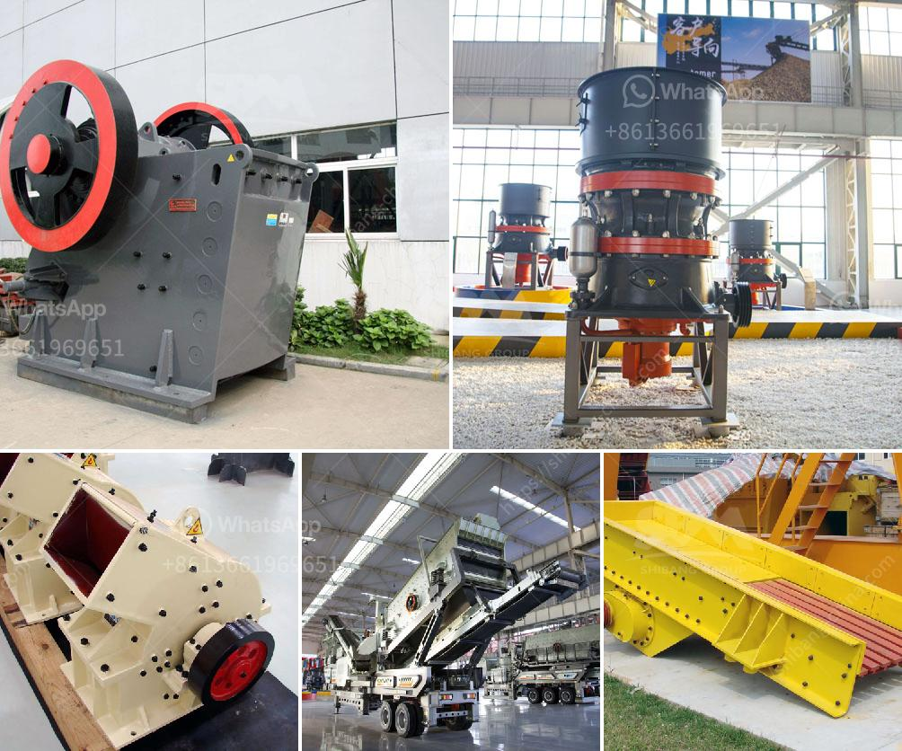

<h3>كسارة للبيع في ماليزيا</h3>
تعتبر ماليزيا واحدة من الدول الرائدة في جنوب شرق آسيا، حيث تتمتع بتاريخ غني وتقدم اقتصادي مزدهر. تعد صناعة البناء والتشييد أحد القطاعات الرئيسية في البلاد، ومن المعروف أن كسارات الحجارة تلعب دورًا حيويًا في هذا القطاع. ومن هنا تأتي أهمية كسارات للبيع في ماليزيا.

تعتبر كسارات الحجارة من المعدات المستخدمة بشكل واسع في صناعة البناء والتشييد لتكسير الصخور والأحجار إلى أحجام مختلفة بحسب المواصفات والاحتياجات المطلوبة. وبفضل التطور التكنولوجي ، يمكن الآن العثور على أنواع مختلفة من الكسارات المستخدمة للبيع في ماليزيا ، والتي تلبي احتياجات السوق المحلية والعالمية بشكل جيد. تتوفر العديد من الكسارات للبيع في ماليزيا، بدءًا من مطاحن الفك وصولًا إلى الكسارات المخروطية والأفقية والصدمية.

من أبرز أنواع الكسارات المتوفرة في السوق الماليزية هي الكسارات الفكية. تعتبر الكسارات الفكية الخيار الأكثر شيوعًا بين المقاولين ومصنعي البناء، حيث توفر أداءً ممتازًا وتعد نظام التحكم فيها بسيطًا وموثوقًا. وتعتبر الكسارات المخروطية من الأنواع الأخرى المهمة في السوق، حيث تمتاز بقدرتها على تكسير الصخور إلى أحجام مختلفة وتوفير حبيبات متساوية الحجم.

تعد ماليزيا بيئة جاذبة للاستثمار في قطاع البناء والتشييد، ولذلك يمكن العثور على العديد من موردي الكسارات في السوق المحلية. هؤلاء الموردين يقدمون مختلف الأنواع من الكسارات المتوفرة للبيع، بعضها مستورد وبعضها صناعة محلية.

بالنسبة للأفراد الذين يبحثون عن شراء كسارة في ماليزيا، يجب عليهم النظر في عوامل عدة. في المقام الأول ، يجب أن يحدد المشتري نوع الكسارة المطلوبة والقدرة الإنتاجية المطلوبة. يجب أن يتأكد المشتري أيضًا من جودة المنتج وأن يطلب معلومات عن الشركة المصنعة للكسارة وسجلها في السوق.

بالإضافة إلى ذلك، يجب أن ينظر المشتري أيضًا إلى عوامل أخرى مثل السعر والضمان وخدمة ما بعد البيع. يفضل أن يتعاون المشتري مع مورد يقدم ضمانًا جيدًا للمنتج ويقدم خدمة ما بعد البيع الموثوقة. وبالطبع يجب أن يكون سعر الكسارة مناسبًا لميزانية المشتري.

باختصار، يعد البحث عن كسارة للبيع في ماليزيا مهمة تتطلب العديد من النقاط الأساسية للانتباه. باختيار الكسارة المناسبة التي تلبي احتياجات المشتري، يمكن الاستفادة منها بشكل كبير في عمليات البناء والتشييد في ماليزيا.
<h3>Contact us</h3><ul><li><strong>Whatsapp:&nbsp;<a href="https://wa.me/8613661969651">+8613661969651</a></strong></li><li><a href="https://swt.shibang-china.com/?git&amp;zhl&amp;كسارة للبيع في ماليزيا"><strong>Online Service(chat now)</strong></a></li></ul><h3>Related</h3><ul><li><a href='سعر كسارة الفك 400x600.md'>سعر كسارة الفك 400x600</a></li><li><a href='إعداد مصنع كسارة الحجر.md'>إعداد مصنع كسارة الحجر</a></li><li><a href='مصنع تكسير الحجر في كوريا.md'>مصنع تكسير الحجر في كوريا</a></li><li><a href='مطحنة الأسطوانة للسائل.md'>مطحنة الأسطوانة للسائل</a></li><li><a href='صور مطحنة الكرات Ceramics.md'>صور مطحنة الكرات Ceramics</a></li></ul>