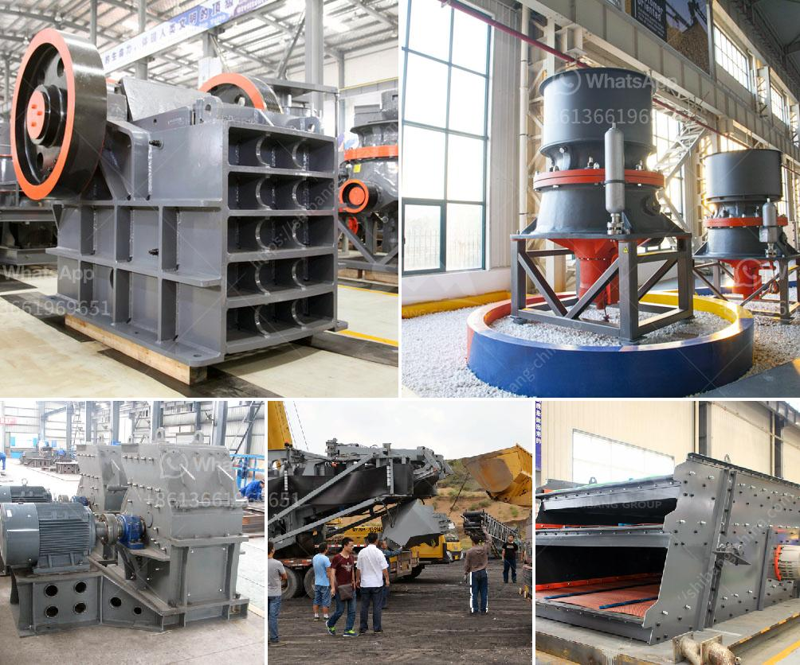

<h3>كسارة للبيع في نيبال</h3>
أثناء البحث عن كسارة للبيع في نيبال، ستجد العديد من الخيارات والفرص التجارية المختلفة لشراء مثل هذه المعدات. من المهم أن تفهم الاحتياجات الخاصة بك وتأخذ بعين الاعتبار عددًا من العوامل الرئيسية قبل اتخاذ القرار النهائي.

أولاً وقبل كل شيء، يجب أن تحدد نوع الكسارة التي ترغب في شرائها بناءً على الاحتياجات الخاصة بك. هل ترغب في شراء كسارة موبايلية تستخدم في مواقع البناء أو تفضل كسارة كبيرة تستخدم في المناجم؟ بعد ذلك، يجب أن تحلل الأرقام والإحصائيات الخاصة بالإنتاجية وكفاءة الطحن لتحديد النموذج المثالي لكسارة.

ثانيًا، يجب أن تأخذ بعين الاعتبار قوة وسعة المحرك الذي تحتاجه الكسارة. ستكون هذه الميزة ذات أهمية كبيرة في تحقيق الأداء الأمثل للكسارة. لذا، حدد بدقة الحد الأدنى والحد الأقصى للاحتياجات الخاصة بك.

ثالثًا، لا تنسَ أن تقيم حالة الكسارة ومدى استدامتها على المدى الطويل. بشكل عام، يُنصح بشراء كسارة جديدة أو شبه جديدة للحصول على أداء مثالي والحد من المشاكل التي قد تنشأ مع الأجهزة المستعملة.

رابعًا، يجب أن تقارن العروض والأسعار المتاحة في السوق التجارية. قم بطلب الاقتباسات من عدة موردين موثوق بهم وقم بمقارنة التفاصيل والأسعار. قد تجد بعض الموردين يوفرون تركيبًا مجانيًا وفترة ضمان ممتدة، وهذا يمكن أن يكون عاملاً مؤثرًا في اتخاذ القرار النهائي.

أخيراً، تذكر أن تأخذ في الاعتبار ظروف الشحن والتوصيل. فمن المهم التأكد من أن الكسارة يمكن توصيلها إلى موقعك في نيبال بسهولة وفي المواعيد المتفق عليها.

في النهاية، شراء كسارة للبيع في نيبال قد يكون استثماراً كبيرًا ويستدعي العديد من العوامل الحاسمة. لذا، تأكد من أن تخطط وتبحث جيدًا قبل اتخاذ القرار النهائي لضمان الحصول على الكسارة المثالية لاحتياجاتك.
<h3>Contact us</h3><ul><li><strong>Whatsapp:&nbsp;<a href="https://wa.me/8613661969651">+8613661969651</a></strong></li><li><a href="https://swt.shibang-china.com/?git&amp;zhl&amp;كسارة للبيع في نيبال"><strong>Online Service(chat now)</strong></a></li></ul><h3>Related</h3><ul><li><a href='الشركة المصنعة للكسارة الرئيسية من الرخام.md'>الشركة المصنعة للكسارة الرئيسية من الرخام</a></li><li><a href='كسارة مخروطية للبيع.md'>كسارة مخروطية للبيع</a></li><li><a href='مطاحن تلك جنوب أفريقيا.md'>مطاحن تلك جنوب أفريقيا</a></li><li><a href='تقرير مشروع كسارة الحجر في كارناتاكا.md'>تقرير مشروع كسارة الحجر في كارناتاكا</a></li><li><a href='طاحونة مطرقية صغيرة بقطر 10 مم.md'>طاحونة مطرقية صغيرة بقطر 10 مم</a></li></ul>